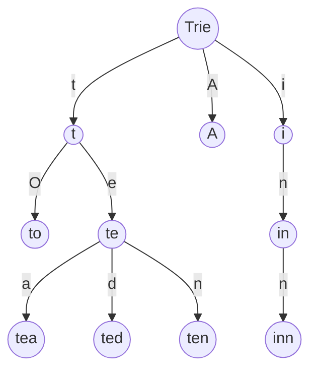
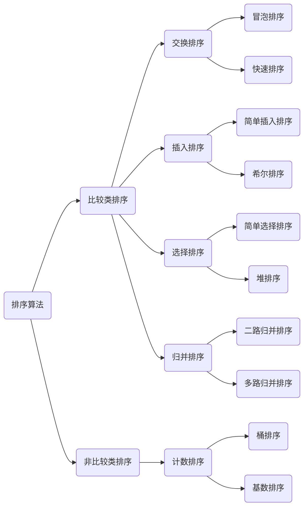
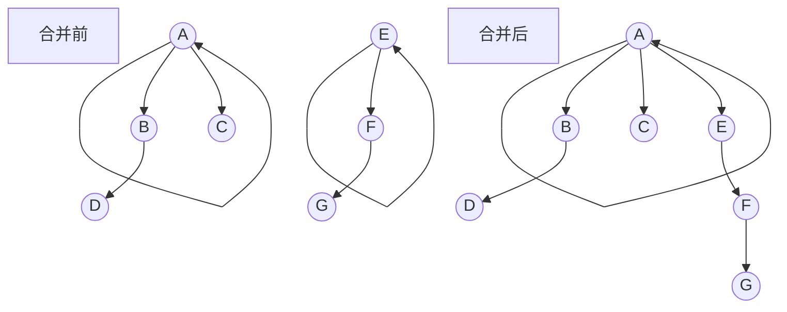
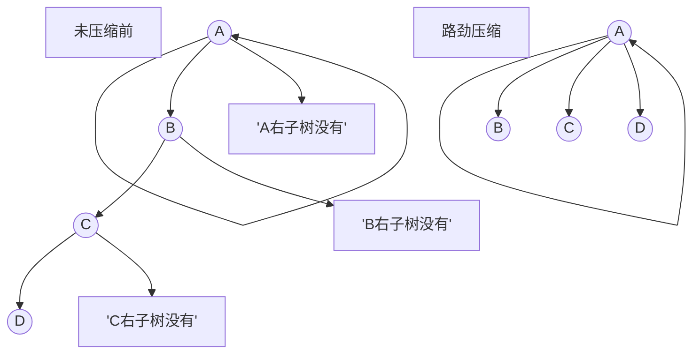

# 动态规划

## 算法描述
>动态规划算法通常用于求解具有某种最优性质的问题。在这类问题中，可能会有许多可行解。每一个解都对应于一个值，我们希望找到具有最优值的解。

>动态规划问题的一般形式就是`求最值`。动态规划其实是运筹学的一种最优化方法，只不过在计算机问题上应用比较多，比如说让你求最长递增子序列呀，最小编辑距离呀等等。既然是要求最值，核心问题是什么呢？求解动态规划的核心问题是`穷举`。因为要求最值，肯定要把所有可行的答案穷举出来，然后在其中找最值呗。首先，动态规划的穷举有点特别，因为这类问题存在「重叠子问题」，如果暴力穷举的话效率会极其低下，所以需要`「备忘录」`或者`「DP table」`来优化穷举过程，避免不必要计算。 而且，动态规划问题一定会具备「最优子结构」，才能通过子问题的最值得到原问题的最值。
另外，虽然动态规划的核心思想就是穷举求最值，但是问题可以千变万化，穷举所有可行解其实并不是一件容易的事，只有列出正确的`「状态转移方程」`才能正确地穷举。

>以上提到的`重叠子问题`、`最优子结构`、`状态转移方程`就是动态规划三要素。

## 算法特点

```text
这个问题的base case(最简单情况)是什么？  
这个问题有什么"状态"？
对于每个状态可以做什么选择使得状态发生改变？
如何定义dp数组/函数的含义来表现状态和选择？
```

## 关键

- 最优子结构 opt[n]=best_of(opt[n-1],opt[n-2])
- 存储中间状态: opt[i]
- 递推公式(状态转移方程或者DP方程) FIB: opt[i]=opt[n-1]+opt[n-2]   二位路径: opt[i,j]=opt[i-1][j]+opt[i][j+1]

## 框架

```shell
# 初始化base case
dp[0][0][...]=base case
# 进行状态转移
for 状态1 in 状态1所有值:
    for 状态2 in 状态2所有值:
        for ...
            dp[状态1][状态2][...] = 求最值(选择1,选择2,...)
```


>列出动态转移方程，就是在解决“如何穷举”的问题。之所以说它难，一是因为很多穷举需要递归实现，二是因为有的问题本身的解空间复杂，不那么容易穷举完整。

## 例子参考

[参考例子](http://mikeygithub.github.io/2020/11/19/interview/LeetCode-%E5%88%B7%E9%A2%98%E8%AE%B0%E5%BD%95/#%E5%8A%A8%E6%80%81%E8%A7%84%E5%88%92)

## 参考资料

[如何理解动态规划？ - 牛岱的回答 - 知乎](https://www.zhihu.com/question/39948290/answer/612439961)
[]()

# 回溯算法

## 算法定义

>回溯算法实际上一个类似枚举的搜索尝试过程，主要是在搜索尝试过程中寻找问题的解，当发现已不满足求解条件时，就“回溯”返回，尝试别的路径。回溯法是一种选优搜索法，按选优条件向前搜索，以达到目标。但当探索到某一步时，发现原先选择并不优或达不到目标，就退回一步重新选择，这种走不通就退回再走的技术为回溯法，而满足回溯条件的某个状态的点称为“回溯点”。

>解决一个回溯问题，实际上就是一个决策树的遍历过程

```text
路径：也就是已经做出的选择。
选择列表：也就是你当前可以做的选择。
结束条件：也就是到达决策树底层，无法再做选择的条件。
```


## 算法框架

<details>
  <summary><span>点击展开</span></summary>
<br>

```shell
result = []
def backtrack(路径, 选择列表):
    if 满足结束条件:
        result.add(路径)
        return

    for 选择 in 选择列表:
        做选择
        backtrack(路径, 选择列表)
        撤销选择
```

</details>

<details>
  <summary><span><a href="">全排列问题</a></span></summary>
  <br>

```java
class Solution{
    //存储结果
    List<List<Integer>> res = new LinkedList<>();
    //函数入口
    List<List<Integer>> permute(int[] nums){
        //记录走过的路径
        LinkedList<Integer> integers = new LinkedList<>();
        //入口
        backtrack(nums,integers);
        return res;
    }
    //回溯函数
    public void backtrack(int[] nums, LinkedList<Integer> track){
        //如果走过的路径包含所有的选择则完成一轮
        if (nums.length==track.size()) {
            res.add(new LinkedList(track));
            return;
        }
        for (int i = 0; i <nums.length; i++) {
            //排除不合法的选择
            if (track.contains(nums[i]))continue;
            //做选择
            track.add(nums[i]);
            //进入下一层决策树
            backtrack(nums,track);
            //撤销选择
            track.removeLast();
        }
    }    
}
```
</details>

# 广度遍历

>BFS 的核心思想应该不难理解的，就是把一些问题抽象成图，从一个点开始，向四周开始扩散。一般来说，我们写 BFS 算法都是用「队列」这种数据结构，每次将一个节点周围的所有节点加入队列。


## 算法框架


<details>
  <summary><span>点击展开</span></summary>

```cgo
// 计算从起点 start 到终点 target 的最近距离
int BFS(Node start, Node target) {
    Queue<Node> q; // 核心数据结构
    Set<Node> visited; // 避免走回头路

    q.offer(start); // 将起点加入队列
    visited.add(start);
    int step = 0; // 记录扩散的步数

    while (q not empty) {
        int sz = q.size();
        /* 将当前队列中的所有节点向四周扩散 */
        for (int i = 0; i < sz; i++) {
            Node cur = q.poll();
            /* 划重点：这里判断是否到达终点 */
            if (cur is target)
                return step;
            /* 将 cur 的相邻节点加入队列 */
            for (Node x : cur.adj())
                if (x not in visited) {
                    q.offer(x);
                    visited.add(x);
                }
        }
        /* 划重点：更新步数在这里 */
        step++;
    }
}
```

</details>

# 深度遍历

## 实现代码
```java
class Solution {
    public List<Integer> DFS(TreeNode root){
        List<Integer> list = new ArrayList<>();
        Stack<TreeNode> stack = new Stack<>();
        stack.push(root);
        while (!stack.isEmpty()){
            TreeNode tmp = stack.pop();
            list.add(tmp.val);
            if(tmp.left!=null)stack.push(tmp.left);
            if(tmp.right!=null)stack.push(tmp.right);
        }
        return list;
    }
}
```

# 窗口滑动

>一般采用队列来解决问题

时间复杂度:  `T(n)=O(n)`

## 算法框架

<details>
  <summary><span>点击展开</span></summary>


  ````cgo
  /* 滑动窗口算法框架 */
  void slidingWindow(string s, string t) {
      unordered_map<char, int> need, window;
      for (char c : t) need[c]++;//初始化
      int left = 0, right = 0;//左右指针
      int valid = 0;//
      while (right < s.size()) {
          // c 是将移入窗口的字符
          char c = s[right];
          // 右移窗口
          right++;
          // 进行窗口内数据的一系列更新
          ...
          /*** debug 输出的位置 ***/
          printf("window: [%d, %d)\n", left, right);
          // 判断左侧窗口是否要收缩
          while (window needs shrink) {
              // d 是将移出窗口的字符
              char d = s[left];
              // 左移窗口
              left++;
              // 进行窗口内数据的一系列更新
              ...
          }
      }
  }
  ````
</details>

# 贪心算法

>贪心算法是在每一步选择中都采取当前状态下最好或最优(即最有利)的选择，从而希望导致结果是全局最好或最优的算法。

>贪心法可以解决一些最优化问题，如:求图中的最小生成树、求哈夫曼树等。然而对于工程和生活中的问题，贪心法一般不能得到我们所求的答案。一旦一个问题可以通过贪心法来解决，那么贪心法一般是解决这个问题的最好办法。由于贪心法的高效性已经其所求得的答案比较接近最优解，贪心法也可以用作辅助算法或者直接解决一些要求结果不特别精确的问题。


<p class="note note-primary">
贪心、回溯、动态规划区别
</p>

贪心算法与动态规划的不同在于他对每个子问题的解决方案都做出选择，不能回退。动态规划会保存以前的运算结果，并根据以前的结果对当前进行选择，有回退功能。

贪心：`当下做局部最优判断`
回溯:`能够回退`
动态规划: `最优判断+回退`

## 参考例子

<details>
  <summary><span><a href="">删除k个数后的最小值()</a></span></summary>
  <br>

<p class="note note-primary">
解题思路：
1.从左向右遍历,找到比自己右侧数字大的数字并删除  
2.如果没有找到要删除的数字,则删除最后一个数字  
3.如果整数的所有数字都被删除了,直接返回0
</p>

```java
class Solution{
    /**
     * 2. * 删除整数的k个数字,获得删除后的最小值
     * 3. * @param num
     * 4. * @param k
     * 5.
     */
    public static String removeKDigits(String num, int k) {
        //新整数的最终长度 =原整数长度-k
        int newLength = num.length() - k;
        //创建一个栈,用于接收所有的数字
        char[] stack = new char[num.length()];
        int top = 0;
        for (int i = 0; i < num.length(); ++i) {
            //遍历当前数字
            char c = num.charAt(i);
            //当栈顶数字大于遍历到的当前数字时,栈顶数字出栈(相当于删除数字
            while (top > 0 && stack[top - 1] > c && k > 0) {
                top -= 1;
                k -= 1;
            }
            //遍历到的当前数字入栈
            stack[top++] = c;
        }
        // 找到栈中第1个非零数字的位置,以此构建新的整数字符串
        int offset = 0;
        while (offset < newLength && stack[offset] == '0') {
            offset++;
        }
        return offset == newLength ? "0" : new String(stack, offset, newLength - offset);
    }
    
    public static void main(String[] args) {
        System.out.println(removeKDigits("1593212", 3));
        System.out.println(removeKDigits("30200", 1));
        System.out.println(removeKDigits("10", 2));
        System.out.println(removeKDigits("541270936", 3));
    }    
}
```
</details>

## 参考资料

# 字典算法

## 算法定义
<p class="note note-primary">
    字典树，即Trie树，又称单词查找树或键树，是一种树形结构。典型应用是用于统计和排序的字符串（但不仅限于字符串），所以经常被搜索引擎用于文本词频率统计
</p>

优点:`最大限度的减少无谓的字符串比较，查询效率比　哈希表高。`



<p class="note note-primary">
性质
</p>

- 节点本身不存在完整单词
- 从根节点到某一节点，路径上经过的字符串连接起来，为该结点对应的字符串
- 每个结点的所有子结点代表的字符都不相同

<p class="note note-primary">
核心思想
</p>

- Trie树的核心思想是空间换时间
- 利用字符串的公共前缀来降低查询时间的开销以达到提高效率的目的

## 参考例子

<details>
  <summary><span><a href="">寻找全排列的下一个数()</a></span></summary>
  <br>

</details>

## 参考资料

[字典序算法](https://www.cnblogs.com/darklights/p/5285598.html)

# 分治算法

## 算法定义

<p class="note note-primary">
将一个难以直接解决的大问题，分割成一些规模较小的相同问题，以便各个击破，分而治之
</p>

<p class="note note-danger">
    对于一个规模为n的问题，若该问题可以容易地解决（比如说规模n较小）则直接解决，否则将其分解为k个规模较小的子问题，这些子问题互相独立且与原问题形式相同，递归地解这些子问题，然后将各子问题的解合并得到原问题的解。这种算法设计策略叫做分治法。
</p>

分治算法的适用情况

>分治法所能解决的问题一般具有以下几个特征：

1) 该问题的规模缩小到一定的程度就可以容易地解决

2) 该问题可以分解为若干个规模较小的相同问题，即该问题具有最优子结构性质。

3) 利用该问题分解出的子问题的解可以合并为该问题的解；

4) 该问题所分解出的各个子问题是相互独立的，即子问题之间不包含公共的子子问题。

## 代码模板

```java
class Solution{
    public int divide_conquer(Problem problem) {
        //recursion terminator
        if (problem == NULL) {    
            int res = process_last_result();    
            return res;       
        }  
        //prepare data
        subProblems = split_problem(problem);
        //conquer subproblems
        res0 = divide_conquer(subProblems[0]);  
        res1 = divide_conquer(subProblems[1]);    
        //process and generate the final result
        result = process_result(res0, res1);   
        //revert the current level states
        return result;
    }
}
```

# 排序类型

[算法篇-排序算法](https://mikeygithub.github.io/2020/11/09/algorithm/%E7%AE%97%E6%B3%95%E7%AF%87-%E6%8E%92%E5%BA%8F%E7%AE%97%E6%B3%95/)

>nlogn排序: 堆排序、快速排序、归并排序



## 初级排序

>`O(n^2)`

- 选择排序(Select Sort)每次找最小值，然后放到待排序数组的起始位置。
- 插入排序(Insert Sort)从前到后逐步构建有序序列；对于未排序数据，在已排序序列中从后向前扫描，找到相应位置并插入。
- 冒泡排序(Bubble Sort)嵌套循环，每次查看相邻的元素如果逆序，则交换。

## 高级排序

>`O(n*logn)`

- 快速排序(Quick Sort)数组取标杆pivot，将小元素放pivot左边，大元素放右边，然后依次对右边和左边的子数组继续快排；以达到整个序列有序
- 归并排序(Merge Sort)
    1.把长度为n的输入序列分成两个长度位n/2的子序列;
    2.把这两个子序列分别采用归并排序;
    3.将两个排序好的子序列合并成一个最终的排序序列;

`归并排序和快速排序具有相似性，但步骤相反`

>归并:先排序左右子数组，然后合并两个有序子数组

>快排:先调出左右子数组，然后对于左右数组进行排序

- 对排序(heap Sort)　堆插入O(logN)，取最大最小值O(1)
    1.数组元素依次建立小堆顶
    2.依次取堆顶元素，并删除

(满二叉搜索树进行实现)

## 拓扑排序

>对一个有向无环图(Directed Acyclic Graph简称DAG)G进行拓扑排序，是将G中所有顶点排成一个线性序列，使得图中任意一对顶点u和v，若边<u,v>∈E(G)，则u在线性序列中出现在v之前。通常，这样的线性序列称为满足拓扑次序(Topological Order)的序列，简称拓扑序列。简单的说，由某个集合上的一个偏序得到该集合上的一个全序，这个操作称之为拓扑排序。

```cpp
queue<int>q;
//priority_queue<int,vector<int>,greater<int>>q;
//优先队列的话，会按照数值大小有顺序的输出
//此处为了理解，暂时就用简单队列
int topo()
{
    for(inti=1;i<=n;i++)
    {
        if(indegree[i]==0)
        {
            q.push(i);
        }
    }
 
    int temp;
    while(!q.empty())
    {
        temp=q.front();//如果是优先队列，这里可以是top()
        printf("%d->",temp);
        q.pop();
        for(inti=1;i<=n;i++)//遍历从temp出发的每一条边，入度--
        {
            if(map[temp][i])
            {
                indegree[i]--;
                if(indegree[i]==0)q.push(i);
            }
        }
    }
}
```


### 算法定义

<p class="note note-primary">
    
</p>

# 并查集型

<p class="note note-primary">
定义
</p>

>并查集是一种树型的数据结构，用于处理一些不相交集合（disjoint sets）的合并及查询问题。常常在使用中以森林来表示。

- 合并（Union）：把两个不相交的集合合并为一个集合。
- 查询（Find）：查询两个元素是否在同一个集合中。

<p class="note note-primary">
适用场景
</p>

- 组团、配对问题
- Group or not ?

<p class="note note-primary">
基本操作
</p>

- makeSet(s): 建立一个新的并查集，其中包含s个单元素集合。
- unionSet(x,y): 把元素x和元素y所在的集合合并，要求x和y所在的集合不相交，如果相交则不合并。
- find(x): 找到元素x所在的集合的代表，该操作也可以用于判断两个元素是否位于同一个集合，只要将他们各自代表比较一下就可以了。

## 图示演示

>查询、合并



>调用find(d)时进行路劲压缩



## 代码模板

```java
    class UnionFind {
        int count;
        int[] parent;
        int[] rank;

        public UnionFind(char[][] grid) {
            count = 0;
            int m = grid.length;
            int n = grid[0].length;
            parent = new int[m * n];
            rank = new int[m * n];
            for (int i = 0; i < m; ++i) {
                for (int j = 0; j < n; ++j) {
                    if (grid[i][j] == '1') {
                        parent[i * n + j] = i * n + j;
                        ++count;
                    }
                    rank[i * n + j] = 0;
                }
            }
        }

        public int find(int i) {
            if (parent[i] != i) parent[i] = find(parent[i]);
            return parent[i];
        }

        public void union(int x, int y) {
            int rootx = find(x);
            int rooty = find(y);
            if (rootx != rooty) {
                if (rank[rootx] > rank[rooty]) {
                    parent[rooty] = rootx;
                } else if (rank[rootx] < rank[rooty]) {
                    parent[rootx] = rooty;
                } else {
                    parent[rooty] = rootx;
                    rank[rootx] += 1;
                }
                --count;
            }
        }

        public int getCount() {
            return count;
        }
    }
```

## 参考例子

- 朋友圈
- 岛屿数量

# 递归算法

## 算法定义

<p class="note note-primary">
递归算法时间复杂度=子问题个数*解决一个子问题需要的时间
</p>


## 算法模板

```java
class Solution{
    public void recur(int level,int param){
       //terminator
        if (level>MAX_LEVEL){
            //procesws resutl
            return;
        }
        //process current logic
        process(level,param);
        //drill down
        recur(level:level+1,newParam);
        //restore current status
    }
}
```

# 二分查找

>有序、上下界、索引访问

<p class="note note-primary">
代码模板
</p>

```java
class BinarySearch{
   public int[] binarySearch(int[] nums,int target){ 
       int left = 0,right = ...;
       while (...){
           int mid = left+(right-left)/2;
           if (nums[mid]==target){
               ...
           }else if (nums[mid]<target){
               left = ...;
           }else if (nums[mid]>target){
               right = ...;
           }
       }
       return ...;
   }
}
```

# 高级搜索

## 初级搜索

- 朴素搜索
- 优化搜索：不重复(fibonacci)，剪枝(生成括号问题)
- 搜索放心 DFS、BFS、双向搜索、启发式搜索

## 剪枝

- 在回溯中将不满足的条件的直接过滤掉，提供算法的效率。

## 双向BFS


## 启发式搜索(A*)

<p class="note note-primary">
定义
</p>

>启发式搜索(Heuristically Search)又称为有信息搜索(Informed Search)，它是利用问题拥有的启发信息来引导搜索，达到减少搜索范围、降低问题复杂度的目的，这种利用启发信息的搜索过程称为启发式搜索。

<p class="note note-primary">
估价函数
</p>

>启发式函数：　h(n),它用来评价哪些节点最有希望的是一个我们要找的结点，h(n)会返回一个非负实数，也可以认为是从结点n的目标结点路径的估计成本

>启发式函数是一种告知搜索方向的方法。它提供了一种明智的方法来猜测哪个邻居结点会导向一个目标。

# 位移运算

- 位运算符

>机器里的数字存储格式是二进制方式

|  含义   | 运算符  | 示例 |
|  ----  | ----  |----|
| 左移  | << |0011 -> 0110|
| 右移  | >> |0110 -> 0011|
| 按位或  | \| |0011\|1011 -> 1011|
| 按位与  | & |0110 & 0011 -> 0010|
| 按位取反  | ~ |~0110 -> 1001|
| 按位异或(相同为0不同为1)  | ^ |0011^0110 -> 0101|

XOR-异或

>相同为0不同为1，也可以用"不进位加法来理解"

```text
x^0=x
x^1s=~x //注意1s=~0
x^x=0
c=a^b -> a^c=b , b^c=a //交换两个数
a^b^c=a^(b^c)=(a^b)^c //associative
```

- 算数位移与逻辑位移

```text
将x最右边的n位清零: x&(~0<<n)
获取x的第n位值(0或者1): (x>>n)&1
获取x的第n位的幂值: x&(1<<(n-1))
仅将第n位置为1: x|(1<<n)
仅将第n位置为0: x&(~(1<<n))
将x最高位至第n位(含)清零: x&((1<<n)-1)
将第n位至第0位(含)清零: x&(~((1<<(n+1))-1))
```

- 位运算的应用

判断奇偶性:
```text
x%2==1 --> (x&1)==1   
x%2==0 --> (x&1)==0   
```

乘除2
```text
x>>1 --> x/2
x<<1 --> x*2
```
清零
```text
x=x&(x-1)清零最低位的1
x&-x  得到最低位的1
x&~x 等于0
```

# 参考资料

[漫画算法:小灰的算法之旅]()

[fucking-algorithm](https://labuladong.gitbook.io/algo/)

[LeetCode-刷题记录](https://mikeygithub.github.io/2020/11/19/interview/%E9%9D%A2%E8%AF%95%E7%AF%87-LeetCode-%E5%88%B7%E9%A2%98%E8%AE%B0%E5%BD%95/#%E6%8E%92%E5%BA%8F%E7%AE%97%E6%B3%95)

[数据结构在线演示](https://www.cs.usfca.edu/~galles/visualization/Algorithms.html)