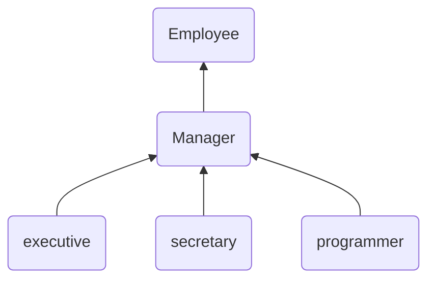
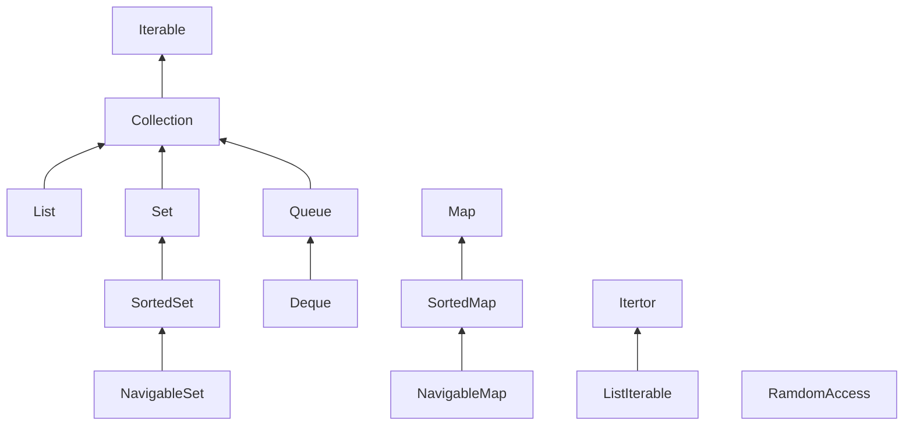
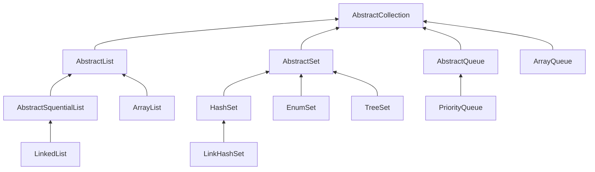
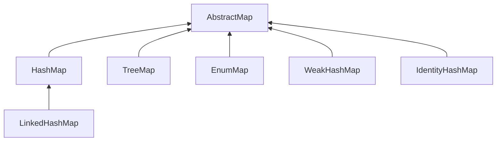
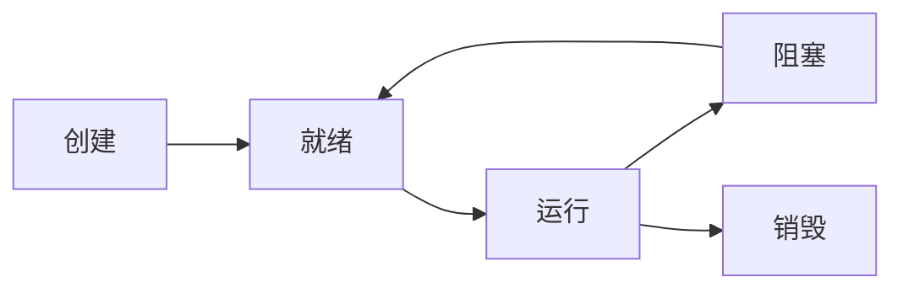

# 书籍地址

链接 [https://pan.baidu.com/s/1fwgY32mqQGy6v0WrdswJiQ](https://pan.baidu.com/s/1fwgY32mqQGy6v0WrdswJiQ)  密码: svse

# 第一章 Java 程序设计概述

>本章主要在总体上对Java展开介绍，包括其Java主要特性、发展历史等内容。

# 第二章 Java 程序设计环镜

>JDK的环境配置、集成开发环境、简单Demo应用开始、


# 第三章 Java 的基本程序设计结构

>讲述了Java的一些规范、各个数据类型的详细介绍、基本的使用操作、文件、流程控制

# 第四章 对象与类

>面向对象程序设计概述、使用预定义类、用户自定义类、静态域与静态方法、方法参数、面向对象程序设计、对象构造 、类路径、文档注释、类设计技巧

>面向对象程序设计（简称 OOP ）是当今主流 程序设计范型 ，它已经取代了 70 代的“结构化”过程 程序设计开发技术 Java 是完全面向对象的 ，必须熟悉 OOP 才能 够编写 Java 程序
面向对象的程序是由对象组成的 每个对象包含对用户公开的特定功能部分和隐藏的 现部分。程序中的很多对象来自标准库，还有一些是自定义的 究竟是自己构造对象，还 从外界购买对象完全取决于开发项目的预算和时间 但是，从根本上说，只要对象能够满足 要求，就不必关心其功能的具体实现过程 在OOP 中，不必关心对象的具体实现，只要能 够满足用户 的需求即可


## 对象

要想使用 OOP 定要清楚对象的 个主要特性：
- 对象的行为（behavior ）一一－可以对对象施加哪些操作，或可以对对象施加哪些方法？
- 对象的状态（ state ）一一一当施加那些方法时，对象如何响应？
- 对象标识（ identity 一一如何辨别具有相同行为与状态的不同对象？
同一个类的所有对象实例，由于支持相同的行为而具有家族式的相似性 对象的行为是 用可调用的方法定义的

## 对象析构与 finalize 方法

有些面向对象的程序设计语言，特别是C++，有显式的析构器方法，其中放置- -些当对
象不再使用时需要执行的清理代码。在析构器中，最常见的操作是回收分配给对象的存储空
间。由于Java有自动的垃圾回收器，不需要人工回收内存，所以Java不支持析构器。
当然，某些对象使用了内存之外的其他资源，例如，文件或使用了系统资源的另一个对
象的句柄。在这种情况下，当资源不再需要时，将其回收和再利用将显得十分重要。
可以为任何一个类添加finalize方法。finalize方法将在垃圾回收器清除对象之前调用。
在实际应用中，不要依赖于使用finalize方法回收任何短缺的资源，这是因为很难知道这个
方法什么时候才能够调用。

## 包

Java允许使用包( package)将类组织起来。借助于包可以方便地组织自己的代码，并将 自已的代码与别人提供的代码库分开管理。
标准的Java类库分布在多个包中，包括java.lang、java.util 和java.net等。标准的Java 包具有一个层次结构。如同硬盘的目录嵌套- -样， 也可以使用嵌套层次组织包。所有标准的
Java包都处于java和javax包层次中。

使用包的主要原因是确保类名的唯一-性。假如两个程序员不约而同地建立了Employee类。只要将这些类放置在不同的包中，就不会产生冲突。事实上，为了保证包名的绝对
唯一性，Sun公司建议将公司的因特网域名(这显然是独--无二的)以逆序的形式作为包 名，并且对于不同的项目使用不同的子包。例如，horstmann.com 是本书作者之一注册 的城名。逆序形式为com.horstmann。这个包还可以被进一步 地划分成子包，如com.horstmann.corejava。 

从编译器的角度来看，嵌套的包之间没有任何关系。例如, java.util包与java.utiljar包
毫无关系。每一个都拥有独立的类集合。

## 类的设计技巧

1.一定要保证数据私有

这是最重要的;绝对不要破坏封装性。有时候，需要编写-个访问器 方法或更改器方法，
但是最好还是保持实例域的私有性。很多惨痛的经验告诉我们，数据的表示形式很可能会改
变，但它们的使用方式却不会经常发生变化。当数据保持私有时，它们的表示形式的变化不
会对类的使用者产生影响，即使出现bug也易于检测。.

2.一定要对数据初始化

Java不对局部变量进行初始化,但是会对对象的实例域进行初始化。最好不要依赖于系
统的默认值，而是应该显式地初始化所有的数据，具体的初始化方式可以是提供默认值，也
可以是在所有构造器中设置默认值。

3.不要在类中使用过多的基本类型

就是说，用其他的类代替多个相关的基本类型的使用。这样会使类更加易于理解且易于
修改。例如，用一个称为Address的新的类替换- -个Customer类中以下的实例域:
```java
private String street;
private String city;
private String state;
private int zip;
```
这样，可以很容易处理地址的变化，例如，需要增加对国际地址的处理。

4.不是所有的域都需要独立的域访问器和域更改器

或许，需要获得或设置雇员的薪金。而一旦构造了雇员对象，就应该禁止更改雇用日
期，并且在对象中，常常包含一些不希望别人获得或设置的实例域，例如，在Address类中，
存放州缩写的数组。

5.将职责过多的类进行分解:

这样说似乎有点含糊不清，究竟多少算是“过多”?每个人的看法不同。但是，如果明
显地可以将一个复杂的类分解成两个更为简单的类，就应该将其分解(但另一方面，也不要
走极端。设计10个类，每个类只有一个方法，显然有些矫枉过正了)。

6.类名和方法名要能够体现它们的职责

与变量应该有一-个能够反映其含义的名字一样， 类也应该如此(在标准类库中，也存在
着一些含义不明确的例子，如: Date类实际上是-一个用于描述时间的类)。
命名类名的良好习惯是采用一个名词(Order)、前面有形容词修饰的名词(RushOrder)
或动名词(有“-ing”后缀)修饰名词(例如，BillingAddress)。 对于方法来说，习惯是访问
器方法用小写get 开头(getSalary), 更改器方法用小写的set开头(setSalary)。

7.优先使用不可变的类

LocalDate类以及java.time 包中的其他类是不可变的一没 有方法能修改对象的状态。
类似plusDays的方法并不是更改对象，而是返回状态已修改的新对象。
更改对象的问题在于，如果多个线程试图同时更新-一个对象，就会发生并发更改。其结
果是不可预料的。如果类是不可变的，就可以安全地在多个线程间共享其对象。
因此，要尽可能让类是不可变的，这是-一个很好的想法。对于表示值的类，如一个字符
串或-一个时间点，这尤其容易。计算会生成新值，而不是更新原来的值。
当然，并不是所有类都应当是不可变的。如果员工加薪时让raiseSalary方法返回一个新
的Employee对象，这会很奇怪。

# 第五章 继承

## 类、超类和子类

关键字`extends`表明正在构造的新类派生于一个已存在的类。已存在的类称为超类( superclass)、基类(base class)或父类( parent class);新类称为子类( subclass)、派生类(derived class)或孩子类(child cass)。超类和子类是Java程序员最常用的两个术语，而了解 其他语言的程序员可能更加偏爱使用父类和孩子类，这些都是继承时使用的术语。

## 多态

有一个用来判断是否应该设计为继承 关系的简单规则，这就是“is-a" 规则，它 表明子类的每个对象也是超类的对象。例Employee 继承层次 如，每个经理都是雇员，因此，将Manager类设计为Employee类的子类是显而易见的，反之不然，并不是每一- 名雇员都是经理。 “is-a” 规则的另- -种表述法是置换法则。它表明程序中出现超类对象的任何地方都可以用子类对象置换。

例如，可以将-一个子类的对象赋给超类变量。
```java
Employee e;
e= new Employee(...); //1 Employee object expected
e= new Manager(...); // OK，Manager can bhe used as well
```
在Java程序设计语言中，对象变量是多态的。一个Employee变量既可以引用一个 Employee类对象，也可以引用一个Employee类的任何-个子类的对象(例如，Manager. Executive、Secretary 等)。

## 参数数量可变的方法

用户自己也可以定义可变参数的方法，并将参数指定为任意类型 ，甚至是基本类型下面是 个简单的示例：其功能为计算若干个数值的最大值

```java
pub1ic static double max(double... values){
    double largest=Double.NEGATIVE_INFINITY;
    for(double v:values)if(v>largest)largest=v;
    return largest;
}
```

## Object:所有类的超类

Object类是Java中所有类的始祖，在Java中每个类都是由它扩展而来的。但是并不需要这样写:
```java
public class Employee extends 0bject
```
如果没有明确地指出超类，Object 就被认为是这个类的超类。由于在Java中，每个类都是由Object类扩展而来的，所以，熟悉这个类提供的所有服务十分重要。
可以使用Object 类型的变量引用任何类型的对象:
```java
Object obj = new Employee("Harry Hacker", 3000;
```
当然，Object类型的变量只能用于作为各种值的通用持有者。要想对其中的内容进行具体的操作，还需要清楚对象的原始类型，并进行相应的类型转换:
```java
Employee e = (Employee) obj;
```
在Java中，只有基本类型( primitive types)不是对象，例如，数值、字符和布尔类型的值都不是对象。所有的数组类型，不管是对象数组还是基本类型的数组都扩展了Object 类。

## 枚举类

下面是一个典型的例子:
```java
public enum Size { SMALL, MEDIUM, LARGE, EXTRA_ LARGE };
```
实际上，这个声明定义的类型是-个类，它刚好有4个实例，在此尽量不要构造新对象。因此，在比较两个枚举类型的值时，永远不需要调用equals,而直接使用“==”就可以了。
如果需要的话，可以在枚举类型中添加一-些构造器、方法和域。当然，构造器只是在构 造枚举常量的时候被调用。下面是一个示例:
```java
public enum Size {
    SMALL("S"), MEDIUM("M"), LARGE("L"), EXTRALRE("X");
    private String abbreviation;

    private Size(String abbreviation) {
        this.abbreviation = abbreviation;
    }

    public String getAbbreviation() {
        return abbreviation;
    }
}
```
所有的枚举类型都是Enum类的子类。它们继承了这个类的许多方法。其中最有用的一个是toString,这个方法能够返回枚举常量名。例如，Size.SMALL.toString( )将返回字符串 SMALL

## 泛型数组列表

ArrayList 是一个采用类型参数（ type parameter ）的泛型类（ generic class ）。为了指定数组列表保存的元素对象类型，需要用一对尖括号将类名括起来加在后面，例如， ArrayList<Employee>

## 反射

反射库( reflection library)提供了一个非常丰富且精心设计的工具集，以便编写能够动态操纵Java代码的程序。这项功能被大量地应用于JavaBeans中，它是Java组件的体系结构(有关JavaBeans的详细内容在卷II中阐述)。使用反射，Java可以支持Visual Basic用户习惯使用的工具。特别是在设计或运行中添加新类时，能够快速地应用开发工具动态地查询新添加类的能力。

能够分析类能力的程序称为反射( reflective)。反射机制的功能极其强大，在下面可以看 到，反射机制可以用来:

- 在运行时分析类的能力。
- 在运行时查看对象，例如，编写一个toString方法供所有类使用。
- 实现通用的数组操作代码。
- 利用Method对象，这个对象很像C++中的函数指针。

反射是一种功能强大且复杂的机制。使用它的主要人员是工具构造者，而不是应用程序员。

>在java.lang.reflect包中有三个类Field、Method 和Constructor分别用于描述类的域、方
法和构造器。这三个类都有-个叫做getName的方法，用来返回项目的名称。Field 类有一
个getType方法，用来返回描述域所属类型的Class对象。Method和Constructor类有能够
报告参数类型的方法，Method类还有一个可以报告返回类型的方法。这三个类还有一个叫
做getModifiers的方法，它将返回一个整型数值，用不同的位开关描述public和static这样
的修饰符使用状况。另外，还可以利用java.lang.reflect包中的Modifier类的静态方法分析
getModifiers返回的整型数值。例如，可以使用Modifier类中的isPublic、 isPrivate 或isFinal
判断方法或构造器是否是public、private 或final。我们需要做的全部工作就是调用Modifier
类的相应方法，并对返回的整型数值进行分析，另外，还可以利用Modifier.toString方法将
修饰符打印出来。

>Class类中的getFields、getMethods 和getConstructors方法将分别返回类提供的
public域、方法和构造器数组，其中包括超类的公有成员。Class 类的getDeclareFields、
getDeclareMethods和getDeclaredConstructors方法将分别返回类中声明的全部域、方法和构
造器，其中包括私有和受保护成员，但不包括超类的成员。

## 对象包装器与自动装箱

有时，需要将int这样的基本类型转换为对象。所有的基本类型都有-一个与之对应的类。 例如，Integer 类对应基本类型int。通常，这些类称为包装器( wrapper)。这些对象包装器类拥有很明显的名字: Integer 、Long、Float、Double、Short、Byte、Character、Void和Boolean (前6个类派生于公共的超类Number)。对象包装器类是不可变的，即一旦构造了 包装器，就不.
允许更改包装在其中的值。同时，对象包装器类还是final,因此不能定义它们的子类。
假设想定义一个整型数组列表。而尖括号中的类型参数不允许是基本类型，也就是说，
不允许写成ArrayList<int>。这里就用到了Integer 对象包装器类。我们可以声明一个Integer
对象的数组列表。
```java
ArrayList<Integer> list = new Arraylist<>();
```

注释: 自动装箱规范要求boolean、 byte、char≤ 127,介于-128 ~ 127 之间的short和int被包装到固定的对象中。例如，如果在前面的例子中将a和b初始化为100，对它们进行比较的结果一定成立。

## 继承的设计技巧

1.将公共操作和域放在超类
这就是为什么将姓名域放在Person类中，而没有将它放在Employee和Student类中的原因。
2.不要使用受保护的域
有些程序员认为，将大多数的实例域定义为protected 是-一个不错的主意，只有这样，子
类才能够在需要的时候直接访问它们。然而，protected 机制并不能够带来更好的保护，其原

3.使用继承实现“is-a” 关系
使用继承很容易达到节省代码的目的，但有时候也被人们滥用了。例如，假设需要定义
一个钟点工类。钟点工的信息包含姓名和雇佣日期，但是没有薪水。他们按小时计薪，并且
不会因为拖延时间而获得加薪。这似乎在诱导人们由Employee派生出子类Contractor,然后
再增加一个hourlyWage域。

4.除非所有继承的方法都有意义，否则不要使用继承假设想编写-一个Holiday类。毫无疑问，每个假日也是一日，并且一日可以用Gregorian Calendar类的实例表示，因此可以使用继承。

5.在覆盖方法时，不要改变预期的行为
置换原则不仅应用于语法，而且也可以应用于行为，这似乎更加重要。在覆盖-一个方法
的时候，不应该毫无原由地改变行为的内涵。就这一- 点而言，编译器不会提供任何帮助，即
编译器不会检查重新定义的方法是否有意义。例如，可以重定义Holiday类中add方法“修
正”原方法的问题，或什么也不做，或抛出一个异常，或继续到下一一个假日。

6.使用多态，而非类型信息
无论什么时候，对于下面这种形式的代码
```java
if(x is of type 1)
action1(x);
else if (x is of type 2)
action2(x);
```
都应该考虑使用多态性。
action,与action2表示的是相同的概念吗?如果是相同的概念，就应该为这个概念定义一
个方法，并将其放置在两个类的超类或接口中，然后，就可以调用
`x.action();`
以便使用多态性提供的动态分派机制执行相应的动作。
使用多态方法或接口编写的代码比使用对多种类型进行检测的代码更加易于维护和扩展。

7.不要过多地使用反射
反射机制使得人们可以通过在运行时查看域和方法，让人们编写出更具有通用性的程序。
这种功能对于编写系统程序来说极其实用，但是通常不适于编写应用程序。反射是很脆弱的，
即编译器很难帮助人们发现程序中的错误，因此只有在运行时才发现错误并导致异常。

# 第六章 接口、 lambda 表达式与内部类

接口 interface 技术，这种技术主要用来描述类具有什么功能，而并不给出每个功能的具体实现

## 接口与抽象类

使用抽象类表示通用属性存在这样一-个问题: 每个类只能扩展于一个类。假设Employee类已经扩展于-个类，例如Person,它就不能再像下面这样扩展第二个类了:
`class Employee extends Person, Comparable // Error`
但每个类可以像下面这样实现多个接口: .
`class Employee extends Person implements Comparable // OK`
有些程序设计语言允许一个类有多个超类，例如C++。我们将此特性称为多重继承( multiple inheritance)。而Java的设计者选择了不支持多继承，其主要原因是多继承会让语言本身变得非常复杂(如同C++),效率也会降低(如同Eiffel)。 实际上，接口可以提供多重继承的大多数好处，同时还能避免多重继承的复杂性和低效性。

## 接口与回调
回调( callback)是一-种常见的程序设计模式。在这种模式中，可以指出某个特定事件发 生时应该采取的动作。例如，可以指出在按下鼠标或选择某个菜单项时应该采取什么行动。

在java.swing包中有一个Timer类，可以使用它在到达给定的时间间隔时发出通告。例如，假如程序中有一个时钟，就可以请求每秒钟获得一个通告， 以便更新时钟的表盘。
在构造定时器时，需要设置--个时间间隔，并告之定时器，当到达时间间隔时需要做些什么操作。

如何告之定时器做什么呢?在很多程序设计语言中，可以提供一个函数名， 定时器周期性地调用它。但是，在Java标准类库中的类采用的是面向对象方法。它将某个类的对象传递给定时器，然后，定时器调用这个对象的方法。由于对象可以携带一些附加的信息， 所以传递一个对象比传递一个函数要灵活得多。
当然，定时器需要知道调用哪一个方法，并要求传递的对象所属的类实现了java.awt.event包的ActionListener 接口。

## lambda 表达式

lambda 表达式是 个可传递的代码块，可以在以后执行 次或多次


## 内部类

内部类( inner class)是定义在另-一个类中的类。为什么需要使用内部类呢?其主要原因有以下三点:

- 内部类方法可以访问该类定义所在的作用域中的数据，包括私有的数据。
- 内部类可以对同一个包中的其他类隐藏起来。
- 当想要定义一个回调函数且不想编写大量代码时，使用匿名(anonymous) 内部类比较便捷。
  这个比较复杂的内容分几部分介绍。
  - 给出一个简单的内部类，它将访问外围类的实例域。
  - 给出内部类的特殊语法规则。
  - 领略一下内部类的内部，探讨一下如何将其转换成常规类。
  - 讨论局部内部类，它可以访问外围作用域中的局部变量。
  - 介绍匿名内部类，说明在Java有lambda表达式之前用于实现回调的基
    本方法。

## 局部类

> 局部类不能用public 或private访问说明符进行声明。它的作用域被限定在声明这个局部类的块中。
> 局部类有- 个优势 ，即对外部世界可以完全地隐藏起来。即使TalkingClock类中的其他代码也不能访问它。除start方法之外，没有任何方法知道TimePrinter类的存在。

由外 部方法访问变量

> 与其他内部类相比较，局部类还有一个优点。它们不仅能够访问包含它们的外部类，还可以访问局部变量。不过，那些局部变量必须事实上为final。这说明，它们- -旦赋值就绝不会改变。

## 匿名内部类

将局部内部类的使用再深入一步 假如只创建这个类的 个对象，就不必命名了 这种类被称为匿名内部类（ nonymous inner class )

```java
pub1ic void start(int interval, boolean beep){
	ActionListener 1istener = new ActionListener()
  {
		pub1ic void actionPerformed(ActionEvent event)
    {
			System.out.print1n("At the tone, the time is " + new Date0);
			if (beep) Too1kit.getDefaultTookit0.beep0);
    }
	};
		Timer t = new Timer(interval, 1istener);
		t.start();
}
```

含义是：创建一个实现 ActionListener 接口的类的新对象，需要实现的方法 ctionPerformed 定义在括号｛｝内

通常的语法格式为:

```java
new SuperType(construction parametrs)
{
  imner class methods and data
}
```

其中, SuperType 可以是ActionListener这样的接口，于是内部类就要实现这个接口。SuperType也可以是-个类， 于是内部类就要扩展它。

由于构造器的名字必须与类名相同，而匿名类没有类名，所以，匿名类不能有构造器。
取而代之的是，将构造器参数传递给超类( superclass)构造器。尤其是在内部类实现接口的时候，不能有任何构造参数。不仅如此，还要像下面这样提供组括号:

```java
new ItetfaceType{
	methods and data
}
```

请仔细研究-下， 看看构造一个类的新对象 与构造-个扩 展了那个类的匿名内部类的对象之间有什么差别。

```java
Person queen = new Person("Mary);
// a Person object
Person count = new Person("Dracula") { . .. };
// an olbject of an inner class extending Person
```

如果构造参数的闭小括号后面跟一个开大括号, 正在定义的就是匿名内部类。

## 静态内部类

有时候，使用内部类只是为了把- -个类隐藏在另外- -个类的内部，并不需要内部类引用外围类对象。为此，可以将内部类声明为static, 以便取消产生的引用。
下面是一个使用静态内部类的典型例子。考虑-下计算数组中最小值和最大值的问题。当然，可以编写两个方法，一个方法用于计算最小值，另一个方法用于计算最大值。在调用这两个方法的时候，数组被遍历两次。如果只遍历数组一次，并能够同时计算出最小值和最
大值，那么就可以大大地提高效率了。


```java
double min = Double.POSITIVE;
double max = Double.NEATIVE;
for (double v : values){
	if (v<min)min = v;
	if (v>max)max = v;
}
```
然而，这个方法必须返回两个数值，为此，可以定义-个包含两个值的类Pair:
```java
class Pair{
private double first;
private double second;
public Pair(double f, double s){
	first=f; 
	second=s;
}
public double getFirst { return first; }
public double getSecond() { return second; }
}
```
minmax方法可以返回一个Pair类型的对象。
```java
class ArrayA1g{
	public static Pair minax(double[] vales){
		return ner Pair(min, max);
  }
}
```
这个方法的调用者可以使用getFirst和getSecond方法获得答案:
```java
Pair p = AryAg,inax();
Syste.out.printin("min.，+ p.getFirst0);
Systev.out.printn.("nax= ' + p.getSecond0);
```
当然，Pair 是一个十分大众化的名字。在大型项目中，除了定义包含一对字符串的Pair类之外，其他程序员也很可能使用这个名字。这样就会产生名字冲突。解决这个问题的办法是将Pair定义为ArrayAlg的内部公有类。此后，通过ArrayAlg.Pair访问它:
```java
rraylgPair p = Arayaygrginax(); .
```

## 代理

>利用代理可以在运行时创建一个实 了一组给定接口的新类 这种功能只有在编译时无法确定需要实现哪个接口 时才有必要使用。

代理类是在程序运行过程中创建的 然而，一旦被创建，就变成了常规类，与虚拟机中的任何其他类没有什么区别所有的代理类都拓展基于Proxy类。

# 第七章 异常、断言和日志

在Java语言中，给出了3种处理系统错误的机制:

- 抛出一个异常
- 日志
- 使用断言

## 处理错误

假设在一个Java程序运行期间出现了一个错误。这个错误可能是由于文件包含了错误信息，或者网络连接出现问题造成的，也有可能是因为使用无效的数组下标，或者试图使用一个没有被赋值的对象引用而造成的。用户期望在出现错误时,程序能够采用一-些理智的行为。如果由于出现错误而使得某些操作没有完成，程序应该:

- 返回到一种安全状态，并能够让用户执行一些 其他的命令;或者
- 允许用户保存所有操作的结果，并以妥善的方式终止程序。

## 异常分类


> 注释： RuntimeExc ti on 这个名字很容易让人混淆 实际上，现在讨论的所有错误都发生在运行时

> 警告：如果在子类中覆盖了超类的一个方法，子类方法中声明的受查异常不能比起类方法中声明的异常更通用（也就是说，子类方法 中可以抛出更特定的异常， 或者根本不抛出任何异常） 特别需要说明的是，如果超类方法没有抛 出任何受查异常，子类也不能抛出任何受查异常 例如，如果覆盖 JComponent.paintComponent 方法，由于超类中这个方法没有抛出任何异常，所以，自定义paintComponent 也不能抛出任何受查异常。

Finally代码块

> 当 finally 子句包含 return 语句时，将会出现一种意想不到的结果 假设利用 return语句从町语句块中退出 在方法返回前， finally 子句的内容将被执行 如果 finally 子句中也有一个 return 语句，这个返回值将会覆盖房、始的返回值。

## 断言的概念

假设确信某个属性符合要求，并且代码的执行依赖于这个属性 例如，需要计算`double y = Math.sqrt(x)`我们确信，这里的x是一个非负数值。原因是: x是另外一个计算的结果，而这个结果不可能是负值;或者x是个方法的参数,而这个方法要求它的调用者只能提供一个正数。
然而，还是希望进行检查，以避免让“不是一个数”的数值参与计算操作。当然，也可以抛出一个异常:
`if (x< 0) throw new IlegalArgumentException("x < 0");`
但是这段代码会一直保 留在程序中，即使测试完毕也不会自动地删除。如果在程序中含有大量的这种检查，程序运行起来会相当慢。
断言机制允许在测试期间向代码中插入一些检查语句。当代码发布时，这些插入的检测语句将会被自动地移走。
Java语言引入了关键字assert。这个关键字有两种形式:

```
assert条件;
assert条件:表达式;
```

这两种形式都会对条件进行检测，如果结果为false,则抛出一个AsertionError异常。在第二种形式中，表达式将被传人AstionError的构造器，并转换成一个消息字符串。

```java
if (x <= 0) throw new AssertionError(x);
```

在默认情况下，断言被禁用。可以在运行程序时用-eablassertiors或-ea选项启用:`java -enableassertions MyApp`

## 断言的使用选择

什么时候应该选择使用断言呢?请记住下面几点:

- 断言失败是致命的、不可恢复的错误。
- 断言检查只用于开发和测阶段(这种做法有时候被戏称为“在靠近海岸时穿上救生衣，但在海中央时就把救生衣抛掉吧”)。
  因此，不应该使用断言向程序的其他部分通告发生了可恢复性的错误，或者，不应该作为程序向用户通告问题的手段。断言只应该用于在测试阶段确定程序内部的错误位置。

##  日志的使用

优点：

- 可以很容易地取消全部日志记录，或者仅仅取消某个级别的日志，而且打开和关闭这个操作也很容易。
- 可以很简单地禁止日志记录的输出，因此，将这些日志代码留在程序中的开销很小。
- 日志记录可以被定向到不同的处理器，用于在控制台中显示，用于存储在文件中等。
- 日志记录器和处理器都可以对记录进行过滤。过滤器可以根据过滤实现器制定的标准丟弃那些无用的记录项。
- 日志记录可以采用不同的方式格式化，例如，纯文本或XML。
- 应用程序可以使用多个日志记录器，它们使用类似包名的这种具有层次结构的名字，例如，com.mycompany.myapp。
- 在默认情况下，日志系统的配置由配置文件控制。如果需要的话，应用程序可以替换
  这个配置。

基本：

```java
Logger.getG1oba().info("File->0pen menu item selected");
```

高级：

```java
private static final Logger myLogger = Logger. getLogger('com.mycompany.myapp');
```

日志级别：

- SEVERE 
- WARNING 
- INFO 
- CONFIG 
- FINE 
- FINER 

- FINEST 


# 第八章 范型程序设计

简单案例

```java
public class Pair<T>{
    private T first;
    private T second;
    public Pair(){
        first = null;
        second= null; 
    }
    public Pair(T first, T second) { 
        this.first = first; 
        this.second = second; 
    }
    public T getFirst(){ 
        return first; 
    }
    public T getSecond(){ 
        return second; 
    }
    public void setFirst(T newValue){
        first = newValue;
    } 
    public void setSecond(T newValue) {
        second = newValue; 
    }
}
```

类型擦除

> 无论何时定义-一个泛型类型，都自动提供了-.个相应的原始类型(rawtype)。原始类型的名字就是删去类型参数后的泛型类型名。擦除( erased)类型变量，并替换为限定类型(无限定的变量用Object)。

约束与局限性

- 不能用基本类型实例化类型参数
- 运行时类型查询只适用于原始类型
- 不能创建参数化类型的数组
- 不能实例化类型变量
- 不能构造泛型数组
- 泛型类的静态上下文中类型变量无效
- 不能抛出或捕获泛型类的实例
- 可以消除对受查异常的检查

```
class A<T extends B>
//这个边界声明了T必须具有类型B或者从B导出的类型。
class A<T super B>
//< ? super Class>表示，指定类的基类。
```

直观地讲， 带有超类型限定的通配柯 可以向泛型对象写人，带有子类型限定的通配符可以从泛型对象读取

**PECS原则**

如果要从集合中读取类型T的数据，并且不能写入，可以使用 ? extends 通配符；(Producer Extends) 

如果要从集合中写入类型T的数据，并且不需要读取，可以使用 ? super 通配符；(Consumer Super) 

如果既要存又要取，那么就不要使用任何通配符。


# 第九章 集合




Java中的具体集合






# 第十章 图形程序设计


略


# 第十一章 事件处理


略


# 第十二章 Swing用户界面组件


略


# 第十三章 部署Java应用


略


# 第十四章 并发

## 线程、进程、携程、程序

- 线程

> 线程是计算机独立调度的基本单位

- 进程

> 计算机分配资源的最小单位

- 协程

> 微线程、英文Coroutines，是一种比线程更加轻量级的存在。正如一个进程可以拥有多个线程一样，一个线程也可以拥有多个协程。

- 程序

> 程序是一组计算机能识别和执行的指令


线程五种状态



## 线程优先级

> 在Java程序设计语言中，每一个线程有一一个优先级。 默认情况下，一个线程继承它的父线程的优先级。可以用setPriority方法提高或降低任何-个线程的优先级。可以将优先级设置为在MIN PRIORITY (在Thread类中定义为1)与MAX PRIORITY (定义为10)之间的任何值。NORM_PRIORITY被定义为5。


## 守护线程

> 可以通过调用`setDaemon(true);`将线程转换为守护线程(daemon thread)。这样- -个线程没有什么神奇。 

守护线程的唯一用途:

>是为其他线程提供服务。计时线程就是一个例子， 它定时地发送“计时器嘀嗒”信号给其他线程或清空过时的高速缓存项的线程。当只剩下守护线程时，虚拟机就退出了，由于如果只剩下守护线程，就没必要继续运行程序了。

>守护线程有时会被初学者错误地使用，他们不打算考虑关机( shutdown)动作。但是，这是很危险的。守护线程应该永远不去访问固有资源，如文件、数据库,因为它会在任何时候甚至在一个操作的中间发生中断。


## 未捕获异常处理器
> 线程的run方法不能抛出任何受查异常，但是，非受查异常会导致线程终止。在这种情况下，线程就死亡了。但是不需要任何catch子句来处理可以被传播的异常。相反，就在线程死亡之前，异常被传递到一个用于未捕获异常的处理器。该处理器必须属于一个实现`Thread.UncaughtExceptionHandler`接口的类。这个接口只有一个方法。`void uncaughtException(Threaed t, Trowable e)`
> 可以用setUncaughtExceptionHandler方法为任何线程安装-一个处理器。也可以用Thread类的静态方法setDefaultUncaughtExceptionHandler为所有线程安装一个默认的处理器。替换处理器可以使用日志API发送未捕获异常的报告到日志文件。

如果不安装默认的处理器，默认的处理器为空。但是，如果不为独立的线程安装处理器，此时的处理器就是该线程的ThreadGroup对象。

## 同步

### 锁对象

- synchronized

> 关键字锁，JVM级别

 锁用来保护代码片段，任何时刻只能有一个线程执行被保护的代码。
 锁可以管理试图进人被保护代码段的线程。
 锁可以拥有一-个或多个相关的条件对象。
 每个条件对象管理那些已经进人被保护的代码段但还不能运行的线程。

- ReetrantLock

> 显式锁，API级别

- 可重入性

锁是可重入的，因为线程可以重复地获得已经持有的锁。锁保持一个持有计数( hold count)来跟踪对lock方法的嵌套调用。线程在每-.次调用lock都要调用unlock来释放锁。由于这-特性，被一个锁保护的代码可以调用另一个使用相同的锁的方法。

### 原子性

> 假设对共享变量除了赋值之外并不完成其他操作，那么可以将这些共享变量声明为volatile，java.util.concurrent. omic 包中有很多类使用了很高效的机器级指令（而不是使用锁）

### 锁测试与超时
>  线程在调用lock方法来获得另一个线程所持有的锁的时候，很可能发生阻塞。应该更加谨慎地申请锁。tryLock 方法试图申请一个锁，在成功获得锁后返回true,否则，立即返回false,而且线程可以立即离开去做其他事情。
