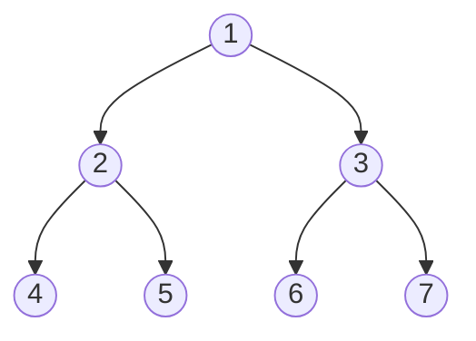
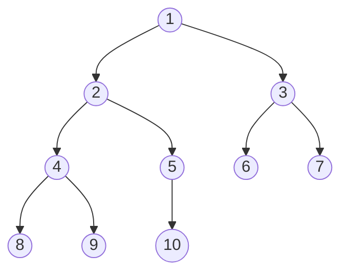

# 栈(stack)
<p class="note note-primary">
栈(stack)是限制插入和删除只能在一 个位置上进行的表,该位置是表的末端,叫做栈顶(top)。它是后进先出(LIFO)的。对栈的基本操作只有 push(进栈)和 pop(出栈)两种,  前者相当于插入,后者相当于删除最后的元素。
</p>

>特点: `先进后出`


# 堆(heap)

<p class="note note-primary">
定义:完全二叉树的数组对象,将根节点最大的堆叫做最大堆或大根堆，根节点最小的堆叫做最小堆或小根堆。
n个元素的序列{k1,k2,ki,…,kn}当且仅当满足下关系时，称之为堆。(ki <= k2i,ki <= k2i+1)或者(ki >= k2i,ki >= k2i+1), (i = 1,2,3,4...n/2)    
</p>

>特点: 非线性数据结构，相当于一维数组，有两个直接后继。常见的堆有二叉堆、斐波那契堆等。

<details>
  <summary><span>堆上浮</span></summary>
  <br>

```java
class Solution {
    //堆上浮调整
    public void upAdjust(int[] array) {
        int childIndex = array.length - 1;
        int parentIndex = (childIndex - 1) / 2;
        //temp保存插入的叶子节点值，用于最后的赋值
        int temp = array[childIndex];
        while (childIndex > 0 && temp < array[parentIndex]) {
            //无需真正交换，单向赋值即可
            array[childIndex] = array[parentIndex];
            childIndex = parentIndex;
            parentIndex = (parentIndex - 1) / 2;
        }
        arr[childIndex] = temp;
    }
}
```

</details>

<details>
  <summary><span>堆下沉</span></summary>
  <br>

```java
class Solution {
    /**
     * 堆下沉调整
     * array 待调整的堆
     * parentIndex 要“下沉”的父节点
     * length 堆的有效大小
     */
    public void downAdjust(int[] array, int parentIndex, int length) {
        int temp = array[parentIndex];//保存父节点值，用于最后复制
        int childIndex = 2 * parentIndex + 1;
        while (childIndex < length) {
            //如果有右孩子，且右孩子小于左孩子的值，则定位到右孩子
            if (childIndex + 1 < length && array[childIndex + 1] < array[childIndex]) {
                childIndex++;
            }
            //如果父节点小于任何一个孩子的值，则直接跳出
            if (temp < array[childIndex]) break;
            //无需真正交换，单向赋值即可
            array[parentIndex] = array[childIndex];
            parentIndex = childIndex;
            childIndex = 2 * childIndex + 1;
        }
        array[parentIndex] = temp;
    }
}
```
</details>

# 普通队列(queue)
<p class="note note-primary">
队列是一种特殊的 线性表 ,特殊之处在于它只允许在表的前端(front)进行删除操作,而在表的后端(rear)进行插入操作,和栈一样,队列是一种操作受限制的线性表。进行插入操作的端称为队尾,进行删除操作的端称为队头。
</p>

>特点: `后进先出`


# 优先队列(PriorityQueue)

- 最大优先队列
<p class="note note-primary">
    无论入队顺序如何，都是当前最大的元素优先出队
</p>

- 最小优先队列
<p class="note note-primary">
    无论入队顺序如何，都是当前最小的元素优先出队
</p>

<details>
  <summary><span>优先队列代码实现</span></summary>
  <br>

```java
public class PriorityQueue {

    private int[] array;
    private int size;

    public PriorityQueue() {
        //队列初始长度为32
        array = new int[32];
    }

    /**
     * 入队
     *
     * @param key 入队元素
     */
    public void enQueue(int key) {
        //队列长度超出范围，扩容
        if (size >= array.length) {
            resize();
        }
        array[size++] = key;
        upAdjust();
    }

    /**
     * 出队
     */
    public int deQueue() throws Exception {
        if (size <= 0) {
            throw new Exception("the queue is empty !");
        }
        //获取堆顶元素
        int head = array[0];
        //让最后一个元素移动到堆顶
        array[0] = array[--size];
        downAdjust();
        return head;
    }

    /**
     * “上浮”调整
     */
    private void upAdjust() {
        int childIndex = size - 1;
        int parentIndex = (childIndex - 1) / 2;
        // temp 保存插入的叶子节点值，用于最后的赋值
        int temp = array[childIndex];
        while (childIndex > 0 && temp > array[parentIndex]) {
        //无须真正交换，单向赋值即可
            array[childIndex] = array[parentIndex];
            childIndex = parentIndex;
            parentIndex = parentIndex / 2;
        }
        array[childIndex] = temp;
    }

    /**
     * “下沉”调整
     */
    private void downAdjust() {
        // temp 保存父节点的值，用于最后的赋值
        int parentIndex = 0;
        int temp = array[parentIndex];
        int childIndex = 1;
        while (childIndex < size) {
        // 如果有右孩子，且右孩子大于左孩子的值，则定位到右孩子
            if (childIndex + 1 < size && array[childIndex + 1] > array[childIndex]) {
                childIndex++;
            }
        // 如果父节点大于任何一个孩子的值，直接跳出
            if (temp >= array[childIndex])
                break;
        //无须真正交换，单向赋值即可
            array[parentIndex] = array[childIndex];
            parentIndex = childIndex;
            childIndex = 2 * childIndex + 1;
        }
        array[parentIndex] = temp;
    }

    /**
     * 队列扩容
     */
    private void resize() {
    //队列容量翻倍
        int newSize = this.size * 2;
        this.array = Arrays.copyOf(this.array, newSize);
    }

    public static void main(String[] args) throws Exception {
        PriorityQueue priorityQueue = new PriorityQueue();
        priorityQueue.enQueue(3);
        priorityQueue.enQueue(5);
        priorityQueue.enQueue(10);
        priorityQueue.enQueue(2);
        priorityQueue.enQueue(7);
        System.out.println(" 出队元素：" + priorityQueue.deQueue());
        System.out.println(" 出队元素：" + priorityQueue.deQueue());
    }

}
```
</details>

# 链表(Link)

<p class="note note-primary">
链表是一种数据结构,和数组同级。比如,Java 中我们使用的 ArrayList,其实现原理是数组。而LinkedList 的实现原理就是链表了。链表在进行循环遍历时效率不高,但是插入和删除时优势明显。
</p>

>特点: `插入、修改速度快、查询速度慢`


# 散列表(Hash Table)

<p class="note note-primary">
散列表(Hash table,也叫哈希表)是一种查找算法,与链表、树等算法不同的是,散列表算法在查找时不需要进行一系列和关键字(关键字是数据元素中某个数据项的值,用以标识一个数据元素)的比较操作。
</p>

散列表算法希望能尽量做到不经过任何比较,通过一次存取就能得到所查找的数据元素,因而必须要在数据元素的存储位置和它的关键字(可用 key 表示)之间建立一个确定的对应关系,使每个关键字和散列表中一个唯一的存储位置相对应。因此在查找时,只要根据这个对应关系找到给定关键字在散列表中的位置即可。这种对应关系被称为散列函数(可用 h(key)表示)。

用的构造散列函数的方法有:
(1)直接定址法: 取关键字或关键字的某个线性函数值为散列地址。即:h(key) = key 或 h(key) = a * key + b,其中 a 和 b 为常数。
(2)数字分析法
(3)平方取值法: 取关键字平方后的中间几位为散列地址。
(4)折叠法:将关键字分割成位数相同的几部分,然后取这几部分的叠加和作为散列地址。
(5)除留余数法:取关键字被某个不大于散列表表长 m 的数 p 除后所得的余数为散列地址,即:h(key) = key MOD p p ≤ m
(6)随机数法:选择一个随机函数,取关键字的随机函数值为它的散列地址,即:h(key) = random(key)

# 树结构(Tree)


计算机科学中的树

| 二叉树           | ▪ [二叉树](http://baike.baidu.com/view/88806.htm)  ▪ [二叉查找树](http://baike.baidu.com/view/389459.htm)  ▪ [笛卡尔树](http://baike.baidu.com/view/6667519.htm)  ▪ [Top tree](http://baike.baidu.com/searchword/?word=Top tree&pic=1&sug=1&enc=utf8)   ▪ [T树](http://baike.baidu.com/searchword/?word=T树&pic=1&sug=1&enc=utf8) |
| ---------------- | ------------------------------------------------------------ |
| 自平衡二叉查找树 | ▪ [AA树](http://baike.baidu.com/searchword/?word=AA树&pic=1&sug=1&enc=utf8)  ▪ [AVL树](http://baike.baidu.com/view/671745.htm)  ▪ [红黑树](http://baike.baidu.com/view/133754.htm)  ▪ [伸展树](http://baike.baidu.com/view/1118088.htm)   ▪ [树堆](http://baike.baidu.com/searchword/?word=树堆&pic=1&sug=1&enc=utf8)  ▪ [节点大小平衡树](http://baike.baidu.com/searchword/?word=节点大小平衡树&pic=1&sug=1&enc=utf8) |
| B树              | ▪ [B树](http://baike.baidu.com/view/298408.htm)  ▪ [B+树](http://baike.baidu.com/view/1168762.htm)  ▪ **B\*树**  ▪ [Bx树](http://baike.baidu.com/searchword/?word=Bx树&pic=1&sug=1&enc=utf8)   ▪ [UB树](http://baike.baidu.com/searchword/?word=UB树&pic=1&sug=1&enc=utf8)  ▪ [2-3树](http://baike.baidu.com/view/1668085.htm)  ▪ [2-3-4树](http://baike.baidu.com/view/1995382.htm)  ▪ [(a,b)-树](http://baike.baidu.com/searchword/?word=(a%2Cb)-树&pic=1&sug=1&enc=utf8)   ▪ [Dancing tree](http://baike.baidu.com/searchword/?word=Dancing tree&pic=1&sug=1&enc=utf8)  ▪ [H树](http://baike.baidu.com/searchword/?word=H树&pic=1&sug=1&enc=utf8) |
| Trie             | ▪ [前缀树](http://baike.baidu.com/searchword/?word=前缀树&pic=1&sug=1&enc=utf8)  ▪ [后缀树](http://baike.baidu.com/view/117678.htm)  ▪ [基数树](http://baike.baidu.com/searchword/?word=基数树&pic=1&sug=1&enc=utf8) |
| 空间划分树       | ▪ [四叉树](http://baike.baidu.com/view/2063378.htm)  ▪ [八叉树](http://baike.baidu.com/view/1035343.htm)  ▪ [k-d树](http://baike.baidu.com/view/8668561.htm)  ▪ [vp-树](http://baike.baidu.com/searchword/?word=vp-树&pic=1&sug=1&enc=utf8)   ▪ [R树](http://baike.baidu.com/view/906563.htm)  ▪ [R*树](http://baike.baidu.com/searchword/?word=R*树&pic=1&sug=1&enc=utf8)  ▪ [R+树](http://baike.baidu.com/searchword/?word=R%2B树&pic=1&sug=1&enc=utf8)  ▪ [X树](http://baike.baidu.com/searchword/?word=X树&pic=1&sug=1&enc=utf8)   ▪ [M树](http://baike.baidu.com/searchword/?word=M树&pic=1&sug=1&enc=utf8)  ▪ [线段树](http://baike.baidu.com/view/670683.htm)  ▪ [希尔伯特R树](http://baike.baidu.com/searchword/?word=希尔伯特R树&pic=1&sug=1&enc=utf8)  ▪ [优先R树](http://baike.baidu.com/searchword/?word=优先R树&pic=1&sug=1&enc=utf8) |
| 非二叉树         | ▪ [Exponential tree](http://baike.baidu.com/searchword/?word=Exponential tree&pic=1&sug=1&enc=utf8)  ▪ [Fusion tree](http://baike.baidu.com/searchword/?word=Fusion tree&pic=1&sug=1&enc=utf8)  ▪ [区间树](http://baike.baidu.com/searchword/?word=区间树&pic=1&sug=1&enc=utf8)  ▪ [PQ tree](http://baike.baidu.com/searchword/?word=PQ tree&pic=1&sug=1&enc=utf8)   ▪ [Range tree](http://baike.baidu.com/searchword/?word=Range tree&pic=1&sug=1&enc=utf8)  ▪ [SPQR tree](http://baike.baidu.com/searchword/?word=SPQR tree&pic=1&sug=1&enc=utf8)  ▪ [Van Emde Boas tree](http://baike.baidu.com/searchword/?word=Van Emde Boas tree&pic=1&sug=1&enc=utf8) |
| 其他类型         | ▪ [堆](http://baike.baidu.com/view/249120.htm)  ▪ [散列树](http://baike.baidu.com/searchword/?word=散列树&pic=1&sug=1&enc=utf8)  ▪ [Finger tree](http://baike.baidu.com/searchword/?word=Finger tree&pic=1&sug=1&enc=utf8)  ▪ [Metric tree](http://baike.baidu.com/searchword/?word=Metric tree&pic=1&sug=1&enc=utf8)   ▪ [Cover tree](http://baike.baidu.com/searchword/?word=Cover tree&pic=1&sug=1&enc=utf8)  ▪ [BK-tree](http://baike.baidu.com/searchword/?word=BK-tree&pic=1&sug=1&enc=utf8)  ▪ [Doubly-chained tree](http://baike.baidu.com/searchword/?word=Doubly-chained tree&pic=1&sug=1&enc=utf8)  ▪ [iDistance](http://baike.baidu.com/searchword/?word=iDistance&pic=1&sug=1&enc=utf8)   ▪ [Link-cut tree](http://baike.baidu.com/searchword/?word=Link-cut tree&pic=1&sug=1&enc=utf8)  ▪ [树状数组](http://baike.baidu.com/view/1420784.htm) |


<details>
  <summary><span>两种存储结构：链表和数组</span></summary>
  <br>


- 数组表示

  

>数组表示按照二叉树深度优先存入二维数组

父节点下标=parent
左子树=2\*parent+1
右子树=2\*parent+2


- 链表表示

  
>left指向左子树,right指向右子树

</details>

# 二叉树(Binary tree)


<p class="note note-primary">
定义: 由一个称为根（root）的元素及两个不相交的、被分别称为左子树和右子树的二叉树组成，是有序树   
</p>




>

# 平衡二叉树(Balance Tree)

>任意节点的子树的高度差都小于等于1,并且左右两个子树都是一棵平衡二叉树。

[详细内容](/2020/12/23/datastructure/平衡二叉树/)

## 完全二叉树

<p class="note note-primary">
    定义:叶子结点只能出现在最下层和次下层，且最下层的叶子结点集中在树的左部。
</p>




>特点：
>具有n个结点的完全二叉树的深度\[log2k]+1（注：[ ]表示向下取整）
>满二叉树肯定是完全二叉树，而完全二叉树不一定是满二叉树

<p class="note note-danger">
完全二叉树判定算法思路
</p>

```text
判断一棵树是否是完全二叉树的思路  
1 如果树为空，则直接返回错
2 如果树不为空：层序遍历二叉树
  2.1 如果一个结点左右孩子都不为空，则pop该节点，将其左右孩子入队列；
  2.1 如果遇到一个结点，左孩子为空，右孩子不为空，则该树一定不是完全二叉树；
  2.2 如果遇到一个结点，左孩子不为空，右孩子为空；或者左右孩子都为空；则该节点之后的队列中的结点都为叶子节点；
  该树才是完全二叉树，否则就不是完全二叉树；
```

# 满二叉树(Full Binary Tree)

<p class="note note-primary">
定义:一个二叉树，如果每一个层的结点数都达到最大值，则这个二叉树就是满二叉树。也就是说，如果一个二叉树的层数为K，且结点总数是(2^k) -1 ，则它就是满二叉树。
</p>


>特点：一个层数为k的满二叉树的叶子结点个数（也就是最后一层）：2^(k-1)
> 结点总数是(2^k) -1

# 二叉排序树(Binary Sort Tree)

<p class="note note-primary">
定义:左子树所有节点值小于它的根节点值,且右子树所有节点值大于它的根节点值,则这样的二叉树就是排序二叉树。
</p>

<p class="note note-danger">
插入操作
</p>
新节点与当前节点比较,如果相同则表示已经存在且不能再重复插入;如果小于当前节点,则到左子树中寻找,如果左子树为空则当前节点为要找的父节点,新节点插入到当前节点的左子树即可;如果大于当前节点,则到右子树中寻找,如果右子树为空则当前节点为要找的父节点,新节点插入到当前节点的右子树即可。


<p class="note note-danger">
删除操作
</p>

删除操作主要分为三种情况,即要删除的节点无子节点,要删除的节点只有一个子节点,要删除的节点有两个子节点。

1. 对于要删除的节点无子节点可以直接删除,即让其父节点将该子节点置空即可。
2. 对于要删除的节点只有一个子节点,则替换要删除的节点为其子节点。
3. 对于要删除的节点有两个子节点,则首先找该节点的替换节点(即右子树中最小的节点),接着替换要删除的节点为替换节点,然后删除替换节点。


<p class="note note-danger">
查询操作    
</p>

查找操作的主要流程为:先和根节点比较,如果相同就返回,如果小于根节点则到左子树中递归查找,如果大于根节点则到右子树中递归查找。因此在排序二叉树中可以很容易获取最大(最右最深子节点)和最小(最左最深子节点)值。

>它能确保任何一个结点的左右子树的`高度差小于两倍`。

[详细参考](https://mikeygithub.github.io/2020/12/27/datastructure/二叉排序树/)

# 红黑树(Red-Black-Tree)

R-B Tree,全称是 Red-Black Tree,又称为“红黑树”,它一种特殊的二叉查找树(近似平衡的二叉搜索树)。红黑树的每个节点上都有存储位表示节点的颜色,可以是红(Red)或黑(Black)。


<p class="note note-primary">
红黑树的特性    
</p>

(1)每个节点或者是黑色,或者是红色。
(2)根节点是黑色。
(3)每个叶子节点(NIL)是黑色。 \[注意:这里叶子节点,是指为空(NIL 或 NULL)的叶子节点!]
(4)如果一个节点是红色的,则它的子节点必须是黑色的。
(5)从一个节点到该节点的子孙节点的所有路径上包含相同数目的黑节点。

<details>
  <summary><span>左旋</span></summary>
  <br>

对 x 进行左旋,意味着,将“x 的右孩子”设为“x 的父亲节点”;即,将 x 变成了一个左节点(x成了为 z 的左孩子)!。 因此,左旋中的“左”,意味着“被旋转的节点将变成一个左节点”。


```cgo
LEFT-ROTATE(T, x)
y ← right[x]
// 前提:这里假设 x 的右孩子为 y。下面开始正式操作
right[x] ← left[y]
// 将 “y 的左孩子” 设为 “x 的右孩子”,即 将β设为 x 的右孩子
p[left[y]] ← x // 将 “x” 设为 “y 的左孩子的父亲”,即 将β的父亲设为 x
p[y] ← p[x] // 将 “x 的父亲” 设为 “y 的父亲”
if p[x] = nil[T]
then root[T] ← y
// 情况 1:如果 “x 的父亲” 是空节点,则将 y 设为根节点
else if x = left[p[x]]
then left[p[x]] ← y
// 情况 2:如果 x 是它父节点的左孩子,则将 y 设为“x 的父节点
的左孩子”
else right[p[x]] ← y // 情况 3:(x 是它父节点的右孩子) 将 y 设为“x 的父节点的右孩
子”
left[y] ← x // 将 “x” 设为 “y 的左孩子”
p[x] ← y // 将 “x 的父节点” 设为 “y”
```


</details>


<details>
  <summary><span>右旋</span></summary>
  <br>

对 x 进行右旋,意味着,将“x 的左孩子”设为“x 的父亲节点”;即,将 x 变成了一个右节点(x成了为 y 的右孩子)! 因此,右旋中的“右”,意味着“被旋转的节点将变成一个右节点”。


```cgo
RIGHT-ROTATE(T, y)
x ← left[y]
// 前提:这里假设 y 的左孩子为 x。下面开始正式操作
left[y] ← right[x] // 将 “x 的右孩子” 设为 “y 的左孩子”,即 将β设为 y 的左孩子
p[right[x]] ← y // 将 “y” 设为 “x 的右孩子的父亲”,即 将β的父亲设为 y
p[x] ← p[y]
// 将 “y 的父亲” 设为 “x 的父亲”
if p[y] = nil[T]
then root[T] ← x
// 情况 1:如果 “y 的父亲” 是空节点,则将 x 设为根节点
else if y = right[p[y]]
then right[p[y]] ← x
// 情况 2:如果 y 是它父节点的右孩子,则将 x 设为“y 的父节
点的左孩子”
else left[p[y]] ← x
// 情况 3:(y 是它父节点的左孩子) 将 x 设为“y 的父节点的左孩
子”
right[x] ← y
p[y] ← x
// 将 “y” 设为 “x 的右孩子”
// 将 “y 的父节点” 设为 “x”
```

</details>


<details>
  <summary><span>添加</span></summary>
  <br>


第一步: 将红黑树当作一颗二叉查找树,将节点插入。

第二步:将插入的节点着色为"红色"。根据被插入节点的父节点的情况,可以将"当节点 z 被着色为红色节点,并插入二叉树"划分为三种情况来处理。

1 情况说明:被插入的节点是根节点。
>处理方法:直接把此节点涂为黑色。

2 情况说明:被插入的节点的父节点是黑色。
>处理方法:什么也不需要做。节点被插入后,仍然是红黑树。

3 情况说明:被插入的节点的父节点是红色。这种情况下,被插入节点是一定存在非空祖父节点的;进一步的讲,被插入节点也一定存在叔叔节点(即使叔叔节点为空,我们也视之为存在,空节点本身就是黑色节点)。理解这点之后,我们依据"叔叔节点的情况",将这种情况进一步划分为 3种情况(Case)。


第三步: 通过一系列的旋转或着色等操作,使之重新成为一颗红黑树。


</details>


<details>
  <summary><span>删除</span></summary>
  <br>

第一步:将红黑树当作一颗二叉查找树,将节点删除。这和"删除常规二叉查找树中删除节点的方法是一样的"。分 3 种情况:
1 被删除节点没有儿子,即为叶节点。那么,直接将该节点删除就 OK 了。
2 被删除节点只有一个儿子。那么,直接删除该节点,并用该节点的唯一子节点顶替它的位置。
3 被删除节点有两个儿子。那么,先找出它的后继节点;然后把“它的后继节点的内容”复制给“该节点的内容”;之后,删除“它的后继节点”。

第二步:通过"旋转和重新着色"等一系列来修正该树,使之重新成为一棵红黑树。

因为"第一步"中删除节点之后,可能会违背红黑树的特性。所以需要通过"旋转和重新着色"来修正该树,使之重新成为一棵红黑树。

选择重着色 3 种情况。

1 情况说明:x 是“红+黑”节点。
>处理方法:直接把 x 设为黑色,结束。此时红黑树性质全部恢复。

2 情况说明:x 是“黑+黑”节点,且 x 是根。

>处理方法:什么都不做,结束。此时红黑树性质全部恢复。

3 情况说明:x 是“黑+黑”节点,且 x 不是根。

>处理方法:这种情况又可以划分为 4 种子情况。这 4 种子情况如下表所示:


</details>

<p class="note note-primary">
AVL VS Red Balck Tree
</p>


[参考资料](https://www.jianshu.com/p/038585421b73)

[代码实现](https://www.cnblogs.com/skywang12345/p/3624343.html)

# B-Tree

B-tree 又叫平衡多路查找树。一棵 m 阶的 B-tree (m 叉树)的特性如下(其中 ceil(x)是一个取上限的函数):

1. 树中每个结点至多有 m 个孩子;

2. 除根结点和叶子结点外,其它每个结点至少有有 ceil(m / 2)个孩子;

3. 若根结点不是叶子结点,则至少有 2 个孩子(特殊情况:没有孩子的根结点,即根结点为叶子结点,整棵树只有一个根节点);

4. 所有叶子结点都出现在同一层,叶子结点不包含任何关键字信息(可以看做是外部结点或查询失败的结点,实际上这些结点不存在,指向这些结点的指针都为 null);

5. 每个非终端结点中包含有 n 个关键字信息: (n,P0,K1,P1,K2,P2,......,Kn,Pn)。其中:

a) Ki (i=1...n)为关键字,且关键字按顺序排序 K(i-1)< Ki。
b) Pi 为指向子树根的接点,且指针 P(i-1)指向子树种所有结点的关键字均小于 Ki,但都大于 K(i-1)。
c) 关键字的个数 n 必须满足: ceil(m / 2)-1 <= n <= m-1。


一棵 m 阶的 B+tree 和 m 阶的 B-tree 的差异在于:
1.有 n 棵子树的结点中含有 n 个关键字; (B-tree 是 n 棵子树有 n-1 个关键字)
2.所有的叶子结点中包含了全部关键字的信息,及指向含有这些关键字记录的指针,且叶子结点本身依关键字的大小自小而大的顺序链接。 (B-tree 的叶子节点并没有包括全部需要查找的信息)
3.所有的非终端结点可以看成是索引部分,结点中仅含有其子树根结点中最大(或最小)关键字。
(B-tree 的非终节点也包含需要查找的有效信息)


# B+树(B+Tree)

[参考](https://mikeygithub.github.io/2020/12/27/datastructure/B%E6%A0%91B+%E6%A0%91B*%E6%A0%91/)

# B*树(B*Tree)

[参考](https://mikeygithub.github.io/2020/12/27/datastructure/B%E6%A0%91B+%E6%A0%91B*%E6%A0%91/)

# 哈夫曼树

>给定N个权值作为N个叶子结点，构造一棵二叉树，若该树的带权路径长度达到最小，称这样的二叉树为最优二叉树，也称为哈夫曼树(Huffman Tree)。哈夫曼树是带权路径长度最短的树，权值较大的结点离根较近。

>设二叉树具有n个带权值的叶结点，那么从根结点到各个叶结点的路径长度与相应结点权值的乘积的和，叫做二叉树的带权路径长度。


<p class="note note-primary">
    对于具有n个叶子结点的哈夫曼树，共有2n-1个结点
</p>


```cgo
typedef struct{
    char data;//结点值
    double weight;//权重
    int parent;//双亲结点
    int lchild;//左孩子结点
    int rchild;//右孩子结点
}HTNode;
```


<p class="note note-danger">
    相同的叶结点构造出不同的二叉树
</p>


>具有最小带权路径长度的二叉树称为哈夫曼树（也称最优树）


构造哈夫曼树的原则：
```text
权值越大的叶结点越靠近根结点。
权值越小的叶结点越远离根结点
```

构造哈夫曼树的过程：
```text
 （1）给定的n个权值{W1，W2，…，Wn}构造n棵只有一个叶结点的二叉树，从而得到一个二叉树的集合F={T1，T2，…，Tn}。
 （2）在F中选取根结点的权值最小和次小的两棵二叉树作为左、右子树构造一棵新的二叉树，这棵新的二叉树根结点的权值为其左、右子树根结点权值之和。
 （3）在集合F中删除作为左、右子树的两棵二叉树，并将新建立的二叉树加入到集合F中。
 （4）重复（2）、（3）两步，当F中只剩下一棵二叉树时，这棵二叉树便是所要建立的哈夫曼树。
```


哈夫曼树的特点:
```text
n1 = 0：因为每次两棵树合并。
n = n0+n1+n2 = n0+n2 = 2n0-1
```

## 哈夫曼编码
>规定哈夫曼树中的左分支为0，右分支为1，则从根结点到每个叶结点所经过的分支对应的0和1组成的序列便为该结点对应字符的编码。这样的编码称为哈夫曼编码。

<p class="note note-primary">
    哈夫曼编码特点：权值越大的字符编码越短，反之越长。哈夫曼编码属0、1二进制编码
</p>


<p class="note note-danger">
    在一组字符的哈夫曼编码中，不可能出现一个字符的哈夫曼编码是另一个字符哈夫曼编码的前缀。哈夫曼编码也称为前缀编码。
</p>

# 位图(graph)

>位图的原理就是用一个 bit 来标识一个数字是否存在,采用一个 bit 来存储一个数据,所以这样可以大大的节省空间。 bitmap 是很常用的数据结构,比如用于 Bloom Filter 中;用于无重复整数的排序等等。bitmap 通常基于数组来实现,数组中每个元素可以看成是一系列二进制数,所有元素组成更大的二进制集合。

[参考资料](https://www.cnblogs.com/polly333/p/4760275.html)


# 布隆管理器(Bloom Filter)

布隆过滤器是Bloom于1970年提出的，其由二进制向量(或者位数组)和一系列随机映射函数(哈希函数)两个部分组成的数据结构。


位数组中的每个元素都只占用 1 bit ，并且每个元素只能是 0 或者 1。这样申请一个 100w 个元素的位数组只占用 1000000Bit / 8 = 125000 Byte = 125000/1024 kb ≈ 122kb 的空间


<details>
    <summary>
        <span>代码实现</span>
    </summary>

```java
package main;

import java.io.Serializable;
import java.nio.charset.Charset;
import java.security.MessageDigest;
import java.security.NoSuchAlgorithmException;
import java.util.BitSet;
import java.util.Collection;

public class BloomFilter<E> implements Serializable {

    private static final long serialVersionUID = -2326638072608273135L;
    private BitSet bitset;
    private int bitSetSize;
    private double bitsPerElement;
    private int expectedNumberOfFilterElements;//可以加入的元素的最大个数
    private int numberOfAddedElements;//过滤器容器中元素的实际数量
    private int k; // 哈希函数的个数

    static final Charset charset = Charset.forName("UTF-8");//存储哈希值的字符串的编码方式

    static final String hashName = "MD5"; //在大多数情况下，MD5提供了较好的散列准确度。如有必要，可以换成 SHA1算法
    static final MessageDigest digestFunction;//MessageDigest类用于为应用程序提供信息摘要算法的功能，如 MD5 或 SHA 算法
    static { // 初始化 MessageDigest 的摘要算法对象
        MessageDigest tmp;
        try {
            tmp = java.security.MessageDigest.getInstance(hashName);
        } catch (NoSuchAlgorithmException e) {
            tmp = null;
        }
        digestFunction = tmp;
    }

    /**
     * 构造一个空的布隆过滤器. 过滤器的长度为c*n
     * @param c
     *            表示每一个元素占有多少位
     * @param n
     *            表示过滤器能加入的最大元素数量
     * @param k
     *            表示须要使用的哈希函数的个数
     */
    public BloomFilter(double c, int n, int k) {
        this.expectedNumberOfFilterElements = n;
        this.k = k;
        this.bitsPerElement = c;
        this.bitSetSize = (int) Math.ceil(c * n);
        numberOfAddedElements = 0;
        this.bitset = new BitSet(bitSetSize);
    }

    /**
     * 构造一个空的布隆过滤器。最优哈希函数的个数将由过滤器的总大小和期望元素个数来确定。
     *
     * @param bitSetSize
     *            指定了过滤器的总大小
     * @param expectedNumberOElements
     *            指定了过滤器能加入的最大的元素数量
     */
    public BloomFilter(int bitSetSize, int expectedNumberOElements) {
        this(bitSetSize / (double) expectedNumberOElements,  expectedNumberOElements, (int) Math.round((bitSetSize / (double) expectedNumberOElements)* Math.log(2.0)));
    }

    /**
     * 通过指定误报率来构造一个过滤器。

     * 每一个元素所占的位数和哈希函数的数量会依据误报率来得出。
     *
     * @param falsePositiveProbability
     *            所期望误报率.
     * @param expectedNumberOfElements
     *            要加入的元素的数量
     */
    public BloomFilter(double falsePositiveProbability, int expectedNumberOfElements) {
        this(Math.ceil(-(Math.log(falsePositiveProbability) / Math.log(2)))/ Math.log(2), // c = k/ln(2)
                expectedNumberOfElements,
                (int) Math.ceil(-(Math.log(falsePositiveProbability) / Math.log(2)))); // k = ln(2)m/n
    }

    /**
     * 依据旧过滤器的数据。又一次构造一个新的过滤器
     *
     * @param bitSetSize
     *            指定了过滤器所需位的大小
     * @param expectedNumberOfFilterElements
     *            指定了过滤器所能加入的元素的最大数量
     *            to contain.
     * @param actualNumberOfFilterElements
     *            指定了原来过滤器的数据的数量
     *            <code>filterData</code> BitSet.
     * @param filterData
     *            原有过滤器中的BitSet对象
     */
    public BloomFilter(int bitSetSize, int expectedNumberOfFilterElements,
                       int actualNumberOfFilterElements, BitSet filterData) {
        this(bitSetSize, expectedNumberOfFilterElements);
        this.bitset = filterData;
        this.numberOfAddedElements = actualNumberOfFilterElements;
    }

    /**
     * 依据字符串的内容生成摘要
     *
     * @param val
     *            字符串的内容
     * @param charset
     *            输入数据的编码方式
     * @return    输出为一个long类型
     */
    public static long createHash(String val, Charset charset) {
        return createHash(val.getBytes(charset));
    }

    /**
     * 依据字符串内容生成摘要
     *
     * @param val
     *            指定了输入的字符串。默认的编码为 UTF-8
     * @return 输出为一个long类型
     */
    public static long createHash(String val) {
        return createHash(val, charset);
    }

    /**
     * 依据字节数组生成摘要
     *
     * @param data
     *            输入数据
     * @return 输出为long类型的摘要
     */
    public static long createHash(byte[] data) {
        long h = 0;
        byte[] res;

        synchronized (digestFunction) {
            res = digestFunction.digest(data);
        }

        for (int i = 0; i < 4; i++) {
            h <<= 8;
            h |= ((int) res[i]) & 0xFF;
        }
        return h;
    }

    /**
     * 重写equals方法
     */
    @Override
    public boolean equals(Object obj) {
        if (obj == null) {
            return false;
        }
        if (getClass() != obj.getClass()) {
            return false;
        }
        final BloomFilter<E> other = (BloomFilter<E>) obj;
        if (this.expectedNumberOfFilterElements != other.expectedNumberOfFilterElements) {
            return false;
        }
        if (this.k != other.k) {
            return false;
        }
        if (this.bitSetSize != other.bitSetSize) {
            return false;
        }
        if (this.bitset != other.bitset
                && (this.bitset == null || !this.bitset.equals(other.bitset))) {
            return false;
        }
        return true;
    }

    /**
     * 重写了hashCode方法
     *
     */
    @Override
    public int hashCode() {
        int hash = 7;
        hash = 61 * hash + (this.bitset != null ? this.bitset.hashCode() : 0);
        hash = 61 * hash + this.expectedNumberOfFilterElements;
        hash = 61 * hash + this.bitSetSize;
        hash = 61 * hash + this.k;
        return hash;
    }

    /**
     * 依据最大元素数量和过滤器的大小来计算误报率。


     * 方法的返回值为误报率。假设插入的元素个数小于最大值，则误报率会比返回值要小。
     *
     * @return 期望的误报率.
     */
    public double expectedFalsePositiveProbability() {
        return getFalsePositiveProbability(expectedNumberOfFilterElements);
    }

    /**
     * 通过插入的元素数量和过滤器容器大小来计算实际的误报率。
     *
     * @param numberOfElements
     *            插入的元素的个数.
     * @return 误报率.
     */
    public double getFalsePositiveProbability(double numberOfElements) {
        // (1 - e^(-k * n / m)) ^ k
        return Math.pow((1 - Math.exp(-k * (double) numberOfElements
                / (double) bitSetSize)), k);

    }

    /**
     * 通过实际插入的元素数量和过滤器容器大小来计算实际的误报率。


     *
     * @return 误报率.
     */
    public double getFalsePositiveProbability() {
        return getFalsePositiveProbability(numberOfAddedElements);
    }

    /**
     * 返回哈希函数的个数 k
     *
     * @return  k.
     */
    public int getK() {
        return k;
    }

    /**
     * 清空过滤器元素
     */
    public void clear() {
        bitset.clear();
        numberOfAddedElements = 0;
    }

    /**
     * 向过滤器中加入元素。
     * 加入的元素的toString()方法将会被调用。返回的字符串作为哈希函数的输出。


     *
     * @param element
     *            要加入的元素
     */
    public void add(E element) {
        long hash;
        String valString = element.toString();
        for (int x = 0; x < k; x++) {
            hash = createHash(valString + Integer.toString(x));
            hash = hash % (long) bitSetSize;
            bitset.set(Math.abs((int) hash), true);
        }
        numberOfAddedElements++;
    }

    /**
     * 加入一个元素集合到过滤器中
     *
     * @param c
     *            元素集合.
     */
    public void addAll(Collection<?

            extends E> c) {
        for (E element : c)
            add(element);
    }

    /**
     * 用来推断元素是否在过滤器中。

     假设已存在。返回 true。
     *
     * @param element
     *            要检查的元素.
     * @return 假设预计该元素已存在。则返回true
     */
    public boolean contains(E element) {
        long hash;
        String valString = element.toString();
        for (int x = 0; x < k; x++) {
            hash = createHash(valString + Integer.toString(x));
            hash = hash % (long) bitSetSize;
            if (!bitset.get(Math.abs((int) hash)))
                return false;
        }
        return true;
    }

    /**
     * 推断一个集合中的元素是否都在过滤器中。


     *
     * @param c
     *            要检查的元素集合
     * @return 假设集合全部的元素都在过滤器中。则返回true。
     */
    public boolean containsAll(Collection<? extends E> c) {
        for (E element : c)
            if (!contains(element))
                return false;
        return true;
    }

    /**
     * 得到某一位的值
     *
     * @param bit
     *            bit的位置.
     * @return 假设该位被设置，则返回true。


     */
    public boolean getBit(int bit) {
        return bitset.get(bit);
    }

    /**
     * 设置过滤器某一位的值
     *
     * @param bit
     *            要设置的位置.
     * @param value
     *            true表示已经成功设置。

    false表示改为被清除。
     */
    public void setBit(int bit, boolean value) {
        bitset.set(bit, value);
    }

    /**
     * 返回存放信息的位数组.
     *
     * @return 位数组.
     */
    public BitSet getBitSet() {
        return bitset;
    }

    /**
     * 得到过滤器中位数组个大小。
     *
     * @return 数组大小.
     */
    public int size() {
        return this.bitSetSize;
    }

    /**
     * 返回已加入的元素的个数
     *
     * @return 元素个数.
     */
    public int count() {
        return this.numberOfAddedElements;
    }

    /**
     * 得到能加入的元素的最大数量
     *
     * @return  最大数量.
     */
    public int getExpectedNumberOfElements() {
        return expectedNumberOfFilterElements;
    }

    /**
     * 得到每一个元素占用的位的个数的期望值
     *
     * @return 每一个元素占用的位数
     */
    public double getExpectedBitsPerElement() {
        return this.bitsPerElement;
    }

    /**
     * 得到每一个元素占用位数的实际值
     *
     * @return 每一个元素占用的位数.
     */
    public double getBitsPerElement() {
        return this.bitSetSize / (double) numberOfAddedElements;
    }
}
```

</details>

优点 

1. 占用空间小，节省内存空间。
2. 查询效率高，相对于普通的容器结构。


缺点
  1.返回的数据结果是概率性的，并不是完全准确，在数据量越多误报可能性越大。

原理

  1.当元素加入布隆过滤器的时候，会对元素进行哈希运算，得到其哈希值（有几个函数得到几个哈希值）
  2.根据得到的哈希值，在位数组中把对应的下标的值设置为1。
  3.在对数据查询判断时对其取哈希如果每个哈希对应的元素的数组值都为1则该数据存在。


特点
  布隆过滤器检测存在该元素其可能出现误判，布隆过滤器检测该元素不存在则该元素一定不存在。

应用场景

1. 防止恶意请求，缓存穿透，垃圾邮件，黑名单。
2. 去重功能。

实际应用
1. 比特币网络
2. 分布式系统(Map-Reduce) - Hadoop、Search engine
3. Redis缓存
4. 垃圾邮件、评论等的过滤


# 最近使用缓存(LRU Cache)

- 两个要素: 大小、替换策略
- HashTable + Double LinkedList
- O(1)查询、O(1)修改、更新

<details>
    <summary>
        <span>LRU Cache</span>
    </summary>

```java
public class LRUCache {
    class DLinkedNode {
        int key;
        int value;
        DLinkedNode prev;
        DLinkedNode next;

        public DLinkedNode() {
        }

        public DLinkedNode(int _key, int _value) {
            key = _key;
            value = _value;
        }
    }

    private Map<Integer, DLinkedNode> cache = new HashMap<Integer, DLinkedNode>();
    private int size;
    private int capacity;
    private DLinkedNode head, tail;

    public LRUCache(int capacity) {
        this.size = 0;
        this.capacity = capacity;
        // 使用伪头部和伪尾部节点
        head = new DLinkedNode();
        tail = new DLinkedNode();
        head.next = tail;
        tail.prev = head;
    }

    public int get(int key) {
        DLinkedNode node = cache.get(key);
        if (node == null) {
            return -1;
        }
        // 如果 key 存在，先通过哈希表定位，再移到头部
        moveToHead(node);
        return node.value;
    }

    public void put(int key, int value) {
        DLinkedNode node = cache.get(key);
        if (node == null) {
            // 如果 key 不存在，创建一个新的节点
            DLinkedNode newNode = new DLinkedNode(key, value);
            // 添加进哈希表
            cache.put(key, newNode);
            // 添加至双向链表的头部
            addToHead(newNode);
            ++size;
            if (size > capacity) {
                // 如果超出容量，删除双向链表的尾部节点
                DLinkedNode tail = removeTail();
                // 删除哈希表中对应的项
                cache.remove(tail.key);
                --size;
            }
        } else {
            // 如果 key 存在，先通过哈希表定位，再修改 value，并移到头部
            node.value = value;
            moveToHead(node);
        }
    }

    private void addToHead(DLinkedNode node) {
        node.prev = head;
        node.next = head.next;
        head.next.prev = node;
        head.next = node;
    }

    private void removeNode(DLinkedNode node) {
        node.prev.next = node.next;
        node.next.prev = node.prev;
    }

    private void moveToHead(DLinkedNode node) {
        removeNode(node);
        addToHead(node);
    }

    private DLinkedNode removeTail() {
        DLinkedNode res = tail.prev;
        removeNode(res);
        return res;
    }
}
```

</details>

# 参考资料


[数据结构-在线演示](https://www.cs.usfca.edu/~galles/visualization/Algorithms.html)