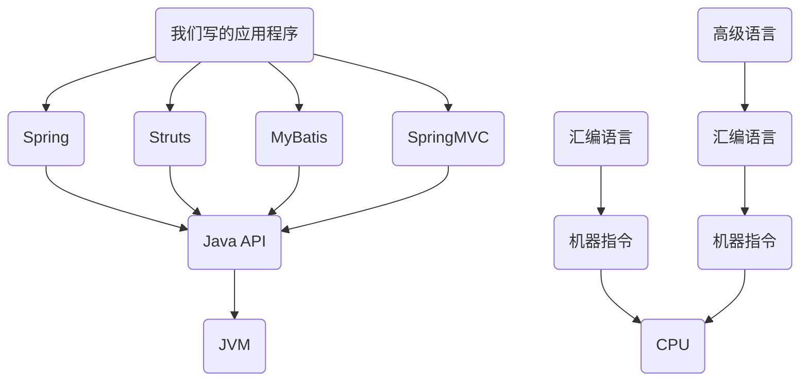
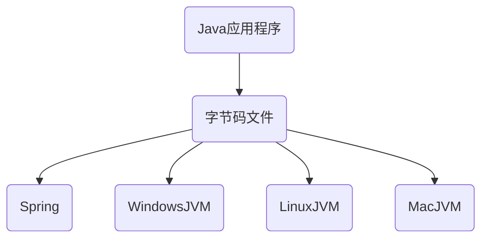
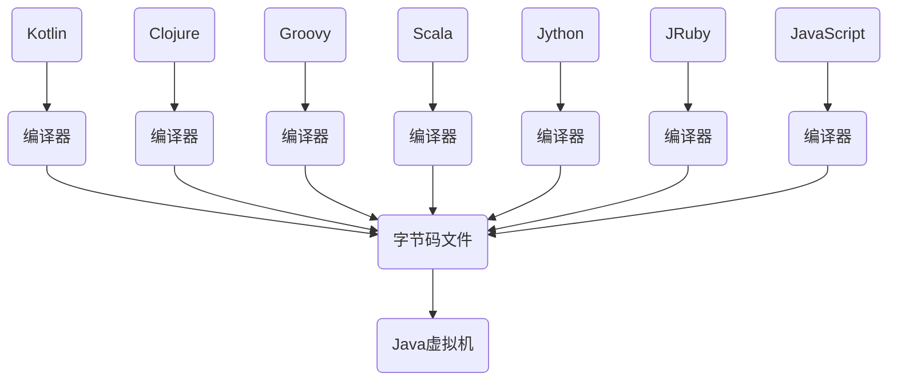

# 01-JVM内存与垃圾回收篇概述

Java Virtual Machine(JVM):

>**Java virtual machine** (**JVM**) is a [virtual machine](https://en.wikipedia.org/wiki/Virtual_machine) that enables a computer to run [Java](https://en.wikipedia.org/wiki/Java_(software_platform)) programs as well as programs written in [other languages](https://en.wikipedia.org/wiki/List_of_JVM_languages) that are also compiled to [Java bytecode](https://en.wikipedia.org/wiki/Java_bytecode). The JVM is detailed by a [specification](https://en.wikipedia.org/wiki/Specification_(technical_standard)) that formally describes what is required in a JVM implementation. Having a specification ensures interoperability of Java programs across different implementations so that program authors using the [Java Development Kit](https://en.wikipedia.org/wiki/Java_Development_Kit) (JDK) need not worry about idiosyncrasies of the underlying hardware platform.

Java Memary Model(JMM):

> The **Java memory model** describes how [threads](https://en.wikipedia.org/wiki/Thread_(computer_science)) in the [Java programming language](https://en.wikipedia.org/wiki/Java_(programming_language)) interact through memory. Together with the description of single-threaded execution of code, the memory model provides the [semantics](https://en.wikipedia.org/wiki/Formal_semantics_of_programming_languages) of the Java programming language.

Garbage Collection(GC):

> Java garbage collection is the process by which Java programs perform automatic memory management. Java programs compile to bytecode that can be run on a Java Virtual Machine, or JVM for short. When Java programs run on the JVM, objects are created on the heap, which is a portion of memory dedicated to the program. Eventually, some objects will no longer be needed. The garbage collector finds these unused objects and deletes them to free up memory.

# 02-如何看待Java上层技术与JVM




# 05-官方规范下载与参考书目

- [The Java® Virtual Machine Specification](https://docs.oracle.com/javase/specs/jvms/se7/html/)

- 《深入了解Java虚拟机》

# 06-跨平台的语言Java和跨语言的平台JVM

[TIOBE语言热度排行榜](https://www.tiobe.com/tiobe-index/)

> Java是目前应用最为广泛的软件开发平台之一

- 作为平台。Java虚拟机有着举足轻重的作用，Groovy、Scala、JRuby、Kotlin等都是Java平台的一部分。
- 作为一种文化。Java几乎成为开源的代名词，第三方开源框架、JDK和JVM也有开源实现，如OpenJDK。
- 作为一个社区。Java拥有全世界最多的技术拥护者和开源社区支持，生态丰富。





# 07-字节码与多语言混合编程

1. Java平台上的多语言混合编程正成为主流，通过特定领域的语言去解决特定领域的问题是当前软件开发应对日趋复杂的项目需求的一个方向。
2. 试想一下，在一个项目之中，并行处理用Clojure语言编写，展示层使用JRuby/Rails，中间层则是Java，每个应用层都将使用不同的编程语言来完成，而且，接口对每一层的开发者都是透明的，各种语言之间的交互不存在任何困难，就像使用自己语言的原生API一样方便，因为它们最终都运行在一个虚拟机之上。
3. 对这些运行于Java虚拟机之上、Java之外的语言，来自系统级的、底层的支持正在迅速增强，以JSR-292为核心的一系列项目和功能改进（如DaVinci Machine项目、Nashorn引擎、InvokeDynamic指令、java.lang.invoke包等），推动Java虚拟机从“Java语言的虚拟机”向 “多语言虚拟机”的方向发展。

# 08-Java及JVM历史上的重大事件

- 1990年，在Sun计算机公司中，由Patrick Naughton、MikeSheridan及James Gosling领导的小组Green Team，开发出的新的程序语言，命名为Oak，后期命名为Java
- 1995年，Sun正式发布Java和HotJava产品，Java首次公开亮相。
- 1996年1月23日Sun Microsystems发布了JDK 1.0。
- 1998年，JDK1.2版本发布。同时，Sun发布了JSP/Servlet、EJB规范，以及将Java分成了J2EE、J2SE和J2ME。这表明了Java开始向企业、桌面应用和移动设备应用3大领域挺进。
- 2000年，JDK1.3发布，Java HotSpot Virtual Machine正式发布，成为Java的默认虚拟机。
- 2002年，JDK1.4发布，古老的Classic虚拟机退出历史舞台。
- 2003年年底，Java平台的scala正式发布，同年Groovy也加入了Java阵营。
- 2004年，JDK1.5发布。同时JDK1.5改名为JavaSE5.0。
- 2006年，JDK6发布。同年，Java开源并建立了OpenJDK。顺理成章，Hotspot虚拟机也成为了OpenJDK中的默认虚拟机。
- 2007年，Java平台迎来了新伙伴Clojure。
- 2008年，oracle收购了BEA，得到了JRockit虚拟机。
- 2009年，Twitter宣布把后台大部分程序从Ruby迁移到Scala，这是Java平台的又一次大规模应用。
- 2010年，Oracle收购了Sun，获得Java商标和最真价值的HotSpot虚拟机。此时，Oracle拥有市场占用率最高的两款虚拟机HotSpot和JRockit，并计划在未来对它们进行整合：HotRockit。JCP组织管理Java语言
- 2011年，JDK7发布。在JDK1.7u4中，正式启用了新的垃圾回收器G1。
- **2017年，JDK9发布。将G1设置为默认GC，替代CMS**
- 同年，IBM的J9开源，形成了现在的Open J9社区
- 2018年，Android的Java侵权案判决，Google赔偿Oracle计88亿美元
- 同年，Oracle宣告JavagE成为历史名词JDBC、JMS、Servlet赠予Eclipse基金会
- **同年，JDK11发布，LTS版本的JDK，发布革命性的ZGC，调整JDK授权许可**
- 2019年，JDK12发布，加入RedHat领导开发的Shenandoah GC

# 09-虚拟机与Java虚拟机介绍

### 虚拟机概念

- 所谓虚拟机（Virtual Machine），就是一台虚拟的计算机。它是一款软件，用来执行一系列虚拟计算机指令。大体上，虚拟机可以分为系统虚拟机和程序虚拟机。

  - 大名鼎鼎的Virtual Box，VMware就属于系统虚拟机，它们完全是对物理计算机硬件的仿真(模拟)，提供了一个可运行完整操作系统的软件平台。

  - 程序虚拟机的典型代表就是Java虚拟机，它专门为执行单个计算机程序而设计，在Java虚拟机中执行的指令我们称为Java字节码指令。

- 无论是系统虚拟机还是程序虚拟机，在上面运行的软件都被限制于虚拟机提供的资源中。

### Java虚拟机

1. Java虚拟机是一台执行Java字节码的虚拟计算机，它拥有独立的运行机制，其运行的Java字节码也未必由Java语言编译而成。
2. JVM平台的各种语言可以共享Java虚拟机带来的跨平台性、优秀的垃圾回器，以及可靠的即时编译器。
3. **Java技术的核心就是Java虚拟机**（JVM，Java Virtual Machine），因为所有的Java程序都运行在Java虚拟机内部。

**作用：**

Java虚拟机就是二进制字节码的运行环境，负责装载字节码到其内部，解释/编译为对应平台上的机器指令执行。每一条Java指令，Java虚拟机规范中都有详细定义，如怎么取操作数，怎么处理操作数，处理结果放在哪里。

**特点：**

1. 一次编译，到处运行
2. 自动内存管理
3. 自动垃圾回收功能

# 10-JVM的位置


# 11-JVM的整体结构

- HotSpot VM是目前市面上高性能虚拟机的代表作之一。
- 它采用解释器与即时编译器并存的架构。
- 在今天，Java程序的运行性能早已脱胎换骨，已经达到了可以和C/C++程序一较高下的地步。


执行引擎包含三部分：`解释器`，`及时编译器`，`垃圾回收器`

# 12-Java代码执行流程


只是能生成被Java虚拟机所能解释的字节码文件，那么理论上就可以自己设计一套代码了

# 13-区分栈的指令集架构和寄存器的指令集架构

Java编译器输入的指令流基本上是一种基于栈的指令集架构，另外一种指令集架构则是基于寄存器的指令集架构。具体来说：这两种架构之间的区别：

基于`栈式架构`的特点

- 设计和实现更简单，适用于资源受限的系统；
- 避开了寄存器的分配难题：使用零地址指令方式分配。
- 指令流中的指令大部分是零地址指令，其执行过程依赖于操作栈。指令集更小，编译器容易实现。
- 不需要硬件支持，可移植性更好，更好实现跨平台

基于寄存器架构的特点

- 典型的应用是x86的二进制指令集：比如传统的PC以及Android的Davlik虚拟机。
- 指令集架构则完全依赖硬件，可移植性差
- 性能优秀和执行更高效
- 花费更少的指令去完成一项操作。
- 在大部分情况下，基于寄存器架构的指令集往往都以一地址指令、二地址指令和三地址指令为主，而基于栈式架构的指令集却是以零地址指令为主方水洋

### 举例

同样执行2+3这种逻辑操作，其指令分别如下：

基于栈的计算流程（以Java虚拟机为例）：

```
iconst_2 //常量2入栈
istore_1
iconst_3 // 常量3入栈
istore_2
iload_1
iload_2
iadd //常量2/3出栈，执行相加
istore_0 // 结果5入栈
```

而基于寄存器的计算流程

```
mov eax,2 //将eax寄存器的值设为1
add eax,3 //使eax寄存器的值加3
```

### 字节码反编译

我们编写一个简单的代码，然后查看一下字节码的反编译后的结果

```
public class StackStruTest {
    public static void main(String[] args) {
        int i = 2 + 3;
    }
}
```

然后我们找到编译后的 class文件，使用下列命令进行反编译

```
javap -v StackStruTest.class
```

得到的文件为:

```
  public static void main(java.lang.String[]);
    descriptor: ([Ljava/lang/String;)V
    flags: ACC_PUBLIC, ACC_STATIC
    Code:
      stack=2, locals=4, args_size=1
         0: iconst_2
         1: istore_1
         2: iconst_3
         3: istore_2
         4: iload_1
         5: iload_2
         6: iadd
         7: istore_3
         8: return
      LineNumberTable:
        line 9: 0
        line 10: 2
        line 11: 4
        line 12: 8
      LocalVariableTable:
        Start  Length  Slot  Name   Signature
            0       9     0  args   [Ljava/lang/String;
            2       7     1     i   I
            4       5     2     j   I
            8       1     3     k   I
```

## 总结

由于跨平台性的设计，Java的指令都是根据栈来设计的。不同平台CPU架构不同，所以不能设计为基于寄存器的。优点是跨平台，指令集小，编译器容易实现，缺点是性能下降，实现同样的功能需要更多的指令。

时至今日，尽管嵌入式平台已经不是Java程序的主流运行平台了（准确来说应该是HotSpotVM的宿主环境已经不局限于嵌入式平台了），那么为什么不将架构更换为基于寄存器的架构呢？

### 栈

- 跨平台性
- 指令集小
- 指令多
- 执行性能比寄存器差

# 14-JVM的生命周期

### 虚拟机的启动

Java虚拟机的启动是通过引导类加载器（bootstrap class loader）创建一个初始类（initial class）来完成的，这个类是由虚拟机的具体实现指定的。

### 虚拟机的执行

- 一个运行中的Java虚拟机有着一个清晰的任务：执行Java程序。
- 程序开始执行时他才运行，程序结束时他就停止。
- 执行一个所谓的Java程序的时候，真真正正在执行的是一个叫做Java虚拟机的进程。

### 虚拟机的退出

有如下的几种情况：

- 程序正常执行结束
- 程序在执行过程中遇到了异常或错误而异常终止
- 由于操作系统用现错误而导致Java虚拟机进程终止
- 某线程调用Runtime类或system类的exit方法，或Runtime类的halt方法，并且Java安全管理器也允许这次exit或halt操作。
- 除此之外，JNI（Java Native Interface）规范描述了用JNI Invocation API来加载或卸载 Java虚拟机时，Java虚拟机的退出情况。

# 15-SUN Classic VM的介绍

- 早在1996年Java1.0版本的时候，Sun公司发布了一款名为sun classic VM的Java虚拟机，它同时也是世界上第一款商用Java虚拟机，JDK1.4时完全被淘汰。
- 这款虚拟机内部只提供解释器。现在还有及时编译器，因此效率比较低，而及时编译器会把热点代码缓存起来，那么以后使用热点代码的时候，效率就比较高。
- 如果使用JIT编译器，就需要进行外挂。但是一旦使用了JIT编译器，JIT就会接管虚拟机的执行系统。解释器就不再工作。解释器和编译器不能配合工作。
- 现在hotspot内置了此虚拟机。

# 16-Exact VM的介绍

为了解决上一个虚拟机问题，jdk1.2时，sun提供了此虚拟机。 Exact Memory Management：准确式内存管理

- 也可以叫Non-Conservative/Accurate Memory Management
- 虚拟机可以知道内存中某个位置的数据具体是什么类型。|

具备现代高性能虚拟机的维形

- 热点探测（寻找出热点代码进行缓存）
- 编译器与解释器混合工作模式

只在solaris平台短暂使用，其他平台上还是classic vm，英雄气短，终被Hotspot虚拟机替换

# 17-HotSpot VM的介绍

HotSpot历史

- 最初由一家名为“Longview Technologies”的小公司设计
- 1997年，此公司被sun收购；2009年，Sun公司被甲骨文收购。
- JDK1.3时，HotSpot VM成为默认虚拟机

目前Hotspot占有绝对的市场地位，称霸武林。

- 不管是现在仍在广泛使用的JDK6，还是使用比例较多的JDK8中，默认的虚拟机都是HotSpot
- Sun/oracle JDK和openJDK的默认虚拟机
- 其他两个商用虚机都没有方法区的概念

从服务器、桌面到移动端、嵌入式都有应用。

名称中的HotSpot指的就是它的热点代码探测技术。

- 通过计数器找到最具编译价值代码，触发即时编译或栈上替换
- 通过编译器与解释器协同工作，在最优化的程序响应时间与最佳执行性能中取得平衡

# 18-JRockit VM的介绍

专注于服务器端应用

- 它可以不太关注程序启动速度，因此JRockit内部不包含解析器实现，全部代码都靠即时编译器编译后执行。

大量的行业基准测试显示，JRockit JVM是世界上最快的JVM。

- 使用JRockit产品，客户已经体验到了显著的性能提高（一些超过了70%）和硬件成本的减少（达50%）。

优势：全面的Java运行时解决方案组合

- JRockit面向延迟敏感型应用的解决方案JRockit Real Time提供以毫秒或微秒级的JVM响应时间，适合财务、军事指挥、电信网络的需要
- MissionControl服务套件，它是一组以极低的开销来监控、管理和分析生产环境中的应用程序的工具。

2008年，JRockit被oracle收购。

oracle表达了整合两大优秀虚拟机的工作，大致在JDK8中完成。整合的方式是在HotSpot的基础上，移植JRockit的优秀特性。

高斯林：目前就职于谷歌，研究人工智能和水下机器人

# 19-IBM J9 VM的介绍

全称：IBM Technology for Java Virtual Machine，简称IT4J，内部代号：J9

市场定位与HotSpot接近，服务器端、桌面应用、嵌入式等多用途VM广泛用于IBM的各种Java产品。

目前，有影响力的三大商用虚拟机之一，也号称是世界上最快的Java虚拟机。

2017年左右，IBM发布了开源J9VM，命名为openJ9，交给EClipse基金会管理，也称为Eclipse OpenJ9

OpenJDK -> 是JDK开源了，包括了虚拟机

# 20-KVM、CDC、CLDC的介绍

racle在Java ME产品线上的两款虚拟机为：CDC/CLDC HotSpot Implementation VM KVM（Kilobyte）是CLDC-HI早期产品目前移动领域地位尴尬，智能机被Angroid和ioS二分天下。

KVM简单、轻量、高度可移植，面向更低端的设备上还维持自己的一片市场

- 智能控制器、传感器
- 老人手机、经济欠发达地区的功能手机

所有的虚拟机的原则：一次编译，到处运行。

# 21-Azul VM和BEA Liquid VM的介绍

###  Azul VM

前面三大“高性能Java虚拟机”使用在通用硬件平台上这里Azu1VW和BEALiquid VM是与特定硬件平台绑定、软硬件配合的专有虚拟机I

- 高性能Java虚拟机中的战斗机。

Azul VM是Azu1Systems公司在HotSpot基础上进行大量改进，运行于Azul Systems公司的专有硬件Vega系统上的ava虚拟机。

每个Azu1VM实例都可以管理至少数十个CPU和数百GB内存的硬件资源，并提供在巨大内存范围内实现可控的GC时间的垃圾收集器、专有硬件优化的线程调度等优秀特性。

2010年，AzulSystems公司开始从硬件转向软件，发布了自己的zing JVM，可以在通用x86平台上提供接近于Vega系统的特性。

### Liquid VM

高性能Java虚拟机中的战斗机。

BEA公司开发的，直接运行在自家Hypervisor系统上Liquid VM即是现在的JRockit VE（Virtual Edition），

Liquid VM不需要操作系统的支持，或者说它自己本身实现了一个专用操作系统的必要功能，如线程调度、文件系统、网络支持等。

随着JRockit虚拟机终止开发，Liquid vM项目也停止了。

# 22-Apache Harmony的介绍

Apache也曾经推出过与JDK1.5和JDK1.6兼容的Java运行平台Apache Harmony。

它是IElf和Inte1联合开发的开源JVM，受到同样开源的openJDK的压制，Sun坚决不让Harmony获得JCP认证，最终于2011年退役，IBM转而参与OpenJDK

虽然目前并没有Apache Harmony被大规模商用的案例，但是它的Java类库代码吸纳进了Android SDK。

# 23-Microsoft JVM和TaobaoJVM

###  Micorsoft JVM

微软为了在IE3浏览器中支持Java Applets，开发了Microsoft JVM。

只能在window平台下运行。但确是当时Windows下性能最好的Java VM。

1997年，sun以侵犯商标、不正当竞争罪名指控微软成功，赔了sun很多钱。微软windowsXPSP3中抹掉了其VM。现在windows上安装的jdk都是HotSpot。

### Taobao JVM

由AliJVM团队发布。阿里，国内使用Java最强大的公司，覆盖云计算、金融、物流、电商等众多领域，需要解决高并发、高可用、分布式的复合问题。有大量的开源产品。

基于openJDK开发了自己的定制版本AlibabaJDK，简称AJDK。是整个阿里Java体系的基石。

基于openJDK Hotspot VM发布的国内第一个优化、深度定制且开源的高性能服务器版Java虚拟机。

- 创新的GCIH（GCinvisible heap）技术实现了off-heap，即将生命周期较长的Java对象从heap中移到heap之外，并且Gc不能管理GCIH内部的Java对象，以此达到降低GC的回收频率和提升Gc的回收效率的目的。
- GCIH中的对象还能够在多个Java虚拟机进程中实现共享
- 使用crc32指令实现JvM intrinsic降低JNI的调用开销
- PMU hardware的Java profiling tool和诊断协助功能
- 针对大数据场景的ZenGc

taobao vm应用在阿里产品上性能高，硬件严重依赖inte1的cpu，损失了兼容性，但提高了性能

目前已经在淘宝、天猫上线，把oracle官方JvM版本全部替换了。

# 24-Dalvik VM及其他虚拟机的介绍

谷歌开发的，应用于Android系统，并在Android2.2中提供了JIT，发展迅猛。

Dalvik y只能称作虚拟机，而不能称作“Java虚拟机”，它没有遵循 Java虚拟机规范

不能直接执行Java的Class文件

基于寄存器架构，不是jvm的栈架构。

执行的是编译以后的dex（Dalvik Executable）文件。执行效率比较高。

- 它执行的dex（Dalvik Executable）文件可以通过class文件转化而来，使用Java语法编写应用程序，可以直接使用大部分的Java API等。

Android 5.0使用支持提前编译（Ahead of Time Compilation，AoT）的ART VM替换Dalvik VM。

# 25-Graal VM的介绍

2018年4月，oracle Labs公开了GraalvM，号称 "Run Programs Faster Anywhere"，勃勃野心。与1995年java的”write once，run anywhere"遥相呼应。

GraalVM在HotSpot VM基础上增强而成的跨语言全栈虚拟机，可以作为“任何语言” 的运行平台使用。语言包括：Java、Scala、Groovy、Kotlin；C、C++、Javascript、Ruby、Python、R等

支持不同语言中混用对方的接口和对象，支持这些语言使用已经编写好的本地库文件

工作原理是将这些语言的源代码或源代码编译后的中间格式，通过解释器转换为能被Graal VM接受的中间表示。Graal VM提供Truffle工具集快速构建面向一种新语言的解释器。在运行时还能进行即时编译优化，获得比原生编译器更优秀的执行效率。

如果说HotSpot有一天真的被取代，Graalvm希望最大。但是Java的软件生态没有丝毫变化。

# 26-内存结构概述


如果自己想手写一个Java虚拟机的话，主要考虑哪些结构呢？

- 类加载器
- 执行引擎

# 27-概述类的加载器及类加载过程

类加载器子系统负责从文件系统或者网络中加载Class文件，class文件在文件开头有特定的文件标识。

ClassLoader只负责class文件的加载，至于它是否可以运行，则由Execution Engine决定。

加载的类信息存放于一块称为方法区的内存空间。除了类的信息外，方法区中还会存放运行时常量池信息，可能还包括字符串字面量和数字常量（这部分常量信息是Class文件中常量池部分的内存映射）


- class file存在于本地硬盘上，可以理解为设计师画在纸上的模板，而最终这个模板在执行的时候是要加载到JVM当中来根据这个文件实例化出n个一模一样的实例。
- class file加载到JVM中，被称为DNA元数据模板，放在方法区。
- 在.class文件->JVM->最终成为元数据模板，此过程就要一个运输工具（类装载器Class Loader），扮演一个快递员的角色。


例如下面的一段简单的代码

```java
public class HelloLoader {
    public static void main(String[] args) {
        System.out.println("我已经被加载啦");
    }
}
```

它的加载过程是怎么样的呢?


完整的流程图如下所示


# 28-类的加载过程一：Loading

通过一个类的全限定名获取定义此类的二进制字节流

将这个字节流所代表的静态存储结构转化为方法区的运行时数据结构

在内存中生成一个代表这个类的java.lang.Class对象，作为方法区这个类的各种数据的访问入口

### 加载class文件的方式

- 从本地系统中直接加载
- 通过网络获取，典型场景：Web Applet
- 从zip压缩包中读取，成为日后jar、war格式的基础
- 运行时计算生成，使用最多的是：动态代理技术
- 由其他文件生成，典型场景：JSP应用从专有数据库中提取.class文件，比较少见
- 从加密文件中获取，典型的防Class文件被反编译的保护措施

# 29-类的加载过程二：Linking

####  验证 Verify

目的在于确保Class文件的字节流中包含信息符合当前虚拟机要求，保证被加载类的正确性，不会危害虚拟机自身安全。

主要包括四种验证，文件格式验证，元数据验证，字节码验证，符号引用验证。


如果出现不合法的字节码文件，那么将会验证不通过

同时我们可以通过安装IDEA的插件，来查看我们的Class文件


点击view选择Show bytecode with jclasslib


###  准备 Prepare

为类变量分配内存并且设置该类变量的默认初始值，即零值。

```java
public class HelloApp {
    private static int a = 1;  // 准备阶段为0，在下个阶段，也就是初始化的时候才是1
    public static void main(String[] args) {
        System.out.println(a);
    }
}
```

上面的变量a在准备阶段会赋初始值，但不是1，而是0。

这里不包含用final修饰的static，因为final在编译的时候就会分配了，准备阶段会显式初始化；

这里不会为实例变量分配初始化，类变量会分配在方法区中，而实例变量是会随着对象一起分配到Java堆中。

### 解析 Resolve

将常量池内的符号引用转换为直接引用的过程。

事实上，解析操作往往会伴随着JVM在执行完初始化之后再执行。

符号引用就是一组符号来描述所引用的目标。符号引用的字面量形式明确定义在《java虚拟机规范》的class文件格式中。直接引用就是直接指向目标的指针、相对偏移量或一个间接定位到目标的句柄。

解析动作主要针对类或接口、字段、类方法、接口方法、方法类型等。对应常量池中的CONSTANT Class info、CONSTANT Fieldref info、CONSTANT Methodref info等

# 30-类的加载过程三：Initialization

初始化阶段就是执行类构造器法（）的过程。

此方法不需定义，是javac编译器自动收集类中的所有类变量的赋值动作和静态代码块中的语句合并而来。

- 也就是说，当我们代码中包含static变量的时候，就会有clinit方法

构造器方法中指令按语句在源文件中出现的顺序执行。

（）不同于类的构造器。（关联：构造器是虚拟机视角下的（））若该类具有父类，JVM会保证子类的（）执行前，父类的（）已经执行完毕。

- 任何一个类在声明后，都有生成一个构造器，默认是空参构造器

```
public class ClassInitTest {
    private static int num = 1;
    static {
        num = 2;
        number = 20;
        System.out.println(num);
        System.out.println(number);  //报错，非法的前向引用
    }

    private static int number = 10;

    public static void main(String[] args) {
        System.out.println(ClassInitTest.num); // 2
        System.out.println(ClassInitTest.number); // 10
    }
}
```

关于涉及到父类时候的变量赋值过程

```
public class ClinitTest1 {
    static class Father {
        public static int A = 1;
        static {
            A = 2;
        }
    }

    static class Son extends Father {
        public static int b = A;
    }

    public static void main(String[] args) {
        System.out.println(Son.b);
    }
}
```

我们输出结果为 2，也就是说首先加载ClinitTest1的时候，会找到main方法，然后执行Son的初始化，但是Son继承了Father，因此还需要执行Father的初始化，同时将A赋值为2。我们通过反编译得到Father的加载过程，首先我们看到原来的值被赋值成1，然后又被复制成2，最后返回

```
iconst_1
putstatic #2 <com/atguigu/java/chapter02/ClinitTest1$Father.A>
iconst_2
putstatic #2 <com/atguigu/java/chapter02/ClinitTest1$Father.A>
return
```

虚拟机必须保证一个类的（）方法在多线程下被同步加锁。

```
public class DeadThreadTest {
    public static void main(String[] args) {
        new Thread(() -> {
            System.out.println(Thread.currentThread().getName() + "\t 线程t1开始");
            new DeadThread();
        }, "t1").start();

        new Thread(() -> {
            System.out.println(Thread.currentThread().getName() + "\t 线程t2开始");
            new DeadThread();
        }, "t2").start();
    }
}
class DeadThread {
    static {
        if (true) {
            System.out.println(Thread.currentThread().getName() + "\t 初始化当前类");
            while(true) {

            }
        }
    }
}
```

上面的代码，输出结果为

```
线程t1开始
线程t2开始
线程t2 初始化当前类
```

从上面可以看出初始化后，只能够执行一次初始化，这也就是同步加锁的过程

# 31-几种类加载器的使用体会


# 32-引导类、扩展类、系统类加载器的使用及演示


# 33-为什么需要用户自定义类加载器及具体实现


# 34-ClassLoader的常用方法及获取方法


# 35-双亲委派机制的工作原理及演示


# 36-双亲委派机制的优势


# 37-沙箱安全机制


# 38-类的主动使用与被动使用等


# 39-运行时数据区内部结构


# 40-JVM中的线程说明


# 41-PC寄存器概述


# 42-PC寄存器的使用举例


# 43-解决PC寄存器两个面试问题


# 44-虚拟机栈的主要特点


# 45-虚拟机栈的常见异常与如何设置栈大小


# 46-栈的存储结构和运行原理


# 47-栈桢的内部结构


# 48-局部变量表结构的认识


# 49-字节码中方法内部结构的剖析


# 50-变量槽slot的理解与演示


# 51-静态变量与局部变量的对比及小结


# 52-操作数栈的特点


# 53-涉及操作数栈的字节码指令执行分析


# 54-栈顶缓存技术


# 55-动态链接的理解与常量池的作用


# 56-方法的绑定机制：静态绑定与动态绑定


# 57-4种方法调用指令区分非虚方法与虚方法


# 58-invokedynamic指令的使用


# 59-方法重写的本质与虚方法表的使用


# 60-方法返回地址的说明


# 61-栈桢中的一些附加信息


# 62-虚拟机栈的5道面试题


# 63-本地方法接口的理解


# 64-本地方法栈的理解


# 65-JVM学习路线与内容回顾


# 66-堆空间的概述_进程中堆的唯一性


# 67-堆空间关于对象创建和和GC的概述


# 68-堆的细分内存结构


# 69-堆空间大小的设置和查看


# 70-OOM的说明与举例


# 71-新生代与老年代中相关参数的设置


# 72-图解对象分配的一般过程


# 73-对象分配的特殊情况


# 74-代码举例与JVisualVM演示对象的分配过程


# 75-常用优工具概述与Jprofiler的演示


# 76-MinorGC、MajorGC和FullGC的对比


# 77-GC举例与日志分析


# 78-体会堆空间分代的思想


# 79-总结内存分配策略


# 80-堆空间为每个线程分配的TLAB


# 81-小结堆空间的常用参数设置


# 82-通过逃逸分析看堆空间的对象分配策略


# 83-代码优化之栈上分配


# 84-代码优化之同步省略


# 85-代码优化之标量替换


# 86-代码优化及堆的小结


# 87-方法区概述_栈堆方法区间的交互关系


# 88-方法区的基本理解


# 89-Hotspot中方法区的演进


# 90-设置方法区大小的参数


# 91-OOM：PermGen和OOM：Metaspace举例


# 92-方法区的内部结构1


# 93-方法区的内部结构2


# 94-class文件中常量池的理解


# 95-运行时常量池的理解


# 96-图示举例方法区的使用


# 97-方法区在jdk6、jdk7、jdk8中的演进细节


# 98-StringTable为什么要调整位置


# 99-如何证明静态变量存在哪


# 100-方法区的垃圾回收行为


# 101-运行时数据区的总结与常见大厂面试题说明


# 102-对象实例化的几种方式


# 103-字节码角度看对象的创建过程


# 104-对象创建的六个步骤


# 105-对象的内存布局


# 106-对象访问定位


# 107-直接内存的简单体验


# 108-使用本地内存读写数据的测试


# 109-直接内存的00M与内存大小的设置


# 110-执行引擎的作用及工作过程概述


# 111-Java程序的编译和解释运行的理解


# 112-机器码_指令_汇编_高级语言理解与执行过程


# 113-解释器的使用


# 114-HotspotVM为何解释器与JIT编译器并存


# 115-热点代码探测确定何时JIT


# 116-Hotspot设置模式_C1与C2编译器


# 117-Graal编译器与AOT编译器


# 118-String的不可变性


# 119-String底层Hashtable结构的说明


# 120-String内存结构的分配位置


# 121-两个案例熟悉String的基本操作


# 122-字符串拼接操作的面试题讲解


# 123-字符串变量拼接操作的底层原理


# 124-拼接操作与append操作的效率对比


# 125-intern()的理解


# 126-new String()到底创建了几个对象


# 127-关于intern()的面试难题


# 128-面试的拓展问题


# 129-intern()的课后练习1


# 130-intern()的课后练习2


# 131-intern()的空间效率测试


# 132-StringTable的垃圾回收测试


# 133-G1垃圾收集器的String去重操作


# 134-垃圾回收相关章节的说明


# 135-什么是GC，为什么需要GC


# 136-了解早期垃圾回收行为


# 137-Java自动内存管理介绍


# 138-垃圾回收相关算法概述


# 139-引用计数算法的原理及优缺点


# 140-Java代码举例_Python的引用计数实施方案


# 141-可达性分析算法与GC Roots


# 142-对象的finalization机制


# 143-代码演示可复活的对象


# 144-使用MAT查看GC Roots


# 145-使用JProfiler进行GC Roots溯源


# 146-使用JProfiler分析OOM


# 147-标记-清除算法原理及优缺点


# 148-复制算法原理及优缺点


# 149-标记-压缩算法原理及优缺点


# 150-不同指标上对比三种算法


# 151-分代收集算法的说明


# 152-增量收集算法原理及优缺点


# 153-分区算法的说明


# 154-垃圾回收相关概念的概述


# 155-System.gc()的理解


# 156-手动gc理解不可达对象的回收行为


# 157-内存溢出的分析


# 158-内存泄漏的分析


# 159-StopTheWorld事件的理解


# 160-程序的并行与并发


# 161-垃圾回收的并行与并发


# 162-安全点与安全区域的说明


# 163-Java中几种不同引用的概述


# 164-强引用：不回收


# 165-软引用：内存不足即回收


# 166-弱引用：发现即回收


# 167-虚引用：对象回收跟踪


# 168-终结器引用的介绍


# 169-垃圾回收器章节概览


# 170-垃圾回收器的分类


# 171-GC性能指标的整体说明


# 172-吞吐量与暂停时间的对比说明


# 173-垃圾回收器的发展迭代史


# 174-垃圾回收器的组合关系


# 175-如何查看默认的垃圾回收器


# 176-Serial与Serial Old垃圾回收器的介绍


# 177-如何设置使用Serial垃圾回收器


# 178-ParNew垃圾回收器的介绍


# 179-如何设置使用ParNew垃圾回收器


# 180-Parallel与Parallel Old垃圾回收器的介绍


# 181-Parallel垃圾回收器的相关参数设置


# 182-CMS垃圾回收器概述与工作原理


# 183-CMS的特点与弊端分析


# 184-CMS垃圾回收器的参数设置


# 185-CMS的小结及后续JDK版本中的变化


# 186-认识G1垃圾回收器


# 187-G1垃圾回收器的优势和不足


# 188-G1的参数设置


# 189-G1在生产环境的适用场景


# 190-region的使用介绍


# 191-G1垃圾回收器的主要回收环节


# 192-记忆集与写屏障


# 193-G1垃圾回收过程的详细说明


# 194-G1垃圾回收的优化建议


# 195-7种经典的垃圾回收器总结与调优建议


# 196-常用的显示GC日志的参数


# 197-GC日志中垃圾回收数据的分析


# 198-举例说明日志中堆空间数据如何解读


# 199-日志分析工具的使用


# 200-新时期的Epsilon和Shenandoah垃圾回收器


# 201-革命性的ZGC的性能介绍


# 202-其他的厂商的垃圾回收器


# 203-最后寄语


# 204-JVM中篇内容概述


# 205-字节码文件的跨平台性


# 206-了解Java的前端编译器


# 207-透过字节码看代码执行细节举例1


# 208-透过字节码看代码执行细节举例2


# 209-透过字节码看代码执行细节举例3


# 210-解读Class文件的三种方式


# 211-Class文件本质和内部数据类型


# 212-Class文件内部结构概述


# 213-字节码数据保存到excel中的操作


# 214-Class文件的标识：魔数


# 215-Class文件版本号


# 216-常量池概述


# 217-常量池计数器


# 218-常量池表中的字面量和符号引用


# 219-解析得到常量池中所有的常量


# 220-常量池表数据的解读1


# 221-常量池表数据的解读2


# 222-常量池表项数据的总结


# 223-访问标识


# 224-类索引、父类索引、接口索引集合


# 225-字段表集合的整体理解


# 226-字段表数据的解读


# 227-方法表集合的整体理解


# 228-方法表数据的解读


# 229-属性表集合的整理理解


# 230-方法中Code属性的解读


# 231-LineNumberTable和LocalVariableTable属性的解读


# 232-SourceFile属性的解读


# 233-Class文件结构的小结


# 234-javac -g操作的说明


# 235-javap主要参数的使用


# 236-javap解析得到的文件结构的解读


# 237-javap使用小结


# 238-字节码指令集的概述


# 239-指令与数据类型的关系及指令分类


# 240-加载与存储指令概述


# 241-再谈操作数栈与局部变量表


# 242-局部变量压栈指令


# 243-常量入栈指令


# 244-出栈装入局部变量表指令


# 245-算术指令及举例


# 246-算法指令再举例


# 247-彻底搞定++运算符


# 248-比较指令的说明


# 249-宽化类型转换


# 250-窄化类型转换


# 251-创建类和数组实例的指令


# 252-字段访问指令


# 253-数组操作指令


# 254-类型检查指令


# 255-方法调用指令


# 256-方法返回指令


# 257-操作数栈管理指令


# 258-比较指令


# 259-条件跳转指令


# 260-比较条件跳转指令


# 261-多条件分支跳转指令


# 262-无条件跳转指令


# 263-抛出异常指令


# 264-异常处理与异常表


# 265-同步控制指令


# 266-类的生命周期概述


# 267-加载完成的操作及二进制的获取方式


# 268-类模型与Class实例的位置


# 269-链接之验证环节


# 270-链接之准备环节


# 271-链接之解析环节


# 272-初始化过程与类初始化方法


# 273-初始化阶段赋值与准备阶段赋值的对比


# 274-类初始化方法clinit()的线程安全性


# 275-何为类的主动使用和被动使用


# 276-类的主动使用1


# 277-类的主动使用2


# 278-类的主动使用3


# 279-类的主动使用4


# 280-类的被动使用


# 281-类的使用介绍


# 282-类的卸载相关问题


# 283-类加载器的概述


# 284-命名空间与类的唯一性


# 285-类的加载器的分类


# 286-引导类加载器的说明


# 287-扩展类加载器的说明


# 288-系统类加载器的说明


# 289-用户自定义类加载器的说明


# 290-测试不同类使用的类加载器


# 291-ClassLoader与Launcher的初步剖析


# 292-ClassLoader的源码解析1


# 293-ClassLoader的源码解析2


# 294-ClassLoader子类的结构剖析


# 295-双亲委派机制的优势与劣势


# 296-三次双亲委派机制的破坏


# 297-热替换的代码实现


# 298-沙箱安全机制


# 299-自定义类加载器的好处和应用场景


# 300-自定义类加载器的代码实现


# 301-Java9的新特性


# 302-性能监控与调优篇概述


# 303-见识一下大厂面试题


# 304-为什么调优及监控的依据


# 305-性能优化的三部曲


# 306-4个性能测试指标及相关关系


# 307-JVM命令行监控工具的概述


# 308-jps：查看正在运行的Java进程


# 309-jstat：基本语法


# 310-jstat：如何排查OOM和内存泄漏


# 311-jinfo：实时查看和修改JVM配置参数


# 312-PrintFlagsFinal的使用


# 313-jmap：各种option参数说明


# 314-导出dump堆转储快照文件的两种方式


# 315-jmap：如何显示堆内存等功能


# 316-jhat：JDK自带堆分析工具


# 317-jstack：追踪JVM中线程快照


# 318-jcmd：多功能命令行工具


# 319-jstatd：远程主机信息收集


# 320-JVM监控及诊断的GUI工具概述


# 321-jConsole的使用


# 322-VisualVM的安装及连接方式


# 323-VisualVM的基本功能


# 324-VisualVM生成和查看堆dump文件


# 325-Visual生成和分析线程dump文件


# 326-VisualVM的CPU抽样和内存抽样


# 327-MAT概述_获取dump的四种方式


# 328-MAT界面主要功能概览


# 329-MAT中Histogram的功能演示


# 330-基于对象的出引用与入引用分析内存泄漏


# 331-ShallowHeap与RetainedHeap


# 332-案例分析：StudentTrace


# 333-支配树的理解及应用


# 334-案例：Tomcat堆溢出分析


# 335-内存泄漏的理解与分类


# 336-内存泄漏的8种情况


# 337-内存泄漏分析案例1


# 338-内存泄漏分析案例2


# 339-OQL语句的使用举例


# 340-JProfiler的使用概述


# 341-JProfiler的安装和配置


# 342-两种数据采集方式


# 343-遥感监测视图中相关监测数据


# 344-内存视图的分析


# 345-Heap Walker功能演示


# 346-CPU视图的功能说明


# 347-Threads视图的功能说明


# 348-JProfiler使用案例1


# 349-JProfiler使用案例2


# 350-为什么要引入Arthas


# 351-Arthas的安装及对Java进程的监控


# 352-Arthas中基础指令的使用


# 353-dashboard命令和thread命令


# 354-sysprop命令和heapdump命令


# 355-sc命令和sm命令


# 356-jad命令_mc命令_classloader命令


# 357-monitor_watch_trace_stack_tt命令


# 358-Arthas的其它相关命令


# 359-JMC介绍_实时JVM监控


# 360-Java Flight Recorder介绍和取样分析


# 361-火焰图的使用介绍


# 362-Tprofiler等工具的介绍


# 363-JVM参数选项类型1：标准参数选项


# 364-JVM参数选项类型2：-X参数选项


# 365-JVM参数选项类型3：-XX参数选项


# 366-如何添加JVM参数选项的说明


# 367-打印设置的XX选项及值


# 368-栈、堆、方法区内存的相关VM参数选项设置


# 369-OutOfMemory相关VM参数选项的设置


# 370-回顾经典的GC及相互搭配关系


# 371-不同垃圾回收器的VM参数选项设置


# 372-GC日志相关VM参数选项的设置


# 373-了解其他VM参数选项


# 374-通过Java代码获取JVM参数


# 375-复习GC的分类


# 376-GC日志的分类


# 377-MinorGC的日志解析


# 378-FullGC的日志解析


# 379-在线日志分析工具：GCEasy


# 380-其它日志分析工具：GCViewer、GChisto、HPjmeter


# 381-OOM及性能优化案例与解决方案


# 参考资料

[视频教程](https://www.bilibili.com/video/BV1PJ411n7xZ)
[思维导图](https://www.processon.com/view/link/601a1df3637689536e17bade)

