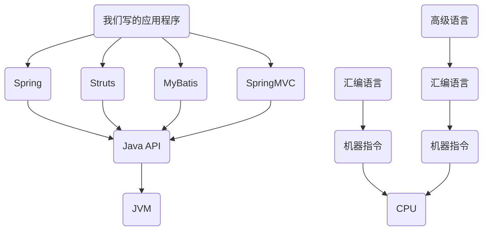
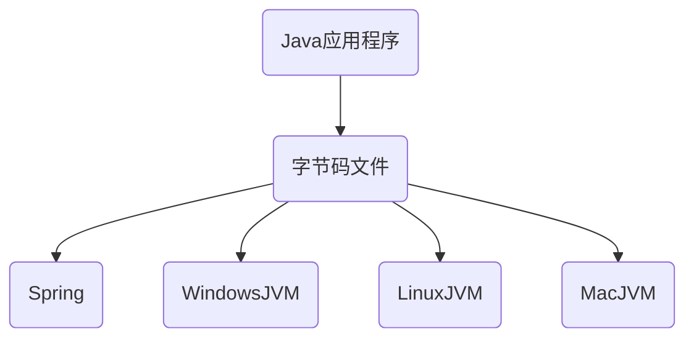
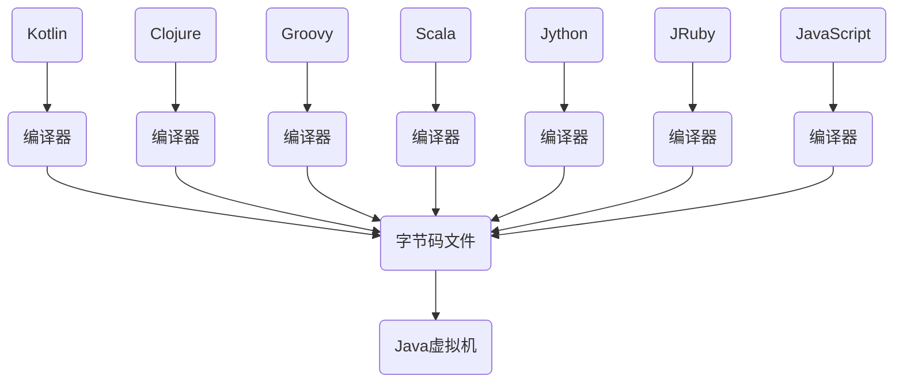

# 01-JVM内存与垃圾回收篇概述

Java Virtual Machine(JVM):

>**Java virtual machine** (**JVM**) is a [virtual machine](https://en.wikipedia.org/wiki/Virtual_machine) that enables a computer to run [Java](https://en.wikipedia.org/wiki/Java_(software_platform)) programs as well as programs written in [other languages](https://en.wikipedia.org/wiki/List_of_JVM_languages) that are also compiled to [Java bytecode](https://en.wikipedia.org/wiki/Java_bytecode). The JVM is detailed by a [specification](https://en.wikipedia.org/wiki/Specification_(technical_standard)) that formally describes what is required in a JVM implementation. Having a specification ensures interoperability of Java programs across different implementations so that program authors using the [Java Development Kit](https://en.wikipedia.org/wiki/Java_Development_Kit) (JDK) need not worry about idiosyncrasies of the underlying hardware platform.

Java Memary Model(JMM):

> The **Java memory model** describes how [threads](https://en.wikipedia.org/wiki/Thread_(computer_science)) in the [Java programming language](https://en.wikipedia.org/wiki/Java_(programming_language)) interact through memory. Together with the description of single-threaded execution of code, the memory model provides the [semantics](https://en.wikipedia.org/wiki/Formal_semantics_of_programming_languages) of the Java programming language.

Garbage Collection(GC):

> Java garbage collection is the process by which Java programs perform automatic memory management. Java programs compile to bytecode that can be run on a Java Virtual Machine, or JVM for short. When Java programs run on the JVM, objects are created on the heap, which is a portion of memory dedicated to the program. Eventually, some objects will no longer be needed. The garbage collector finds these unused objects and deletes them to free up memory.

# 02-如何看待Java上层技术与JVM

# 05-官方规范下载与参考书目

- [The Java® Virtual Machine Specification](https://docs.oracle.com/javase/specs/jvms/se7/html/)

- 《深入了解Java虚拟机》

# 06-跨平台的语言Java和跨语言的平台JVM

[TIOBE语言热度排行榜](https://www.tiobe.com/tiobe-index/)

> Java是目前应用最为广泛的软件开发平台之一

- 作为平台。Java虚拟机有着举足轻重的作用，Groovy、Scala、JRuby、Kotlin等都是Java平台的一部分。
- 作为一种文化。Java几乎成为开源的代名词，第三方开源框架、JDK和JVM也有开源实现，如OpenJDK。
- 作为一个社区。Java拥有全世界最多的技术拥护者和开源社区支持，生态丰富。

# 07-字节码与多语言混合编程

1. Java平台上的多语言混合编程正成为主流，通过特定领域的语言去解决特定领域的问题是当前软件开发应对日趋复杂的项目需求的一个方向。
2. 试想一下，在一个项目之中，并行处理用Clojure语言编写，展示层使用JRuby/Rails，中间层则是Java，每个应用层都将使用不同的编程语言来完成，而且，接口对每一层的开发者都是透明的，各种语言之间的交互不存在任何困难，就像使用自己语言的原生API一样方便，因为它们最终都运行在一个虚拟机之上。
3. 对这些运行于Java虚拟机之上、Java之外的语言，来自系统级的、底层的支持正在迅速增强，以JSR-292为核心的一系列项目和功能改进（如DaVinci Machine项目、Nashorn引擎、InvokeDynamic指令、java.lang.invoke包等），推动Java虚拟机从“Java语言的虚拟机”向 “多语言虚拟机”的方向发展。

# 08-Java及JVM历史上的重大事件

- 1990年，在Sun计算机公司中，由Patrick Naughton、MikeSheridan及James Gosling领导的小组Green Team，开发出的新的程序语言，命名为Oak，后期命名为Java
- 1995年，Sun正式发布Java和HotJava产品，Java首次公开亮相。
- 1996年1月23日Sun Microsystems发布了JDK 1.0。
- 1998年，JDK1.2版本发布。同时，Sun发布了JSP/Servlet、EJB规范，以及将Java分成了J2EE、J2SE和J2ME。这表明了Java开始向企业、桌面应用和移动设备应用3大领域挺进。
- 2000年，JDK1.3发布，Java HotSpot Virtual Machine正式发布，成为Java的默认虚拟机。
- 2002年，JDK1.4发布，古老的Classic虚拟机退出历史舞台。
- 2003年年底，Java平台的scala正式发布，同年Groovy也加入了Java阵营。
- 2004年，JDK1.5发布。同时JDK1.5改名为JavaSE5.0。
- 2006年，JDK6发布。同年，Java开源并建立了OpenJDK。顺理成章，Hotspot虚拟机也成为了OpenJDK中的默认虚拟机。
- 2007年，Java平台迎来了新伙伴Clojure。
- 2008年，oracle收购了BEA，得到了JRockit虚拟机。
- 2009年，Twitter宣布把后台大部分程序从Ruby迁移到Scala，这是Java平台的又一次大规模应用。
- 2010年，Oracle收购了Sun，获得Java商标和最真价值的HotSpot虚拟机。此时，Oracle拥有市场占用率最高的两款虚拟机HotSpot和JRockit，并计划在未来对它们进行整合：HotRockit。JCP组织管理Java语言
- 2011年，JDK7发布。在JDK1.7u4中，正式启用了新的垃圾回收器G1。
- **2017年，JDK9发布。将G1设置为默认GC，替代CMS**
- 同年，IBM的J9开源，形成了现在的Open J9社区
- 2018年，Android的Java侵权案判决，Google赔偿Oracle计88亿美元
- 同年，Oracle宣告JavagE成为历史名词JDBC、JMS、Servlet赠予Eclipse基金会
- **同年，JDK11发布，LTS版本的JDK，发布革命性的ZGC，调整JDK授权许可**
- 2019年，JDK12发布，加入RedHat领导开发的Shenandoah GC

# 09-虚拟机与Java虚拟机介绍

### 虚拟机概念

- 所谓虚拟机（Virtual Machine），就是一台虚拟的计算机。它是一款软件，用来执行一系列虚拟计算机指令。大体上，虚拟机可以分为系统虚拟机和程序虚拟机。

  - 大名鼎鼎的Virtual Box，VMware就属于系统虚拟机，它们完全是对物理计算机硬件的仿真(模拟)，提供了一个可运行完整操作系统的软件平台。

  - 程序虚拟机的典型代表就是Java虚拟机，它专门为执行单个计算机程序而设计，在Java虚拟机中执行的指令我们称为Java字节码指令。

- 无论是系统虚拟机还是程序虚拟机，在上面运行的软件都被限制于虚拟机提供的资源中。

### Java虚拟机

1. Java虚拟机是一台执行Java字节码的虚拟计算机，它拥有独立的运行机制，其运行的Java字节码也未必由Java语言编译而成。
2. JVM平台的各种语言可以共享Java虚拟机带来的跨平台性、优秀的垃圾回器，以及可靠的即时编译器。
3. **Java技术的核心就是Java虚拟机**（JVM，Java Virtual Machine），因为所有的Java程序都运行在Java虚拟机内部。

**作用：**

Java虚拟机就是二进制字节码的运行环境，负责装载字节码到其内部，解释/编译为对应平台上的机器指令执行。每一条Java指令，Java虚拟机规范中都有详细定义，如怎么取操作数，怎么处理操作数，处理结果放在哪里。

**特点：**

1. 一次编译，到处运行
2. 自动内存管理
3. 自动垃圾回收功能

# 10-JVM的位置

# 11-JVM的整体结构

# 12-Java代码执行流程

# 13-区分栈的指令集架构和寄存器的指令集架构

# 14-JVM的生命周期

# 15-SUN Classic VM的介绍

# 16-Exact VM的介绍

# 17-HotSpot VM的介绍

# 18-JRockit VM的介绍

# 19-IBM J9 VM的介绍

# 20-KVM、CDC、CLDC的介绍

# 21-Azul VM和BEA Liquid VM的介绍

# 22-Apache Harmony的介绍

# 23-Microsoft JVM和TaobaoJVM

# 24-Dalvik VM及其他虚拟机的介绍

# 25-Graal VM的介绍

# 26-内存结构概述

# 27-概述类的加载器及类加载过程

# 28-类的加载过程一：Loading

# 29-类的加载过程二：Linking

# 30-类的加载过程三：Initialization

# 31-几种类加载器的使用体会

# 32-引导类、扩展类、系统类加载器的使用及演示

# 33-为什么需要用户自定义类加载器及具体实现

# 34-ClassLoader的常用方法及获取方法

# 35-双亲委派机制的工作原理及演示

# 36-双亲委派机制的优势

# 37-沙箱安全机制

# 38-类的主动使用与被动使用等

# 39-运行时数据区内部结构

# 40-JVM中的线程说明

# 41-PC寄存器概述

# 42-PC寄存器的使用举例

# 43-解决PC寄存器两个面试问题

# 44-虚拟机栈的主要特点

# 45-虚拟机栈的常见异常与如何设置栈大小

# 46-栈的存储结构和运行原理

# 47-栈桢的内部结构

# 48-局部变量表结构的认识

# 49-字节码中方法内部结构的剖析

# 50-变量槽slot的理解与演示

# 51-静态变量与局部变量的对比及小结

# 52-操作数栈的特点

# 53-涉及操作数栈的字节码指令执行分析

# 54-栈顶缓存技术

# 55-动态链接的理解与常量池的作用

# 56-方法的绑定机制：静态绑定与动态绑定

# 57-4种方法调用指令区分非虚方法与虚方法

# 58-invokedynamic指令的使用

# 59-方法重写的本质与虚方法表的使用

# 60-方法返回地址的说明

# 61-栈桢中的一些附加信息

# 62-虚拟机栈的5道面试题

# 63-本地方法接口的理解

# 64-本地方法栈的理解

# 65-JVM学习路线与内容回顾

# 66-堆空间的概述_进程中堆的唯一性

# 67-堆空间关于对象创建和和GC的概述

# 68-堆的细分内存结构

# 69-堆空间大小的设置和查看

# 70-OOM的说明与举例

# 71-新生代与老年代中相关参数的设置

# 72-图解对象分配的一般过程

# 73-对象分配的特殊情况

# 74-代码举例与JVisualVM演示对象的分配过程

# 75-常用优工具概述与Jprofiler的演示

# 76-MinorGC、MajorGC和FullGC的对比

# 77-GC举例与日志分析

# 78-体会堆空间分代的思想

# 79-总结内存分配策略

# 80-堆空间为每个线程分配的TLAB

# 81-小结堆空间的常用参数设置

# 82-通过逃逸分析看堆空间的对象分配策略

# 83-代码优化之栈上分配

# 84-代码优化之同步省略

# 85-代码优化之标量替换

# 86-代码优化及堆的小结

# 87-方法区概述_栈堆方法区间的交互关系

# 88-方法区的基本理解

# 89-Hotspot中方法区的演进

# 90-设置方法区大小的参数

# 91-OOM：PermGen和OOM：Metaspace举例

# 92-方法区的内部结构1

# 93-方法区的内部结构2

# 94-class文件中常量池的理解

# 95-运行时常量池的理解

# 96-图示举例方法区的使用

# 97-方法区在jdk6、jdk7、jdk8中的演进细节

# 98-StringTable为什么要调整位置

# 99-如何证明静态变量存在哪

# 100-方法区的垃圾回收行为

# 101-运行时数据区的总结与常见大厂面试题说明

# 102-对象实例化的几种方式

# 103-字节码角度看对象的创建过程

# 104-对象创建的六个步骤

# 105-对象的内存布局

# 106-对象访问定位

# 107-直接内存的简单体验

# 108-使用本地内存读写数据的测试

# 109-直接内存的00M与内存大小的设置

# 110-执行引擎的作用及工作过程概述

# 111-Java程序的编译和解释运行的理解

# 112-机器码_指令_汇编_高级语言理解与执行过程

# 113-解释器的使用

# 114-HotspotVM为何解释器与JIT编译器并存

# 115-热点代码探测确定何时JIT

# 116-Hotspot设置模式_C1与C2编译器

# 117-Graal编译器与AOT编译器

# 118-String的不可变性

# 119-String底层Hashtable结构的说明

# 120-String内存结构的分配位置

# 121-两个案例熟悉String的基本操作

# 122-字符串拼接操作的面试题讲解

# 123-字符串变量拼接操作的底层原理

# 124-拼接操作与append操作的效率对比

# 125-intern()的理解

# 126-new String()到底创建了几个对象

# 127-关于intern()的面试难题

# 128-面试的拓展问题

# 129-intern()的课后练习1

# 130-intern()的课后练习2

# 131-intern()的空间效率测试

# 132-StringTable的垃圾回收测试

# 133-G1垃圾收集器的String去重操作

# 134-垃圾回收相关章节的说明

# 135-什么是GC，为什么需要GC

# 136-了解早期垃圾回收行为

# 137-Java自动内存管理介绍

# 138-垃圾回收相关算法概述

# 139-引用计数算法的原理及优缺点

# 140-Java代码举例_Python的引用计数实施方案

# 141-可达性分析算法与GC Roots

# 142-对象的finalization机制

# 143-代码演示可复活的对象

# 144-使用MAT查看GC Roots

# 145-使用JProfiler进行GC Roots溯源

# 146-使用JProfiler分析OOM

# 147-标记-清除算法原理及优缺点

# 148-复制算法原理及优缺点

# 149-标记-压缩算法原理及优缺点

# 150-不同指标上对比三种算法

# 151-分代收集算法的说明

# 152-增量收集算法原理及优缺点

# 153-分区算法的说明

# 154-垃圾回收相关概念的概述

# 155-System.gc()的理解

# 156-手动gc理解不可达对象的回收行为

# 157-内存溢出的分析

# 158-内存泄漏的分析

# 159-StopTheWorld事件的理解

# 160-程序的并行与并发

# 161-垃圾回收的并行与并发

# 162-安全点与安全区域的说明

# 163-Java中几种不同引用的概述

# 164-强引用：不回收

# 165-软引用：内存不足即回收

# 166-弱引用：发现即回收

# 167-虚引用：对象回收跟踪

# 168-终结器引用的介绍

# 169-垃圾回收器章节概览

# 170-垃圾回收器的分类

# 171-GC性能指标的整体说明

# 172-吞吐量与暂停时间的对比说明

# 173-垃圾回收器的发展迭代史

# 174-垃圾回收器的组合关系

# 175-如何查看默认的垃圾回收器

# 176-Serial与Serial Old垃圾回收器的介绍

# 177-如何设置使用Serial垃圾回收器

# 178-ParNew垃圾回收器的介绍

# 179-如何设置使用ParNew垃圾回收器

# 180-Parallel与Parallel Old垃圾回收器的介绍

# 181-Parallel垃圾回收器的相关参数设置

# 182-CMS垃圾回收器概述与工作原理

# 183-CMS的特点与弊端分析

# 184-CMS垃圾回收器的参数设置

# 185-CMS的小结及后续JDK版本中的变化

# 186-认识G1垃圾回收器

# 187-G1垃圾回收器的优势和不足

# 188-G1的参数设置

# 189-G1在生产环境的适用场景

# 190-region的使用介绍

# 191-G1垃圾回收器的主要回收环节

# 192-记忆集与写屏障

# 193-G1垃圾回收过程的详细说明

# 194-G1垃圾回收的优化建议

# 195-7种经典的垃圾回收器总结与调优建议

# 196-常用的显示GC日志的参数

# 197-GC日志中垃圾回收数据的分析

# 198-举例说明日志中堆空间数据如何解读

# 199-日志分析工具的使用

# 200-新时期的Epsilon和Shenandoah垃圾回收器

# 201-革命性的ZGC的性能介绍

# 202-其他的厂商的垃圾回收器

# 203-最后寄语

# 204-JVM中篇内容概述

# 205-字节码文件的跨平台性

# 206-了解Java的前端编译器

# 207-透过字节码看代码执行细节举例1

# 208-透过字节码看代码执行细节举例2

# 209-透过字节码看代码执行细节举例3

# 210-解读Class文件的三种方式

# 211-Class文件本质和内部数据类型

# 212-Class文件内部结构概述

# 213-字节码数据保存到excel中的操作

# 214-Class文件的标识：魔数

# 215-Class文件版本号

# 216-常量池概述

# 217-常量池计数器

# 218-常量池表中的字面量和符号引用

# 219-解析得到常量池中所有的常量

# 220-常量池表数据的解读1

# 221-常量池表数据的解读2

# 222-常量池表项数据的总结

# 223-访问标识

# 224-类索引、父类索引、接口索引集合

# 225-字段表集合的整体理解

# 226-字段表数据的解读

# 227-方法表集合的整体理解

# 228-方法表数据的解读

# 229-属性表集合的整理理解

# 230-方法中Code属性的解读

# 231-LineNumberTable和LocalVariableTable属性的解读

# 232-SourceFile属性的解读

# 233-Class文件结构的小结

# 234-javac -g操作的说明

# 235-javap主要参数的使用

# 236-javap解析得到的文件结构的解读

# 237-javap使用小结

# 238-字节码指令集的概述

# 239-指令与数据类型的关系及指令分类

# 240-加载与存储指令概述

# 241-再谈操作数栈与局部变量表

# 242-局部变量压栈指令

# 243-常量入栈指令

# 244-出栈装入局部变量表指令

# 245-算术指令及举例

# 246-算法指令再举例

# 247-彻底搞定++运算符

# 248-比较指令的说明

# 249-宽化类型转换

# 250-窄化类型转换

# 251-创建类和数组实例的指令

# 252-字段访问指令

# 253-数组操作指令

# 254-类型检查指令

# 255-方法调用指令

# 256-方法返回指令

# 257-操作数栈管理指令

# 258-比较指令

# 259-条件跳转指令

# 260-比较条件跳转指令

# 261-多条件分支跳转指令

# 262-无条件跳转指令

# 263-抛出异常指令

# 264-异常处理与异常表

# 265-同步控制指令

# 266-类的生命周期概述

# 267-加载完成的操作及二进制的获取方式

# 268-类模型与Class实例的位置

# 269-链接之验证环节

# 270-链接之准备环节

# 271-链接之解析环节

# 272-初始化过程与类初始化方法

# 273-初始化阶段赋值与准备阶段赋值的对比

# 274-类初始化方法clinit()的线程安全性

# 275-何为类的主动使用和被动使用

# 276-类的主动使用1

# 277-类的主动使用2

# 278-类的主动使用3

# 279-类的主动使用4

# 280-类的被动使用

# 281-类的使用介绍

# 282-类的卸载相关问题

# 283-类加载器的概述

# 284-命名空间与类的唯一性

# 285-类的加载器的分类

# 286-引导类加载器的说明

# 287-扩展类加载器的说明

# 288-系统类加载器的说明

# 289-用户自定义类加载器的说明

# 290-测试不同类使用的类加载器

# 291-ClassLoader与Launcher的初步剖析

# 292-ClassLoader的源码解析1

# 293-ClassLoader的源码解析2

# 294-ClassLoader子类的结构剖析

# 295-双亲委派机制的优势与劣势

# 296-三次双亲委派机制的破坏

# 297-热替换的代码实现

# 298-沙箱安全机制

# 299-自定义类加载器的好处和应用场景

# 300-自定义类加载器的代码实现

# 301-Java9的新特性

# 302-性能监控与调优篇概述

# 303-见识一下大厂面试题

# 304-为什么调优及监控的依据

# 305-性能优化的三部曲

# 306-4个性能测试指标及相关关系

# 307-JVM命令行监控工具的概述

# 308-jps：查看正在运行的Java进程

# 309-jstat：基本语法

# 310-jstat：如何排查OOM和内存泄漏

# 311-jinfo：实时查看和修改JVM配置参数

# 312-PrintFlagsFinal的使用

# 313-jmap：各种option参数说明

# 314-导出dump堆转储快照文件的两种方式

# 315-jmap：如何显示堆内存等功能

# 316-jhat：JDK自带堆分析工具

# 317-jstack：追踪JVM中线程快照

# 318-jcmd：多功能命令行工具

# 319-jstatd：远程主机信息收集

# 320-JVM监控及诊断的GUI工具概述

# 321-jConsole的使用

# 322-VisualVM的安装及连接方式

# 323-VisualVM的基本功能

# 324-VisualVM生成和查看堆dump文件

# 325-Visual生成和分析线程dump文件

# 326-VisualVM的CPU抽样和内存抽样

# 327-MAT概述_获取dump的四种方式

# 328-MAT界面主要功能概览

# 329-MAT中Histogram的功能演示

# 330-基于对象的出引用与入引用分析内存泄漏

# 331-ShallowHeap与RetainedHeap

# 332-案例分析：StudentTrace

# 333-支配树的理解及应用

# 334-案例：Tomcat堆溢出分析

# 335-内存泄漏的理解与分类

# 336-内存泄漏的8种情况

# 337-内存泄漏分析案例1

# 338-内存泄漏分析案例2

# 339-OQL语句的使用举例

# 340-JProfiler的使用概述

# 341-JProfiler的安装和配置

# 342-两种数据采集方式

# 343-遥感监测视图中相关监测数据

# 344-内存视图的分析

# 345-Heap Walker功能演示

# 346-CPU视图的功能说明

# 347-Threads视图的功能说明

# 348-JProfiler使用案例1

# 349-JProfiler使用案例2

# 350-为什么要引入Arthas

# 351-Arthas的安装及对Java进程的监控

# 352-Arthas中基础指令的使用

# 353-dashboard命令和thread命令

# 354-sysprop命令和heapdump命令

# 355-sc命令和sm命令

# 356-jad命令_mc命令_classloader命令

# 357-monitor_watch_trace_stack_tt命令

# 358-Arthas的其它相关命令

# 359-JMC介绍_实时JVM监控

# 360-Java Flight Recorder介绍和取样分析

# 361-火焰图的使用介绍

# 362-Tprofiler等工具的介绍

# 363-JVM参数选项类型1：标准参数选项

# 364-JVM参数选项类型2：-X参数选项

# 365-JVM参数选项类型3：-XX参数选项

# 366-如何添加JVM参数选项的说明

# 367-打印设置的XX选项及值

# 368-栈、堆、方法区内存的相关VM参数选项设置

# 369-OutOfMemory相关VM参数选项的设置

# 370-回顾经典的GC及相互搭配关系

# 371-不同垃圾回收器的VM参数选项设置

# 372-GC日志相关VM参数选项的设置

# 373-了解其他VM参数选项

# 374-通过Java代码获取JVM参数

# 375-复习GC的分类

# 376-GC日志的分类

# 377-MinorGC的日志解析

# 378-FullGC的日志解析

# 379-在线日志分析工具：GCEasy

# 380-其它日志分析工具：GCViewer、GChisto、HPjmeter

# 381-OOM及性能优化案例与解决方案

# 参考资料

[视频教程](https://www.bilibili.com/video/BV1PJ411n7xZ)
[思维导图](https://www.processon.com/view/link/601a1df3637689536e17bade)

