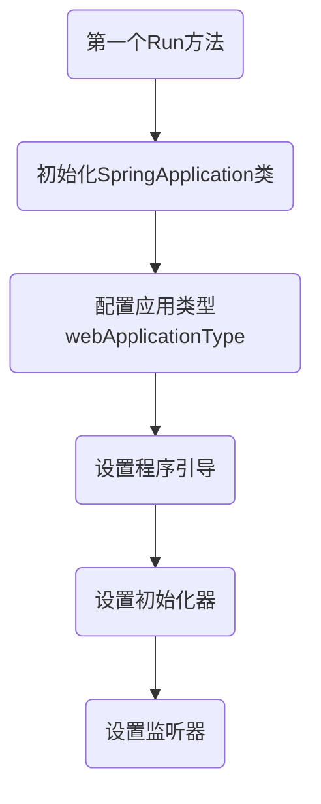
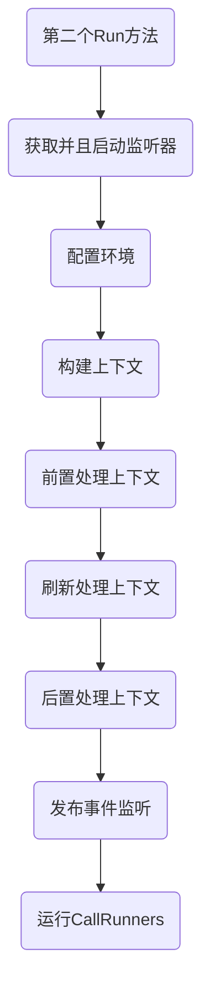

# 启动流程


## 第一个Run方法



调用Run方法后初始化SpringApplication类

```java
    public SpringApplication(ResourceLoader resourceLoader, Class<?>... primarySources) {
        this.sources = new LinkedHashSet();
        this.bannerMode = Mode.CONSOLE;
        this.logStartupInfo = true;
        this.addCommandLineProperties = true;
        this.addConversionService = true;
        this.headless = true;
        this.registerShutdownHook = true;
        this.additionalProfiles = Collections.emptySet();
        this.isCustomEnvironment = false;
        this.lazyInitialization = false;
        //应用上下文工厂SERVLET/REACTIVE
        this.applicationContextFactory = ApplicationContextFactory.DEFAULT;
        //缺省应用启动器
        this.applicationStartup = ApplicationStartup.DEFAULT;
        //资源加载进器
        this.resourceLoader = resourceLoader;
        //断言当前主源码相关信息:类路径、类加载器等
        Assert.notNull(primarySources, "PrimarySources must not be null");
        this.primarySources = new LinkedHashSet(Arrays.asList(primarySources));
        //获取当前web应用的类型是SERVLET/REACTIVE
        this.webApplicationType = WebApplicationType.deduceFromClasspath();
        //根据Bootstrapper获取SpringFactory实例
        this.bootstrappers = new ArrayList(this.getSpringFactoriesInstances(Bootstrapper.class));
        //设置ApplicationContextInitializer
        this.setInitializers(this.getSpringFactoriesInstances(ApplicationContextInitializer.class));
        //设置监听器
        this.setListeners(this.getSpringFactoriesInstances(ApplicationListener.class));
        //通过反射获取main方法
        this.mainApplicationClass = this.deduceMainApplicationClass();
    }

```

获取当前web应用的类型是SERVLET/REACTIVE

```java
public enum WebApplicationType {//枚举类型
    NONE,
    SERVLET,
    REACTIVE;
	//常量信息
    private static final String[] SERVLET_INDICATOR_CLASSES = new String[]{"javax.servlet.Servlet", "org.springframework.web.context.ConfigurableWebApplicationContext"};
    private static final String WEBMVC_INDICATOR_CLASS = "org.springframework.web.servlet.DispatcherServlet";
    private static final String WEBFLUX_INDICATOR_CLASS = "org.springframework.web.reactive.DispatcherHandler";
    private static final String JERSEY_INDICATOR_CLASS = "org.glassfish.jersey.servlet.ServletContainer";
    private static final String SERVLET_APPLICATION_CONTEXT_CLASS = "org.springframework.web.context.WebApplicationContext";
    private static final String REACTIVE_APPLICATION_CONTEXT_CLASS = "org.springframework.boot.web.reactive.context.ReactiveWebApplicationContext";

    private WebApplicationType() {
    }
	//通过类路径下的信息获取应用类型
    static WebApplicationType deduceFromClasspath() {
        //是否为reactive类型
        if (ClassUtils.isPresent("org.springframework.web.reactive.DispatcherHandler", (ClassLoader)null) && !ClassUtils.isPresent("org.springframework.web.servlet.DispatcherServlet", (ClassLoader)null) && !ClassUtils.isPresent("org.glassfish.jersey.servlet.ServletContainer", (ClassLoader)null)) {
            return REACTIVE;
        } else {//否则为Servlet类型
            String[] var0 = SERVLET_INDICATOR_CLASSES;
            int var1 = var0.length;

            for(int var2 = 0; var2 < var1; ++var2) {
                String className = var0[var2];
                if (!ClassUtils.isPresent(className, (ClassLoader)null)) {
                    return NONE;
                }
            }
            return SERVLET;
        }
    }

    static WebApplicationType deduceFromApplicationContext(Class<?> applicationContextClass) {
        if (isAssignable("org.springframework.web.context.WebApplicationContext", applicationContextClass)) {
            return SERVLET;
        } else {
            return isAssignable("org.springframework.boot.web.reactive.context.ReactiveWebApplicationContext", applicationContextClass) ? REACTIVE : NONE;
        }
    }
}
```

通过加载DispacherHander


具体的加载方法

```java
public static Class<?> forName(String name, @Nullable ClassLoader classLoader) throws ClassNotFoundException, LinkageError {
    Assert.notNull(name, "Name must not be null");
    Class<?> clazz = resolvePrimitiveClassName(name);
    if (clazz == null) {
        //优先在缓存中查找
        clazz = (Class)commonClassCache.get(name);
    }
    if (clazz != null) {
        return clazz;
    } else {
        Class elementClass;
        String elementName;//元素名字
        if (name.endsWith("[]")) {//数组类型
            elementName = name.substring(0, name.length() - "[]".length());
            elementClass = forName(elementName, classLoader);
            return Array.newInstance(elementClass, 0).getClass();
        } else if (name.startsWith("[L") && name.endsWith(";")) {//L数组类型
            elementName = name.substring("[L".length(), name.length() - 1);
            elementClass = forName(elementName, classLoader);
            return Array.newInstance(elementClass, 0).getClass();
        } else if (name.startsWith("[")) {
            elementName = name.substring("[".length());
            elementClass = forName(elementName, classLoader);
            return Array.newInstance(elementClass, 0).getClass();
        } else {
            ClassLoader clToUse = classLoader;
            if (classLoader == null) {
                clToUse = getDefaultClassLoader();
            }
            try {
                return Class.forName(name, false, clToUse);
            } catch (ClassNotFoundException var9) {
                int lastDotIndex = name.lastIndexOf(46);
                if (lastDotIndex != -1) {
                    //$代表内部类
                    String nestedClassName = name.substring(0, lastDotIndex) + '$' + name.substring(lastDotIndex + 1);
                    try {
                        return Class.forName(nestedClassName, false, clToUse);
                    } catch (ClassNotFoundException var8) {
                    }
                }
                throw var9;
            }
        }
    }
}
```

默认加载META-INF/spring.factories配置文件

```java
private static Map<String, List<String>> loadSpringFactories(ClassLoader classLoader) {
    Map<String, List<String>> result = (Map)cache.get(classLoader);
    if (result != null) {
        return result;
    } else {
        HashMap result = new HashMap();
        try {
        	//获取资源
            Enumeration urls = classLoader.getResources("META-INF/spring.factories");
            while(urls.hasMoreElements()) {
                URL url = (URL)urls.nextElement();
                UrlResource resource = new UrlResource(url);
                Properties properties = PropertiesLoaderUtils.loadProperties(resource);
                Iterator var6 = properties.entrySet().iterator();

                while(var6.hasNext()) {
                    Entry<?, ?> entry = (Entry)var6.next();
                    String factoryTypeName = ((String)entry.getKey()).trim();
                    String[] factoryImplementationNames = StringUtils.commaDelimitedListToStringArray((String)entry.getValue());
                    String[] var10 = factoryImplementationNames;
                    int var11 = factoryImplementationNames.length;

                    for(int var12 = 0; var12 < var11; ++var12) {
                        String factoryImplementationName = var10[var12];
                        ((List)result.computeIfAbsent(factoryTypeName, (key) -> {
                            return new ArrayList();
                        })).add(factoryImplementationName.trim());
                    }
                }
            }
            result.replaceAll((factoryType, implementations) -> {
                return (List)implementations.stream().distinct().collect(Collectors.collectingAndThen(Collectors.toList(), Collections::unmodifiableList));
            });
            cache.put(classLoader, result);
            return result;
        } catch (IOException var14) {
            throw new IllegalArgumentException("Unable to load factories from location [META-INF/spring.factories]", var14);
        }
    }
}
```

## 第二个Run方法




调用Run方法

```java
public ConfigurableApplicationContext run(String... args) {
    StopWatch stopWatch = new StopWatch();
    //开启计时
    stopWatch.start();
    //默认根启动器上下文
    DefaultBootstrapContext bootstrapContext = this.createBootstrapContext();
    ConfigurableApplicationContext context = null;
    this.configureHeadlessProperty();
    //设置监听器
    SpringApplicationRunListeners listeners = this.getRunListeners(args);
    //开启监听
    listeners.starting(bootstrapContext, this.mainApplicationClass);

    try {
        ApplicationArguments applicationArguments = new DefaultApplicationArguments(args);
        //配置环境
        ConfigurableEnvironment environment = this.prepareEnvironment(listeners, bootstrapContext, applicationArguments);
        this.configureIgnoreBeanInfo(environment);
        Banner printedBanner = this.printBanner(environment);
        //构建上下文
        context = this.createApplicationContext();
        context.setApplicationStartup(this.applicationStartup);
        //前置处理上下文
        this.prepareContext(bootstrapContext, context, environment, listeners, applicationArguments, printedBanner);
        //刷新上下文
        this.refreshContext(context);
        //后置刷新刷新
        this.afterRefresh(context, applicationArguments);
        //结束计时
        stopWatch.stop();
        if (this.logStartupInfo) {
            (new StartupInfoLogger(this.mainApplicationClass)).logStarted(this.getApplicationLog(), stopWatch);
        }
		//启动上下文监听
        listeners.started(context);
        this.callRunners(context, applicationArguments);
    } catch (Throwable var10) {
        this.handleRunFailure(context, var10, listeners);
        throw new IllegalStateException(var10);
    }

    try {
        listeners.running(context);
        return context;
    } catch (Throwable var9) {
        this.handleRunFailure(context, var9, (SpringApplicationRunListeners)null);
        throw new IllegalStateException(var9);
    }
}
```

Run方法中的准备上下文

```java
private void prepareContext(DefaultBootstrapContext bootstrapContext, ConfigurableApplicationContext context, ConfigurableEnvironment environment, SpringApplicationRunListeners listeners, ApplicationArguments applicationArguments, Banner printedBanner) {
    context.setEnvironment(environment);
    this.postProcessApplicationContext(context);
    this.applyInitializers(context);
    listeners.contextPrepared(context);
    bootstrapContext.close(context);
    if (this.logStartupInfo) {
        this.logStartupInfo(context.getParent() == null);
        this.logStartupProfileInfo(context);
    }

    ConfigurableListableBeanFactory beanFactory = context.getBeanFactory();
    beanFactory.registerSingleton("springApplicationArguments", applicationArguments);
    if (printedBanner != null) {
        beanFactory.registerSingleton("springBootBanner", printedBanner);
    }

    if (beanFactory instanceof DefaultListableBeanFactory) {
        ((DefaultListableBeanFactory)beanFactory).setAllowBeanDefinitionOverriding(this.allowBeanDefinitionOverriding);
    }

    if (this.lazyInitialization) {
        context.addBeanFactoryPostProcessor(new LazyInitializationBeanFactoryPostProcessor());
    }

    Set<Object> sources = this.getAllSources();
    Assert.notEmpty(sources, "Sources must not be empty");
    this.load(context, sources.toArray(new Object[0]));
    listeners.contextLoaded(context);
}
```

发布事件监听

```java
void started(ConfigurableApplicationContext context) {
    this.doWithListeners("spring.boot.application.started", (listener) -> {
        listener.started(context);
    });
}
public void started(ConfigurableApplicationContext context) {
    //发布监听
    context.publishEvent(new ApplicationStartedEvent(this.application, this.args, context));
    AvailabilityChangeEvent.publish(context, LivenessState.CORRECT);
}
```

运行CallRunners

```java
private void callRunners(ApplicationContext context, ApplicationArguments args) {
    List<Object> runners = new ArrayList();
    //根据不同类型获取其容器中所有的bean
    runners.addAll(context.getBeansOfType(ApplicationRunner.class).values());
    runners.addAll(context.getBeansOfType(CommandLineRunner.class).values());
    AnnotationAwareOrderComparator.sort(runners);
    Iterator var4 = (new LinkedHashSet(runners)).iterator();

    while(var4.hasNext()) {
        Object runner = var4.next();
        //两种类型
        if (runner instanceof ApplicationRunner) {
            this.callRunner((ApplicationRunner)runner, args);
        }
        if (runner instanceof CommandLineRunner) {
            this.callRunner((CommandLineRunner)runner, args);
        }
    }

}
```

# 自动装配

```java
@Target({ElementType.TYPE})
@Retention(RetentionPolicy.RUNTIME)
@Documented
@Inherited
@AutoConfigurationPackage//自动配置包注解
@Import({AutoConfigurationImportSelector.class})//导入自动配置选择
public @interface EnableAutoConfiguration {
    String ENABLED_OVERRIDE_PROPERTY = "spring.boot.enableautoconfiguration";
    Class<?>[] exclude() default {};
    String[] excludeName() default {};
}
```

```java
@Target({ElementType.TYPE})
@Retention(RetentionPolicy.RUNTIME)
@Documented
@Inherited
@Import({Registrar.class})
public @interface AutoConfigurationPackage {
    String[] basePackages() default {};
    Class<?>[] basePackageClasses() default {};
}
```

在AutoConfigurationImportSelector的getCandidateConfigurations方法是用来加载候选配置的，可以看出如果configurations为空则断言失败

```java
protected List<String> getCandidateConfigurations(AnnotationMetadata metadata, AnnotationAttributes attributes) {
    List<String> configurations = SpringFactoriesLoader.loadFactoryNames(this.getSpringFactoriesLoaderFactoryClass(), this.getBeanClassLoader());
    Assert.notEmpty(configurations, "No auto configuration classes found in META-INF/spring.factories. If you are using a custom packaging, make sure that file is correct.");
    return configurations;
}
```
当我们的SpringBoot项目启动的时候，会先导入AutoConfigurationImportSelector，这个类会帮我们选择所有候选的配置，我们需要导入的配置都是SpringBoot帮我们写好的一个一个的配置类，那么这些配置类的位置，存在与META-INF/spring.factories文件中，通过这个文件，Spring可以找到这些配置类的位置，于是去加载其中的配置。

# 参考资料

[SpringBoot源码深度解析](https://www.cnblogs.com/icodingedu/p/12890007.html)

[非常详细的SpringBoot-自动装配原理](https://www.cnblogs.com/hhcode520/p/9450933.html)
  


 