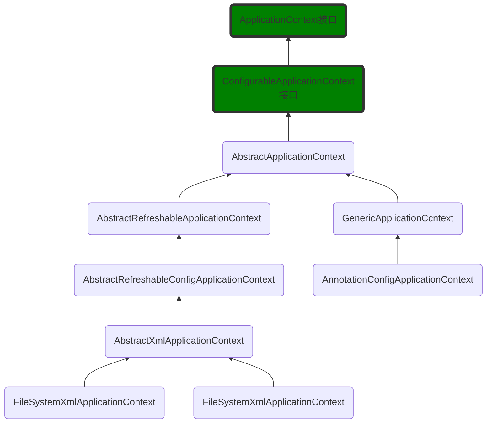

# 启动流程

```
spring
├── aopalliance-1.0.jar
├── commons-logging-1.2.jar
├── spring-aop-5.2.3.RELEASE.jar
├── spring-aspects-5.2.3.RELEASE.jar
├── spring-beans-5.2.3.RELEASE.jar
├── spring-context-5.2.3.RELEASE.jar
├── spring-context-support-5.2.3.RELEASE.jar
├── spring-core-5.2.3.RELEASE.jar
├── spring-expression-5.2.3.RELEASE.jar
├── spring-instrument-5.2.3.RELEASE.jar
├── spring-jdbc-5.2.3.RELEASE.jar
├── spring-jms-5.2.3.RELEASE.jar
├── spring-messaging-5.2.3.RELEASE.jar
├── spring-orm-5.2.3.RELEASE.jar
├── spring-oxm-5.2.3.RELEASE.jar
├── spring-test-5.2.3.RELEASE.jar
└── spring-tx-5.2.3.RELEASE.jar
```

先贴代码

```xml
<?xml version="1.0" encoding="UTF-8"?>
<beans xmlns="http://www.springframework.org/schema/beans"
       xmlns:xsi="http://www.w3.org/2001/XMLSchema-instance"
       xsi:schemaLocation="http://www.springframework.org/schema/beans http://www.springframework.org/schema/beans/spring-beans.xsd">
    <beans>
        <bean id="messageService" class="com.analyxe.service.impl.MessageServiceImpl"/>
    </beans>
</beans>
```

```java
public interface MessageService {
    public String getMessage();
}
```

```java
public class MessageServiceImpl implements MessageService {
    @Override
    public String getMessage() {
        System.out.println("get message ......");
        return "MESSAGE";
    }
}
```


```java
public class Main {

    public static void main(String[] args) {

        ClassPathXmlApplicationContext context = new ClassPathXmlApplicationContext("classpath:applicationContext.xml");

        MessageService messageService = (MessageService) context.getBean("messageService");

        String message = messageService.getMessage();

        System.out.println(message);

    }

}
```



下面我们一步一步来代码跟踪

1.首先调用其构造方法

```java
public ClassPathXmlApplicationContext(String configLocation) throws BeansException {
    this(new String[]{configLocation}, true, (ApplicationContext)null);
}
```

2.具体构造方法

```java
public ClassPathXmlApplicationContext(String[] configLocations, boolean refresh, @Nullable ApplicationContext parent) throws BeansException {
    super(parent);//调用父类AbstractXmlApplicationContext(看上图)构造方法
    this.setConfigLocations(configLocations);//设置配置文件位置
    if (refresh) {//是否刷新容器，默认传进来为true
        this.refresh();//刷新容器(这个很重要下面会详细讲)
    }

}
```

3.再看看其调用ClassPathXmlApplicationContext父类构造方法具体是什么

```java
public AbstractXmlApplicationContext(@Nullable ApplicationContext parent) {
    super(parent);//调用父类AbstractRefreshableConfigApplicationContext(看上图)构造方法
}
```

4.再看看其调用AbstractXmlApplicationContext父类构造方法具体是什么，它又调用父类

```java
public AbstractRefreshableApplicationContext(@Nullable ApplicationContext parent) {
    super(parent);//调用父类AbstractApplicationContext(看上图)构造方法
}
```

5.我们瞧瞧这个AbstractApplicationContext的构造方法

```java
public AbstractApplicationContext(@Nullable ApplicationContext parent) {
    this();//构造方法
    this.setParent(parent);//设置ApplicationContext(顶层接口)
}
```

6.构造方法

```java
public AbstractApplicationContext() {
    //1.获取类加载器加载日志配置
    this.logger = LogFactory.getLog(this.getClass());
    //当前身份实例id&显示名字 org.springframework.context.support.ClassPathXmlApplicationContext@3498ed
    this.id = ObjectUtils.identityToString(this);
    this.displayName = ObjectUtils.identityToString(this);
    //BeanFactory后处理器
    this.beanFactoryPostProcessors = new ArrayList();
    //是否已经激活和关闭
    this.active = new AtomicBoolean();
    this.closed = new AtomicBoolean();
    //开启/关闭监视器
    this.startupShutdownMonitor = new Object();
    //监听器
    this.applicationListeners = new LinkedHashSet();
    //资源匹配器
    this.resourcePatternResolver = this.getResourcePatternResolver();
}
```

7.设置ApplicationContext(顶层接口)

```java
public void setParent(@Nullable ApplicationContext parent) {
    this.parent = parent;//设置ApplicationContext
    if (parent != null) {//如果ApplicationContext为空则
        Environment parentEnvironment = parent.getEnvironment();
        if (parentEnvironment instanceof ConfigurableEnvironment) {
            this.getEnvironment().merge((ConfigurableEnvironment)parentEnvironment);
        }
    }

}
```

执行完成回到2，设置配置文件位置和刷新容器

```java
	public void refresh() throws BeansException, IllegalStateException {
		synchronized (this.startupShutdownMonitor) {
			// 准备刷新容器
			prepareRefresh();
			// 告诉子类刷新内部beanFactory
			ConfigurableListableBeanFactory beanFactory = obtainFreshBeanFactory();
			// 准备beanFactory以便在容器中使用。
			prepareBeanFactory(beanFactory);
			try {
				// Allows post-processing of the bean factory in context subclasses.
				postProcessBeanFactory(beanFactory);
				// Invoke factory processors registered as beans in the context.
				invokeBeanFactoryPostProcessors(beanFactory);
				// Register bean processors that intercept bean creation.
				registerBeanPostProcessors(beanFactory);
				// Initialize message source for this context.
				initMessageSource();
				// Initialize event multicaster for this context.
				initApplicationEventMulticaster();
				// 初始化特定容器子类中的其他特殊bean.
				onRefresh();
				// 检查监听器并注册
				registerListeners();
				// 实例化所有的 singletons bean (除了lazy-init外).
				finishBeanFactoryInitialization(beanFactory);
				// 最后容器构造完成发布其事件
				finishRefresh();
			}catch (BeansException ex) {
				if (logger.isWarnEnabled()) {
					logger.warn("Exception encountered during context initialization - " +
							"cancelling refresh attempt: " + ex);
				}
				// Destroy already created singletons to avoid dangling resources.
				destroyBeans();
				// Reset 'active' flag.
				cancelRefresh(ex);
				// Propagate exception to caller.
				throw ex;
			}
			finally {
				// Reset common introspection caches in Spring's core, since we
				// might not ever need metadata for singleton beans anymore...
				resetCommonCaches();
			}
		}
	}
```

看看准备刷新前做了什么工作

```java
protected void prepareRefresh() {
   // Switch to active.
   this.startupDate = System.currentTimeMillis();
   this.closed.set(false);
   this.active.set(true);
   if (logger.isDebugEnabled()) {
      if (logger.isTraceEnabled()) {
         logger.trace("Refreshing " + this);
      }
      else {
         logger.debug("Refreshing " + getDisplayName());
      }
   }
   // Initialize any placeholder property sources in the context environment.
   initPropertySources();
   // Validate that all properties marked as required are resolvable:
   // see ConfigurablePropertyResolver#setRequiredProperties
   getEnvironment().validateRequiredProperties();
   // Store pre-refresh ApplicationListeners...
   if (this.earlyApplicationListeners == null) {
      this.earlyApplicationListeners = new LinkedHashSet<>(this.applicationListeners);
   }
   else {
      // Reset local application listeners to pre-refresh state.
      this.applicationListeners.clear();
      this.applicationListeners.addAll(this.earlyApplicationListeners);
   }
   // Allow for the collection of early ApplicationEvents,
   // to be published once the multicaster is available...
   this.earlyApplicationEvents = new LinkedHashSet<>();
}
```

实例化所有的 singletons bean (除了lazy-init外)

```java
public void preInstantiateSingletons() throws BeansException {
   if (logger.isTraceEnabled()) {
      logger.trace("Pre-instantiating singletons in " + this);
   }
   //迭代副本以允许init方法注册新的bean定义。
   //虽然这可能不是常规工厂引导的一部分，但它在其他方面工作正常。
   List<String> beanNames = new ArrayList<>(this.beanDefinitionNames);

   // 触发所有非懒加载单例bean的初始化。。。
   for (String beanName : beanNames) {
      RootBeanDefinition bd = getMergedLocalBeanDefinition(beanName);
      if (!bd.isAbstract() && bd.isSingleton() && !bd.isLazyInit()) {//非抽象且单例且非懒加载
         if (isFactoryBean(beanName)) {
            Object bean = getBean(FACTORY_BEAN_PREFIX + beanName);
            if (bean instanceof FactoryBean) {
               final FactoryBean<?> factory = (FactoryBean<?>) bean;
               boolean isEagerInit;
               if (System.getSecurityManager() != null && factory instanceof SmartFactoryBean) {
                  isEagerInit = AccessController.doPrivileged((PrivilegedAction<Boolean>)
                              ((SmartFactoryBean<?>) factory)::isEagerInit,
                        getAccessControlContext());
               }
               else {
                  isEagerInit = (factory instanceof SmartFactoryBean &&
                        ((SmartFactoryBean<?>) factory).isEagerInit());
               }
               if (isEagerInit) {
                  getBean(beanName);
               }
            }
         }
         else {
            getBean(beanName);
         }
      }
   }

   // Trigger post-initialization callback for all applicable beans...
   for (String beanName : beanNames) {
      Object singletonInstance = getSingleton(beanName);
      if (singletonInstance instanceof SmartInitializingSingleton) {
         final SmartInitializingSingleton smartSingleton = (SmartInitializingSingleton) singletonInstance;
         if (System.getSecurityManager() != null) {
            AccessController.doPrivileged((PrivilegedAction<Object>) () -> {
               smartSingleton.afterSingletonsInstantiated();
               return null;
            }, getAccessControlContext());
         }
         else {
            smartSingleton.afterSingletonsInstantiated();
         }
      }
   }
}
```

# 缓存分析

TODO

# 参考资料

[Spring核心IOC的源码分析](https://javadoop.com/post/spring-ioc)   


 