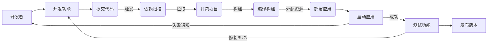

# 背景简介

>我们知道在企业级产品开发的流程中CI、CD能极大的提高我们的开发测试的效率。本篇文章将从真实企业环境出发，介绍CI、CD平台的设计与实现

# 系统设计

>首先我们需要结合企业的实际环境来设定，如项目组件数量是否庞大、组件之间的通信方式是什么、是否有自己机房等等。
目前其主要的CI、CD产品有Jenkins、Travis-CI、Gitlab CI等，其中Jenkins作为业界的标准，在设计中我们也采用他来进行搭建。

在CICD的流程中主要分为

> 根据上面的功能流程进行分析我们需要的一些组件自建代码库可以采用gitlab、代码审计使用gerrit进行扫描、资源的动态分配可以采用k8s进行分配。

# 参考资料   

[Gerrit 代码评审工具](https://www.gerritcodereview.com/)

[Docker](https://www.docker.com/)

[k8s]()

