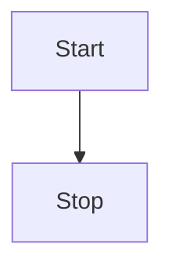
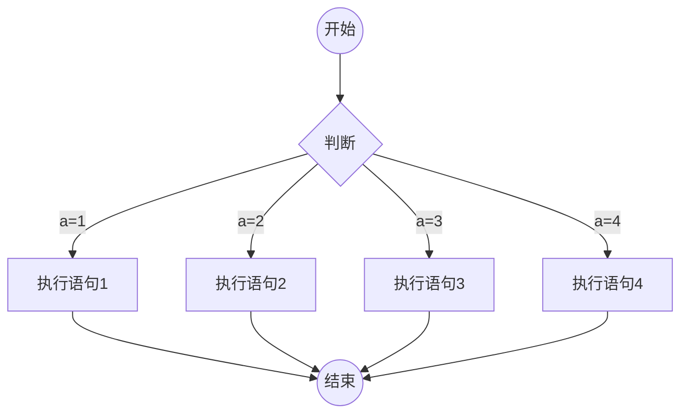
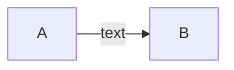
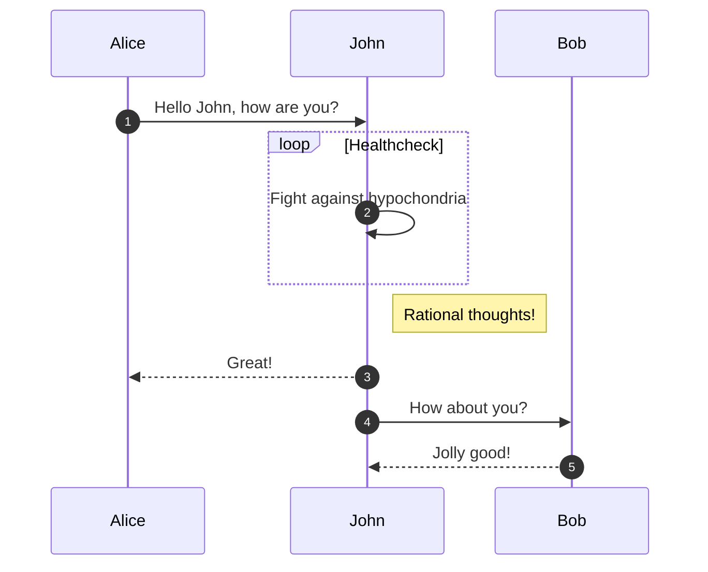
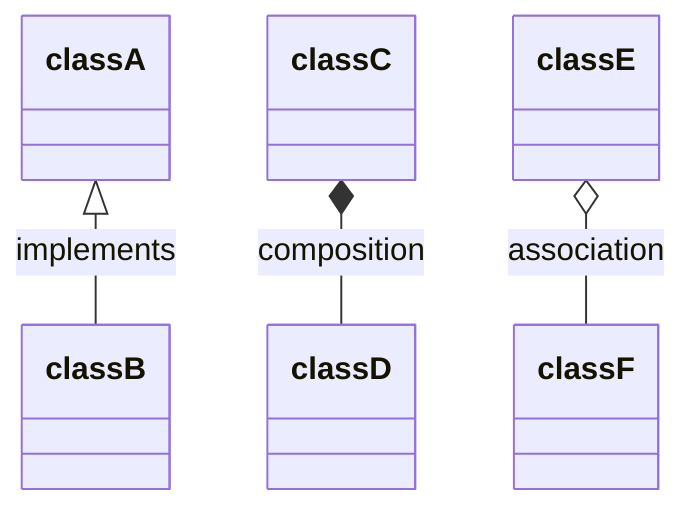
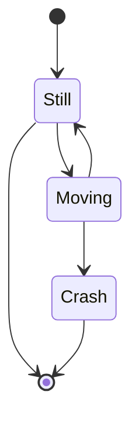
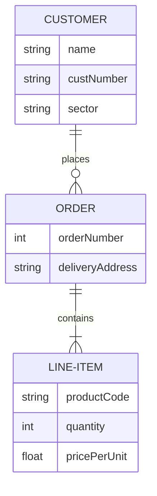
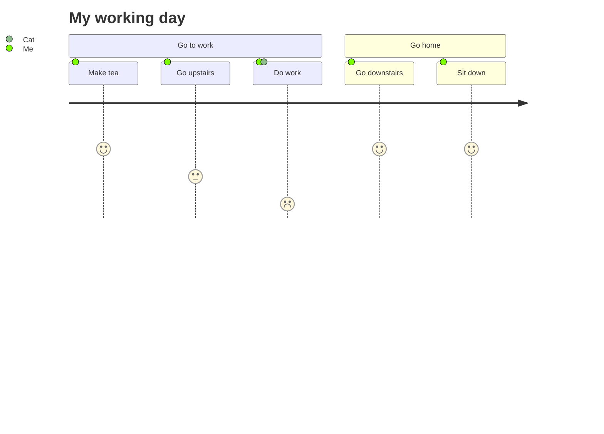
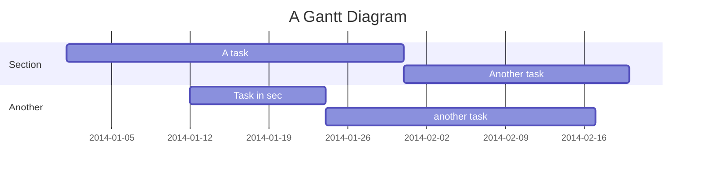
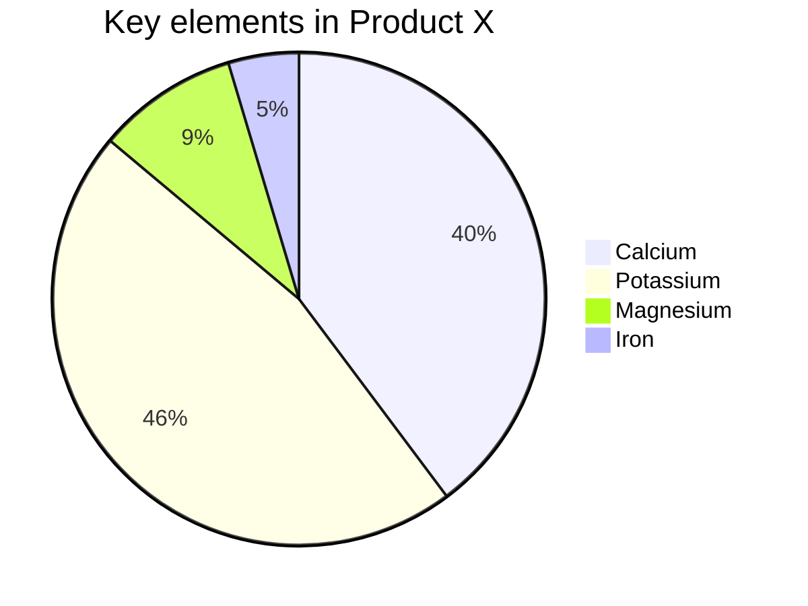

# Mermaid简介
mermaid 美人鱼, 是一个类似 markdown，用文本语法来描述文档图形(流程图、 时序图、甘特图)的工具，您可以在文档中嵌入一段 mermaid 文本来生成 SVG 形式的图形 比如插入下面的代码

编写代码
````text
graph TD
    Start --> Stop
````

生成图示



编写代码
````
graph TD
    B((开始)) -->C{判断}
    C --  a=1 -->D[执行语句1]
    C --  a=2  -->E[执行语句2]
    C --  a=3 -->F[执行语句3]
    C -- a=4  -->G[执行语句4]
    D--> AA((结束))
    E--> AA
    F--> AA
   G--> AA      
````
生成对应图：



# 使用教程

## 流程图
<table>
    <tr>
        <th>格式</th>
        <th>描述</th>
    </tr>
    <tr>
        <td>TB</td>
        <td>从上到下</td>
    </tr>
    <tr>
        <td>TD</td>
        <td>自顶向下/从上至下相同</td>
    </tr>    
    <tr>
        <td>BT</td>
        <td>从下至上</td>
    </tr>
    <tr>
        <td>RL</td>
        <td>从右至左</td>
    </tr>
    <tr>
        <td>LR</td>
        <td>从左至右</td>
    </tr>
</table>

代码
````text
graph LR
    A-->|text|B
````
图示

## 顺序图

代码
````text
sequenceDiagram
    autonumber
    Alice->>John: Hello John, how are you?
    loop Healthcheck
        John->>John: Fight against hypochondria
    end
    Note right of John: Rational thoughts!
    John-->>Alice: Great!
    John->>Bob: How about you?
    Bob-->>John: Jolly good!
````
图像


## 类图
代码
```text
classDiagram
classA <|-- classB : implements
classC *-- classD : composition
classE o-- classF : association
```
图示

## 状态图
代码
```text
stateDiagram-v2
    [*] --> Still
    Still --> [*]

    Still --> Moving
    Moving --> Still
    Moving --> Crash
    Crash --> [*]
```
图示


## 实体关系图
代码
```text
erDiagram
    CUSTOMER ||--o{ ORDER : places
    CUSTOMER {
        string name
        string custNumber
        string sector
    }
    ORDER ||--|{ LINE-ITEM : contains
    ORDER {
        int orderNumber
        string deliveryAddress
    }
    LINE-ITEM {
        string productCode
        int quantity
        float pricePerUnit
    }
```
图示

## 用户旅程
代码
```text
journey
    title My working day
    section Go to work
      Make tea: 5: Me
      Go upstairs: 3: Me
      Do work: 1: Me, Cat
    section Go home
      Go downstairs: 5: Me
      Sit down: 5: Me
```
图示

## 甘特
代码
```text
gantt
    title A Gantt Diagram
    dateFormat  YYYY-MM-DD
    section Section
    A task           :a1, 2014-01-01, 30d
    Another task     :after a1  , 20d
    section Another
    Task in sec      :2014-01-12  , 12d
    another task      : 24d
```
图示

## 饼形图
代码
```text
pie
    title Key elements in Product X
    "Calcium" : 42.96
    "Potassium" : 50.05
    "Magnesium" : 10.01
    "Iron" :  5
```
图示

# 参考资料

[官方文档](https://mermaid-js.github.io/mermaid/#/)   


 